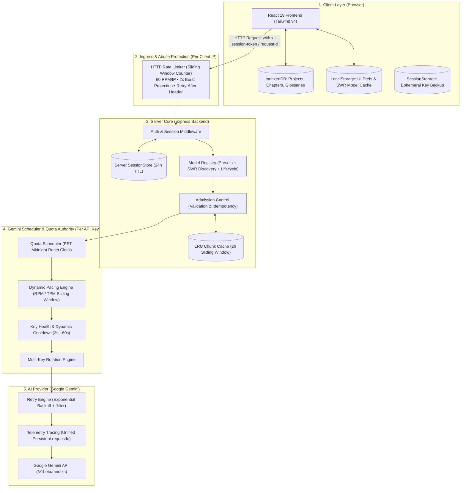

# AI Dịch Truyện Trung-Việt — Enterprise Edition

[](https://www.typescriptlang.org/)
[](https://react.dev/)
[](https://tailwindcss.com/)
[](https://expressjs.com/)
[](https://vitest.dev/)

Hệ thống dịch tiểu thuyết chữ Trung Quốc sang tiếng Việt sử dụng công nghệ **Google Gemini AI**, được xây dựng với kiến trúc phân tầng chịu lỗi cao (**Resilient Tiered Architecture**), phân tách rõ ràng giữa **Bảo vệ Máy chủ (HTTP Abuse Limiter)** và **Bộ điều phối Hạn mức AI (Gemini Quota Scheduler)**.

---

## 🌟 Tính năng Cốt lõi

### ⚡ 1. Dịch Trực Tiếp Độc Lập & Bảo Mật Tuyệt Đối (Direct Client Translation)
- **100% Client-to-Gemini**: Toàn bộ yêu cầu dịch thuật diễn ra trực tiếp giữa trình duyệt người dùng và Google Gemini REST API. Máy chủ không nhận, không xử lý, và không lưu trữ bất kỳ văn bản truyện nào của người dùng.
- **Bắt buộc API Key Cá Nhân**: Người dùng tự cung cấp Gemini API Key (lấy miễn phí từ Google AI Studio), không dùng chung key hay phụ thuộc vào hàng đợi máy chủ — đảm bảo tốc độ tối đa và quyền riêng tư tuyệt đối (khớp với `docs/privacy-policy.md`).

### 🤖 2. Dịch AI 3 Giai Đoạn Chuyên Sâu
- **Giai đoạn 1 (Dịch thô & Trích xuất)**: Dịch sát nghĩa, bảo toàn cấu trúc câu, tự động phân tích và trích xuất thực thể/danh từ riêng tiếng Trung.
- **Giai đoạn 2 (Biên tập & Chuốt văn phong)**: Tự động tra cứu từ điển (Glossary) và chuốt lại văn phong thuần Việt theo từng thể loại truyện (Tiên Hiệp, Võ Hiệp, Huyền Huyễn, Ngôn Tình,...).
- **Giai đoạn 3 (Kiểm duyệt QA AI)**: Đối chiếu nguyên tác và bản dịch phát hiện lỗi bỏ sót, thêm thắt, hoặc lặp câu.

### 🧠 2. Quản lý Danh mục & Vòng đời Mô hình AI (Model Lifecycle)
- **Mô hình Khuyên dùng**:
  - `gemini-2.5-flash`: Cân bằng tối ưu giữa tốc độ, văn phong và chi phí (Mặc định).
  - `gemini-2.5-pro`: Suy luận nâng cao cho các đoạn văn cổ trang, ẩn dụ phức tạp.
  - `gemini-3.1-flash-lite`: Tối ưu hóa độ trễ cực thấp cho dịch nhanh và tra cứu.
  - `gemma-4-31b-it`: Mô hình mã nguồn mở thế hệ mới.
- **Cơ chế Khám phá SWR (Stale-While-Revalidate)**: Tải danh mục mô hình từ bộ đệm tức thì (< 5ms), revalidate ngầm và bảo toàn stale cache khi Google API lỗi (Zero-Wipe).
- **Tự động Chuyển đổi Mô hình Hết hạn (Shutdown Migration)**: Tự động chuyển các model bị đóng cửa (`gemini-1.5-flash`, `gemini-1.5-pro`...) sang model kế thừa tương đương.
- **Mô hình Tùy chỉnh (Custom Models)**: Hỗ trợ xác minh và sử dụng các mô hình Fine-tuned riêng (`tunedModels/...`).

### ⚙️ 3. Điều phối Đa Khóa & Quản lý Hạn mức Thông minh (Gemini Quota Authority)
- **Đồng hồ Reset RPD theo Múi giờ PST**: Tự động reset hạn mức ngày (RPD) vào đúng **00:00:00 PST** (`America/Los_Angeles`).
- **Cửa sổ Trượt 60 Giây (Sliding RPM/TPM)**: Kiểm soát số lượt gọi và số lượng token tiêu thụ theo thời gian thực.
- **Dynamic Pacing & Key Health**: Tự động luân phiên key theo sức khỏe (`Healthy`, `Degraded`, `Cooldown`, `QuotaExhausted`), tự động ngắt mạch Circuit Breaker khi lỗi liên tiếp và hồi phục sau Cooldown (3s - 60s).

### 🛡️ 4. Bảo vệ Hạ tầng & An toàn Thông tin (Security & Storage)
- **HTTP Abuse Protection**: Rate Limiter dạng Sliding Window Counter (60 RPM/IP) triệt tiêu hoàn toàn lỗ hổng 2x boundary burst, trả về đúng header `Retry-After`.
- **Zero-Plain-Key Storage Invariant**: Tuyệt đối không lưu plain API keys hay nội dung bản thảo trong `localStorage`; API keys được quản lý trong Server SessionStore (24h TTL) hoặc `sessionStorage`.
- **IndexedDB Single Source of Truth**: Toàn bộ dự án, chương truyện và thuật ngữ từ điển được lưu trữ bền vững tại IndexedDB phía client.
- **Suy biến Mượt mà (Graceful Degradation)**: Tự động chuyển sang in-memory rate limiter và cache khi Redis mất kết nối mà không làm gián đoạn hệ thống.

### ☁️ 5. Đăng Nhập Google & Đồng Bộ Google Drive 2 Chiều (Tùy Chọn)
- **100% Client-Side OAuth 2.0 PKCE**: Tự sinh PKCE challenge và trao đổi token trực tiếp từ trình duyệt đến Google. Không dùng client secret, không có bước trung gian hay lưu token nào trên máy chủ.
- **Quyền Hạn Tối Thiểu (`drive.file`)**: Chỉ có quyền đọc/ghi thư mục `AI_Dich_Truyen_Data/` do ứng dụng tạo ra. Không có quyền truy cập bất kỳ tệp nào khác trong Drive.
- **Đồng Bộ Hai Chiều Linh Hoạt**: Dễ dàng sao lưu (Push) và khôi phục (Pull) toàn bộ truyện, chương và từ điển từ IndexedDB sang Google Drive để làm việc liên thiết bị mà không lo mất dữ liệu.

---

## 🏛️ Sơ đồ Kiến trúc Hệ thống (Architecture Map)



### Phân định Ranh giới Kỹ thuật

```
┌────────────────────────────────────────────────────────┐
│ HTTP Rate Limiter (Abuse Protection)                   │
│ • Định danh: Client IP (req.ip)                        │
│ • Thuật toán: Sliding Window Counter                   │
│ • Mục đích: Chống tấn công DoS / brute-force           │
│ • Ngưỡng: 60 requests / 60s / IP                       │
└────────────────────────────────────────────────────────┘
                           vs
┌────────────────────────────────────────────────────────┐
│ Gemini Quota Scheduler (AI Provider Capacity)          │
│ • Định danh: API Key Hash (keyHash)                    │
│ • Thuật toán: PST Midnight Reset + Sliding RPM/TPM     │
│ • Mục đích: Tránh lỗi 429 từ Google, tối ưu hóa quota  │
│ • Ngưỡng: 15 RPM / 1M TPM / 1500 RPD theo từng key     │
└────────────────────────────────────────────────────────┘
```

---

## 🚀 Hướng dẫn Cài đặt & Khởi chạy

### Yêu cầu Tiên quyết
- **Node.js**: Phiên bản LTS 18.x hoặc 20.x+
- **Redis** *(Tùy chọn)*: Để đồng bộ rate limiting phân tán (hệ thống tự động dùng bộ đệm in-memory nếu không có Redis).

### 1. Cài đặt Dependencies
```bash
git clone <repo-url>
cd <repo-folder>
npm install
```

### 2. Cấu hình Môi trường
Tạo file `.env` từ file mẫu:
```bash
cp .env.example .env
```

Nội dung file `.env`:
```env
PORT=3000
NODE_ENV=development
# Redis URL (tùy chọn - để trống sẽ tự động dùng in-memory fallback)
# REDIS_URL=redis://localhost:6379

# API Key mặc định của hệ thống (tùy chọn)
GEMINI_API_KEY=your_gemini_api_key_here
```

### 3. Khởi chạy Ứng dụng

#### Chế độ Phát triển (Development):
```bash
npm run dev
```
Truy cập giao diện Web tại: `http://localhost:3000`

#### Chế độ Triển khai (Production):
```bash
npm run build
npm run start
```

---

## 🧪 Quy chuẩn Kiểm thử & CI/CD Quality Gates

Dự án áp dụng quy trình kiểm thử nghiêm ngặt với 3 cổng chất lượng (**Quality Gates**) bắt buộc:

```bash
# 1. Kiểm tra Type & Cú pháp TypeScript (PHẢI đạt 0 lỗi)
npm run lint

# 2. Chạy toàn bộ Test Suite với Vitest (PHẢI pass 100% - 59 files / 431 tests)
npm test

# 3. Đóng gói Production (Vite Build + Esbuild Server)
npm run build
```

---

## 📂 Cấu trúc Thư mục Dự án

```text
├── src/                                # Frontend Source (React 19 + TypeScript)
│   ├── components/                     # UI Components (Translator, Glossary, Settings...)
│   │   └── ui/                         # Atomic Primitives (Button, Badge, Seal...)
│   ├── hooks/                          # Custom React Hooks (useModelDiscovery, useAIConfig...)
│   ├── lib/                            # Helper Utilities (cn.ts...)
│   ├── services/                       # Client Storage & IndexedDB (db.ts)
│   ├── utils/                          # Model Registry & Storage Audit
│   └── types.ts                        # Shared TypeScript Data Models
├── server/                             # Backend Source (Express + Node.js)
│   ├── controllers/                    # Business Logic Controllers
│   ├── middleware/                     # Rate Limiter (Sliding Window), Auth
│   ├── routes/                         # API Route Definitions (api.ts)
│   ├── services/                       # Quota Service, Session Store, Redis Manager
│   └── utils/                          # Chunk Cache, Safe Logger
├── docs/                               # Deep Architecture & Subsystem Documentation
│   ├── architecture.md                 # Full Architecture Blueprint & Data Ownership
│   ├── model-system.md                 # SWR Model Registry & Lifecycle Management
│   ├── quota-and-scheduling.md         # Gemini Quota Authority & Key Health Scheduler
│   └── api.md                          # API Endpoint Reference & Error Contracts
├── specs/                              # Spec-Driven Development (Spec-Kit History)
├── server.ts                           # Server Entrypoint
└── package.json                        # Scripts & Dependencies
```

---

## 📚 Tài liệu Kỹ thuật Chuyên sâu

- 📖 [Kiến trúc Chi tiết & Phân vùng Dữ liệu](docs/architecture.md)
- 🧠 [Phân hệ Mô hình & Cơ chế SWR Discovery](docs/model-system.md)
- ⚙️ [Bộ điều phối Hạn mức Quota & Sức khỏe Khóa API](docs/quota-and-scheduling.md)
- 🛠️ [Danh mục API Endpoints & Mã lỗi Chuẩn](docs/api.md)

---

## 📄 Bản quyền
Phát hành theo giấy phép MIT.
