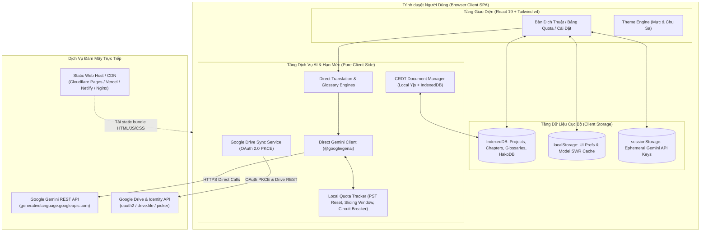

# Bản Thảo Chu Sa — AI Dịch Truyện Trung - Việt (Pure Client-Side SPA)

[](https://www.typescriptlang.org/)
[](https://react.dev/)
[](https://tailwindcss.com/)
[](https://vitejs.dev/)
[](https://vitest.dev/)
[](LICENSE)

Hệ thống dịch thuật tiểu thuyết Trung - Việt ứng dụng công nghệ **Google Gemini AI thế hệ mới**, tối ưu hóa ngữ cảnh kiếm hiệp, tiên hiệp, huyền huyễn với bộ nhớ thực thể và kiểm định văn phong Hako.

Ứng dụng được thiết kế theo kiến trúc **100% Thuần Client-Side (Pure Client-Side SPA / Zero Backend)**:
- Biên dịch tĩnh bằng duy nhất `vite build`.
- Deploy trực tiếp lên mọi nền tảng Static Hosting (Cloudflare Pages, Netlify, Vercel, GitHub Pages, S3/CDN, Nginx) mà **không cần chạy bất kỳ tiến trình Node.js nào lúc runtime**.
- Bảo mật tuyệt đối: Mọi kết nối gọi API Gemini và Google Drive đều diễn ra trực tiếp từ trình duyệt người dùng.

---

## 🌟 Tính năng Cốt lõi

### ⚡ 1. Dịch Trực Tiếp Độc Lập & Bảo Mật Tuyệt Đối (Direct Client-to-Gemini)
- **100% Client-to-Gemini**: Toàn bộ yêu cầu AI (dịch thô, chuốt văn, trích xuất thực thể, phân tích thuật ngữ, QA critique) diễn ra trực tiếp giữa trình duyệt người dùng và Google Gemini REST API. Không qua máy chủ trung gian.
- **Bảo Mật API Key Cực Cao**: API Key của người dùng được lưu tạm thời trong `sessionStorage` của trình duyệt hoặc mã hóa trong IndexedDB, không bao giờ gửi qua server bên thứ ba.

### 🤖 2. Quy Trình Dịch AI 3 Giai Đoạn Chuyên Sâu
- **Giai đoạn 1 (Dịch thô & Trích xuất)**: Dịch sát nghĩa, bảo toàn cấu trúc câu, tự động phân tích và trích xuất thực thể/danh từ riêng tiếng Trung.
- **Giai đoạn 2 (Biên tập & Chuốt văn phong)**: Tự động tra cứu từ điển (Glossary) và chuốt lại văn phong thuần Việt theo từng thể loại truyện (Tiên Hiệp, Võ Hiệp, Huyền Huyễn, Ngôn Tình,...).
- **Giai đoạn 3 (Kiểm duyệt QA AI)**: Đối chiếu nguyên tác và bản dịch phát hiện lỗi bỏ sót, thêm thắt, hoặc lặp câu.

### 🧠 3. Quản lý Danh mục & Vòng đời Mô hình AI (Model Lifecycle)
- **Mô hình Khuyên dùng**:
  - `gemini-2.5-flash`: Cân bằng tối ưu giữa tốc độ, văn phong và chi phí (Mặc định).
  - `gemini-2.5-pro`: Suy luận nâng cao cho các đoạn văn cổ trang, ẩn dụ phức tạp.
  - `gemini-3.1-flash-lite`: Tối ưu hóa độ trễ cực thấp cho dịch nhanh và tra cứu.
  - `gemma-4-31b-it`: Mô hình mã nguồn mở thế hệ mới.
- **Cơ chế Khám phá SWR (Stale-While-Revalidate)**: Tải danh mục mô hình từ bộ đệm tức thì (< 5ms), revalidate ngầm trực tiếp với Google Generative Language API và bảo toàn stale cache khi có sự cố.
- **Tự động Chuyển đổi Mô hình Hết hạn**: Tự động chuyển các model cũ (`gemini-1.5-flash`, `gemini-1.5-pro`...) sang model kế thừa tương đương.

### ⚙️ 4. Điều phối Đa Khóa & Quản lý Hạn mức Trực Tiếp Client (Client Quota Tracker)
- **Đồng hồ Reset RPD theo Múi giờ PST**: Tự động reset hạn mức ngày (RPD) vào đúng **00:00:00 PST** (`America/Los_Angeles`).
- **Cửa sổ Trượt 60 Giây (Sliding RPM/TPM)**: Kiểm soát số lượt gọi và token tiêu thụ thời gian thực trên trình duyệt.
- **Key Health & Circuit Breaker**: Theo dõi sức khỏe từng key (`Healthy`, `Degraded`, `Cooldown`, `QuotaExhausted`), tự động ngắt mạch Circuit Breaker khi lỗi liên tiếp và tự phục hồi sau thời gian chờ.

### ☁️ 5. Đăng Nhập Google & Đồng Bộ / Cộng Tác Google Drive
- **100% Client-Side OAuth 2.0 PKCE**: Tự sinh PKCE challenge và trao đổi token trực tiếp từ trình duyệt đến Google. Không dùng client secret, không lưu token trên server.
- **Quyền Hạn Tối Thiểu (`drive.file`)**: Chỉ có quyền đọc/ghi thư mục `AI_Dich_Truyen_Data/` do ứng dụng tạo ra.
- **Đồng Bộ Hai Chiều Linh Hoạt**: Sao lưu (Push) và khôi phục (Pull) toàn bộ truyện, chương và từ điển từ IndexedDB sang Google Drive để làm việc liên thiết bị.
- **Chia Sẻ & Cộng Tác Nhóm**: Phân quyền thư mục dự án trên Drive, mở qua Google Picker API để cùng dịch từng chương độc lập với cơ chế chống ghi đè và giải quyết xung đột thông minh.

### 🎨 6. Hệ Thống Chế Độ Màu Đọc & Biên Tập (Theme System)
- **4 Chế Độ Màu Linh Hoạt**: Tối (Mực & Chu Sa - Mặc định), Sáng (Giấy Ngà `#F7F2E9`), Sepia (Bản Thảo Cũ `#F4ECD8`), và Tùy chỉnh (Custom Studio).
- **Điểm Nhấn Đỏ Chu Sa Độc Bản (`#B8402C`)**: Duy trì bản sắc văn học cổ phong xuyên suốt mọi chế độ, đạt chuẩn tương phản WCAG 2.1 AA.
- **Tự Động Nhận Diện & Chống Chớp (Zero FOUC)**: Nhận diện `prefers-color-scheme`, áp dụng tức thì qua script `theme-init.js`.

### 🛡️ 7. Kiểm Định Chất Lượng Bản Dịch Cho Moderator (Hako Quality Checker)
- **Nạp chương trực tiếp từ IndexedDB**: Liên kết `sourceText` và bản dịch, hoàn toàn offline.
- **Phân Tích Lai Heuristic & AI Semantic**: Tự động phát hiện bất nhất tên riêng, sai xưng hô/giới tính, thuật ngữ lệch chuẩn, sót Hán tự/raw, lặp đoạn, sai nghĩa, bỏ sót.
- **Duyệt Quyết Định & Xuất Báo Cáo**: Cho phép moderator xác nhận, yêu cầu xem lại hoặc bác bỏ từng lỗi, xuất báo cáo Markdown dạng cấu trúc gửi cho dịch giả trong 1 click.

---

## 🏛️ Sơ đồ Kiến trúc Thuần Client-Side (Zero Backend Architecture)



---

## 🚀 Hướng dẫn Cài đặt & Khởi chạy

### Yêu cầu Tiên quyết
- **Node.js**: Phiên bản 18.x hoặc 20.x+ (chỉ dùng để build code trong quá trình phát triển)
- **Trình duyệt hiện đại**: Chrome, Edge, Firefox, Safari (hỗ trợ ES2022 và IndexedDB)

### 1. Cài đặt Dependencies
```bash
git clone <repo-url>
cd <repo-folder>
npm install
```

### 2. Cấu hình Môi trường (Tùy chọn)
Tạo file `.env` từ file mẫu:
```bash
cp .env.example .env
```

Nội dung file `.env` (chỉ bao gồm cấu hình client-side):
```env
# Đường dẫn cơ sở khi deploy vào thư mục con (Tùy chọn, mặc định: /)
VITE_BASE_URL="/"

# Cấu hình Google Drive Sync & Google Picker (Tùy chọn)
VITE_GOOGLE_CLIENT_ID="your_client_id.apps.googleusercontent.com"
VITE_GOOGLE_PICKER_API_KEY="your_picker_api_key"
VITE_GOOGLE_APP_ID="123456789012"
```

### 3. Khởi chạy Ứng dụng

#### Chế độ Phát triển (Development):
```bash
npm run dev
```
Truy cập giao diện Web tại: `http://localhost:5173` (hoặc cổng hiển thị trên terminal).

#### Đóng gói Production (Static Build):
```bash
npm run build
```
Lệnh trên sẽ chạy `tsc && vite build`, sinh ra duy nhất thư mục `dist/` chứa toàn bộ static assets.

#### Xem trước Bản build (Preview):
```bash
npm run preview
```

---

## 🌐 Triển khai Lên Static Hosting (Deployment)

Dự án có thể deploy lên bất kỳ static host nào mà **không cần server runtime**:

- **Cloudflare Pages**:
  - Build command: `npm run build`
  - Build output directory: `dist`
  - Đã tích hợp sẵn file cấu hình `public/_headers` (bảo vệ CSP, COOP cho Google OAuth popup, HSTS).
- **Vercel**:
  - Build command: `npm run build`
  - Output directory: `dist`
  - Đã tích hợp sẵn file `vercel.json` (cấu hình SPA rewrites và HTTP security headers).
- **Netlify**:
  - Build command: `npm run build`
  - Publish directory: `dist`
- **Docker / Nginx**:
  - Chạy `docker build -t ai-dich-truyen .` và `docker run -p 80:80 ai-dich-truyen` (sử dụng Dockerfile multi-stage đóng gói Nginx Alpine phục vụ thư mục `dist`).

---

## 🧪 Quy chuẩn Kiểm thử & Quality Gates

```bash
# 1. Kiểm tra Type & Cú pháp TypeScript (PHẢI sạch 0 lỗi)
npm run lint

# 2. Chạy toàn bộ Test Suite với Vitest (PHẢI pass 100%)
npm test

# 3. Đóng gói Production
npm run build
```

---

## 📂 Cấu trúc Thư mục Dự án

```text
├── src/                                # Frontend Source (React 19 + TypeScript)
│   ├── components/                     # UI Components (Translator, Glossary, Settings...)
│   │   ├── google-sync/                # Google Drive Sync & Collaboration UI
│   │   ├── translator-workspace/       # Workspace song ngữ & thanh công cụ
│   │   └── ui/                         # Atomic Primitives (Button, Badge, Seal...)
│   ├── context/                        # React Contexts (ThemeContext, etc.)
│   ├── hooks/                          # Custom Hooks (useAIConfig, useChapterCRDT...)
│   ├── lib/                            # Helper Utilities (cn.ts)
│   ├── services/                       # Dịch vụ cốt lõi:
│   │   ├── db.ts                       # IndexedDB Service (Single Source of Truth)
│   │   ├── directGeminiClient.ts       # Direct Gemini REST Client
│   │   ├── directTranslationEngine.ts  # Translation Engine Client-side
│   │   ├── directGlossaryEngine.ts     # Glossary Engine Client-side
│   │   ├── localQuotaTracker.ts        # Quota Tracker, Key Health & Circuit Breaker
│   │   └── googleDriveSyncService.ts   # Google Drive Backup & Sync
│   ├── utils/                          # Tiện ích bổ trợ (textCleaner, storageAudit, etc.)
│   └── types.ts                        # Type Definitions
├── shared/                             # Các tiện ích và hằng số dùng chung
│   ├── constants.ts                    # Hằng số cấu hình hệ thống
│   ├── sinoNormalize.ts                # Chuẩn hóa Hán-Việt & từ điển Phồn-Giản
│   └── text.ts                         # Xử lý chuỗi & Redaction bảo mật
├── public/                             # Tài nguyên tĩnh & Header hosting (_headers, favicon, etc.)
├── docs/                               # Tài liệu kỹ thuật chi tiết
│   ├── architecture.md                 # Kiến trúc tổng thể Zero Backend
│   ├── model-system.md                 # Quản lý mô hình AI
│   └── quota-and-scheduling.md         # Bộ theo dõi quota & xoay vòng key
├── vercel.json                         # Cấu hình hosting Vercel
├── vite.config.ts                      # Cấu hình Vite & Rollup Chunking
└── package.json                        # Scripts & Dependencies
```

---

## 📚 Tài liệu Kỹ thuật Chuyên sâu

- 📖 [Kiến trúc Tổng thể Zero Backend](docs/architecture.md)
- ⚙️ [Bộ điều phối Hạn mức Quota & Sức khỏe Khóa API Client-side](docs/quota-and-scheduling.md)
- 🧠 [Phân hệ Mô hình & Cơ chế SWR Discovery](docs/model-system.md)

---

## 📄 Bản quyền
Phát hành theo giấy phép MIT.
