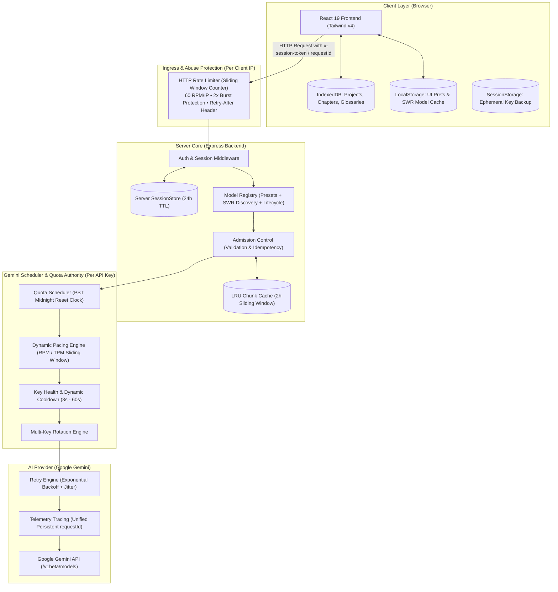
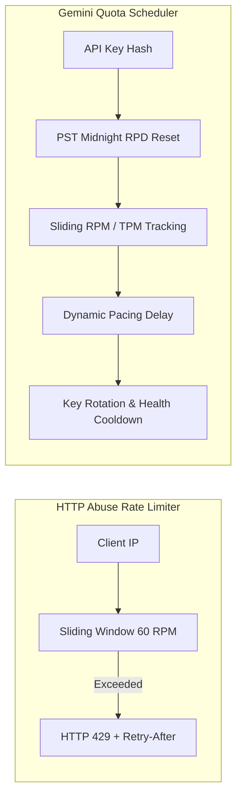

# System Architecture Blueprint

## 1. Overview & High-Level Design

Hệ thống Dịch Truyện Trung - Việt AI là ứng dụng dịch thuật toàn diện được thiết kế với kiến trúc phân tầng chịu lỗi cao (**Resilient Tiered Architecture**), phân tách rõ ràng giữa:
- **Tầng Giao diện & Lưu trữ Cục bộ (Client Layer)**: React 19, Tailwind CSS v4, Motion, Lucide Icons, và IndexedDB.
- **Tầng Cổng vào & Bảo vệ Máy chủ (HTTP Ingress & Abuse Protection)**: Express middleware với Sliding Window Counter Rate Limiter.
- **Tầng Điều phối & Quản lý Hạn mức AI (Gemini Scheduler & Quota Authority)**: Quota tracking theo múi giờ PST, Dynamic Pacing, Key Rotation, và Circuit Breaker.
- **Tầng Tích hợp AI Provider (AI Provider Layer)**: Google Gemini API Client với Exponential Backoff & Jitter, Persistent Request Tracing.

---

## 2. Logical Architecture Flow

---

## 3. Ranh giới Phân định Cốt lõi (Architectural Boundaries)

> [!IMPORTANT]
> **Ranh giới quan trọng**: Hệ thống phân định rạch ròi 2 lớp kiểm soát tốc độ hoàn toàn độc lập:
> 1. **HTTP Abuse Rate Limiter**: Giới hạn số lượng HTTP request gửi đến server theo từng IP máy khách (`req.ip`) để chống spam DoS.
> 2. **Gemini Quota Scheduler**: Quản lý hạn mức tiêu thụ token/request của từng Google API key (`keyHash`) để tối ưu hóa quota và ngăn chặn lỗi 429 từ Google.

---

## 4. Bảng Phân định Quyền Sở hữu Dữ liệu (Storage Source of Truth)

| Phân vùng dữ liệu (Data Domain) | Nguồn sự thật duy nhất (Single Source of Truth) | Tầng bộ nhớ đệm (Cache Layer) | Vòng đời / TTL | Cơ chế dọn dẹp / Di chuyển |
|:---|:---|:---|:---|:---|
| **Dự án, Chương truyện, Bản thảo** | **IndexedDB** (`db.ts`) | React Memory | Vĩnh viễn (Client-owned) | IndexedDB Version Migration, Manual Wipe |
| **API Keys & Credentials** | **Server SessionStore** | `sessionStorage` (fallback) | 24 giờ | Auto-expire Fixed TTL, Không lưu plaintext ở `localStorage` |
| **Model Selection** | **`localStorage`** | React Memory | Vĩnh viễn | Default Fallback on Deprecation |
| **Discovered Models Cache** | **Server Model Registry** | `localStorage` (SWR) | 1 giờ TTL | SWR Stale Cache Preservation, Zero-wipe on 429 |
| **Quota & Token Usage** | **Server QuotaService** | React Memory | Hằng ngày | Reset lúc 00:00:00 America/Los_Angeles (PST/PDT) |
| **Key Health & Cooldown** | **Server QuotaService** | React Memory | Động (3s - 60s) | Tự động phục hồi khi hết Cooldown hoặc khi gọi thành công |
| **Translation Chunk Cache** | **Server Memory Cache** | Server LRU Map | 2 giờ | LRU Eviction & Periodic Pruning |

---

## 5. Cơ chế Suy biến Mượt mà (Graceful Degradation)

Hệ thống được thiết kế để hoạt động ổn định trong mọi điều kiện lỗi hạ tầng:
1. **Redis Mất kết nối**:
   - HTTP Rate Limiter tự động chuyển sang In-memory Sliding Window (tối đa 10.000 entries) với độ trễ chuyển đổi < 5ms.
   - Chunk Cache tự động lưu trữ trên bộ nhớ RAM của tiến trình Express.
2. **Google API Quota 429 hoặc Lỗi 503**:
   - Key hiện tại được đưa vào trạng thái Cooldown.
   - Request tự động chuyển sang Key tiếp theo trong Key Ring với cùng `requestId`.
3. **Model Discovery Quá hạn hoặc Lỗi Mạng**:
   - Giao diện UI tải ngay lập tức danh sách model từ stale cache.
   - Background revalidation ngầm mà không block thao tác của người dùng.
