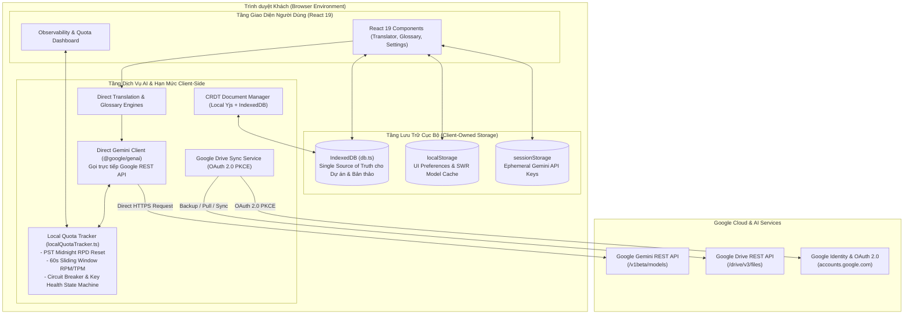

# System Architecture Blueprint — Pure Client-Side SPA (Zero Backend)

## 1. Overview & High-Level Design

Hệ thống Dịch Truyện Trung - Việt AI là ứng dụng dịch thuật toàn diện vận hành theo kiến trúc **100% Thuần Client-Side (Pure Client-Side SPA / Zero Backend)**:
- **Biên dịch & Đóng gói**: Sử dụng duy nhất `vite build`, tạo ra thư mục `dist/` chứa static assets.
- **Triển khai Không Máy Chủ**: Deploy trực tiếp lên bất kỳ nền tảng Static Hosting nào (Cloudflare Pages, Netlify, Vercel, GitHub Pages, S3/CDN, Nginx) mà không cần tiến trình Node.js lúc runtime.
- **Không Lưu Khóa trên Máy Chủ Trung Gian**: Mọi API Key của Google Gemini do người dùng tự quản lý và lưu tạm thời trong `sessionStorage` của trình duyệt hoặc mã hóa trong IndexedDB.
- **Giao Tiếp Đám Mây Trực Tiếp**: Toàn bộ thao tác dịch thuật, gọi AI, phân tích thuật ngữ và đồng bộ Google Drive đều được thực thi trực tiếp từ trình duyệt người dùng đến Google REST APIs.

---

## 2. Kiến trúc Luồng Dữ liệu (Logical Architecture Flow)



---

## 3. Ranh giới Phân định & Trách nhiệm Bộ phận

```
┌────────────────────────────────────────────────────────┐
│ Local Quota Tracker (Client-Side Capacity Management)  │
│ • Định danh: SHA-256 API Key Hash (idempotent)         │
│ • Thuật toán: PST Midnight Reset + Sliding RPM/TPM     │
│ • Mục đích: Chống lỗi 429 từ Google, bảo vệ quota       │
│ • Cơ chế: Circuit Breaker, Cooldown & Dynamic Rotation │
└────────────────────────────────────────────────────────┘
                           vs
┌────────────────────────────────────────────────────────┐
│ Static Web Hosting & Edge Security Headers             │
│ • Nền tảng: Cloudflare Pages / Vercel / Netlify        │
│ • Cấu hình: public/_headers và vercel.json             │
│ • Mục đích: CSP chặt chẽ, COOP same-origin-allow-popups│
│ • Tối ưu: Cache static assets dài hạn, SPA routing     │
└────────────────────────────────────────────────────────┘
```

---

## 4. Bảng Phân định Quyền Sở hữu Dữ liệu (Storage Source of Truth)

| Phân vùng dữ liệu (Data Domain) | Nguồn sự thật duy nhất (Single Source of Truth) | Tầng bộ nhớ đệm (Cache Layer) | Vòng đời / TTL | Cơ chế bảo vệ & dọn dẹp |
|:---|:---|:---|:---|:---|
| **Dự án, Chương truyện, Bản thảo** | **IndexedDB** (`db.ts`) | React Memory | Vĩnh viễn (Client-owned) | IndexedDB Version Migration, Storage Audit |
| **Báo cáo Kiểm định Hako** | **IndexedDB** (`HakoQualityCheckerDB`) | React Memory | Vĩnh viễn (Client-owned) | Xóa theo dự án hoặc dọn thủ công |
| **API Keys & Credentials** | **`sessionStorage`** | Bộ nhớ tiến trình React | Session trình duyệt | Tự xóa khi đóng tab, không lưu plaintext trong `localStorage` |
| **Giao diện & Cài đặt UI** | **`localStorage`** | React Memory | Vĩnh viễn | Tự đồng bộ qua ThemeContext |
| **Mô hình AI Khám phá (SWR)** | **`localStorage`** | React State | 24 giờ SWR | Stale Cache Preservation, tự khôi phục khi offline |
| **Thống kê Quota & Token Usage** | **`localQuotaTracker` (In-memory)** | React Memory | Chu kỳ ngày PST | Reset lúc 00:00:00 PST (`America/Los_Angeles`) |
| **Trạng thái Sức khỏe Khóa (Key Health)** | **`localQuotaTracker` (In-memory)** | React Memory | Phiên làm việc | Circuit Breaker chuyển đổi tự động (Closed / Open / HalfOpen) |

---

## 5. Cơ chế Chịu lỗi & Tự phục hồi (Resilience & Self-Healing)

1. **Google API Quota 429 hoặc Lỗi 503**:
   - `localQuotaTracker` tự động chuyển key gặp sự cố sang trạng thái `Cooldown` hoặc `QuotaExhausted`.
   - `directGeminiClient` ngay lập tức xoay vòng sang key khả dụng kế tiếp trong Key Ring để hoàn thành tác vụ mà người dùng không bị gián đoạn.
2. **Model Discovery Quá hạn hoặc Lỗi Mạng**:
   - Giao diện UI tải tức thì danh sách mô hình từ stale cache lưu ở `localStorage`.
   - Quá trình revalidation ngầm thực hiện trực tiếp với Google API mà không block thao tác người dùng.
3. **Mất Kết Nối Mạng (Offline-First)**:
   - Toàn bộ bản thảo, từ điển và lịch sử phiên dịch vẫn truy cập và chỉnh sửa bình thường trong IndexedDB.
   - Khi có kết nối trở lại, người dùng có thể thực hiện đồng bộ lên Google Drive.
