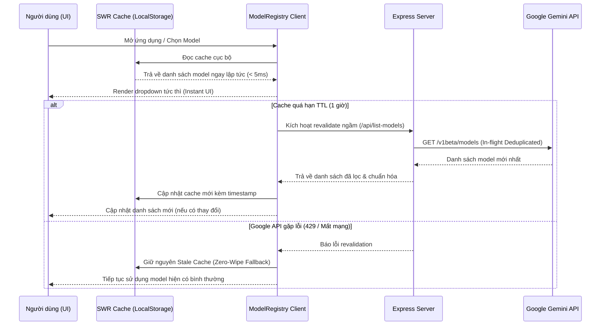

# Model Subsystem: Registry, SWR Discovery & Lifecycle Management

## 1. Tổng quan Phân hệ Mô hình

Phân hệ quản lý mô hình (**Model Subsystem**) chịu trách nhiệm quản lý danh mục mô hình AI (Google Gemini & Custom Models), tự động cập nhật mô hình mới nhất từ Google thông qua cơ chế Stale-While-Revalidate (SWR), và di chuyển an toàn các mô hình đã ngừng hoạt động (Deprecated/Shutdown Models).

---

## 2. Danh mục Mô hình Định sẵn (Preset Models)

Hệ thống cung cấp danh mục mô hình tối ưu hóa cho dịch truyện Trung - Việt:

| Model ID | Nhãn hiển thị | Mô tả | Hạn mức mặc định (RPM / TPM / RPD) |
|:---|:---|:---|:---|
| `gemini-2.5-flash` | **Gemini 2.5 Flash** | Mô hình tiêu chuẩn, tốc độ cao, độ chính xác cao và tiết kiệm chi phí (Mặc định). | 15 RPM / 1M TPM / 1500 RPD |
| `gemini-2.5-pro` | **Gemini 2.5 Pro** | Mô hình cao cấp cho các chương có văn phong cổ trang khó hoặc ẩn dụ phức tạp. | 5 RPM / 500K TPM / 100 RPD |
| `gemini-3.1-flash-lite` | **Gemini 3.1 Flash Lite** | Tối ưu hóa độ trễ cực thấp cho các tác vụ dịch nhanh và tra từ điển. | 15 RPM / 1M TPM / 1500 RPD |
| `gemma-4-31b-it` | **Gemma 4 31B IT** | Mô hình mã nguồn mở thế hệ mới hỗ trợ dịch thuật ngữ cảnh dài. | 15 RPM / 1M TPM / 1500 RPD |

---

## 3. Cơ chế Khám phá Mô hình SWR (Stale-While-Revalidate)

Để tối ưu hóa trải nghiệm người dùng và giảm thiểu các lệnh gọi API thừa đến Google, danh mục mô hình áp dụng mô hình **SWR Lifecycle**:



### Các Đặc tính Kỹ thuật của SWR:
- **Thời gian sống (TTL)**: 1 giờ (`DISCOVERED_MODELS_TTL_MS = 3600000`).
- **Khử trùng lặp In-Flight (Deduplication)**: Nếu có nhiều component cùng yêu cầu khám phá mô hình cùng lúc, chỉ có duy nhất 1 Promise được thực thi.
- **Bảo toàn Stale Cache khi lỗi (Zero-Wipe)**: Khi Google API trả về lỗi 429 hoặc mất mạng, hệ thống **tuyệt đối không xóa** danh mục mô hình đã lưu mà tiếp tục dùng cache cũ.

---

## 4. Quản lý Vòng đời & Tự động Chuyển đổi (Shutdown Migration)

Khi một mô hình Google bị đóng cửa hoặc ngừng hỗ trợ, hệ thống tự động nhận diện và chuyển đổi sang mô hình kế thừa tương thích:

```typescript
export const SHUTDOWN_MODEL_MIGRATIONS: Record<string, { replacementId: string; reason: string }> = {
  'gemini-1.5-flash': {
    replacementId: 'gemini-2.5-flash',
    reason: 'Mô hình "Gemini 1.5 Flash" đã chính thức ngừng hoạt động (Shutdown). Tự động chuyển sang mô hình "gemini-2.5-flash".',
  },
  'gemini-1.5-pro': {
    replacementId: 'gemini-2.5-pro',
    reason: 'Mô hình "Gemini 1.5 Pro" đã chính thức ngừng hoạt động (Shutdown). Tự động chuyển sang mô hình "gemini-2.5-pro".',
  },
};
```

---

## 5. Thêm & Xác minh Mô hình Tùy chỉnh (Custom Models)

Người dùng có thể nhập các mô hình Fine-tuned (`tunedModels/...`) hoặc mô hình Preview riêng:
1. Nhập Model ID trên giao diện Cấu hình AI.
2. Hệ thống gọi endpoint `/api/verify-model` để xác minh API Key có quyền truy cập và mô hình có hỗ trợ phương thức `generateContent`.
3. Khi xác minh thành công, mô hình được lưu vào danh sách tùy chỉnh và sẵn sàng để dịch.
