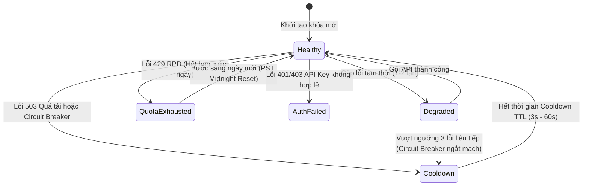

# Gemini Quota Authority, Scheduling & Multi-Key Health Management

## 1. Kiến trúc 5 Tầng Chuẩn hóa (5-Tier Architecture)

Phân hệ Quota Scheduler là trung tâm kiểm soát tải (**Admission & Pacing Authority**) cho tất cả các yêu cầu dịch thuật gửi đến Google Gemini API, vận hành theo mô hình phân tầng chặt chẽ:

```
┌────────────────────────────────────────────────────────┐
│                   Model Registry                       │
│  - Vòng đời: Active, Deprecated, Shutdown              │
│  - Năng lực: generateContent, structuredOutput, vision │
│  - Xác minh: Verified / Unverified (Singleflight)      │
└───────────────────────────┬────────────────────────────┘
                            │
                            ▼
┌────────────────────────────────────────────────────────┐
│                 Admission / Request                    │
│  - Validation, Token estimation, Request routing       │
└───────────────────────────┬────────────────────────────┘
                            │
                            ▼
┌────────────────────────────────────────────────────────┐
│                Quota Group / Project                   │
│  - Sở hữu hạn mức: Provider Quota (RPM / TPM / RPD)    │
│  - Thực thi điều phối: Observed Usage, Sliding Window  │
│  - Gợi ý điều phối: Scheduling Hint, Pacing Floor      │
└───────────────────────────┬────────────────────────────┘
                            │
                            ▼
┌────────────────────────────────────────────────────────┐
│                 API Key Health Pool                    │
│  - Máy trạng thái: Healthy, Degraded, Cooldown,        │
│    AuthFailed, Disabled                                │
│  - Sức khỏe độc lập: Circuit Breaker, LastUsedAt       │
└───────────────────────────┬────────────────────────────┘
                            │
                            ▼
┌────────────────────────────────────────────────────────┐
│                   Gemini Execution                     │
│  - Phân loại lỗi chuẩn hóa: Upstream Error Taxonomy    │
│  - Quản lý thử lại có điều kiện: Smart Retry & Pacing  │
│  - Thực thi gọi nhà cung cấp: Provider Dispatcher      │
└────────────────────────────────────────────────────────┘
```

---

## 2. Ba Quy tắc Bắt buộc (Core Invariants)

1. **API Key ≠ Quota Bucket**: Hạn ngạch nhà cung cấp (RPM, TPM, RPD) thuộc về cấp độ Google Cloud Project / `QuotaGroup`, không thuộc về từng API key riêng lẻ. Việc thêm nhiều key cùng dự án chỉ tăng tính sẵn sàng và khả năng xoay vòng khi lỗi, tuyệt đối không nhân ảo hạn ngạch của hệ thống.
2. **Provider Attempt ≠ Logical Request**: 1 yêu cầu dịch logic của người dùng có thể thực hiện nhiều lượt gọi provider (do xoay key, thử lại hoặc phân giải lỗi). Các tầng đo lường và ghi nhận quota tách bạch rõ ràng giữa hai khái niệm này.
3. **Pacing ≠ HTTP Rate Limit**: Khoảng cách an toàn giữa các lượt gửi (pacing / safety interval) là cơ chế chủ động phòng ngừa quá tải, độc lập với việc bị chặn lỗi 429 từ phía Google.

---

## 3. Đồng hồ Reset Hạn mức Ngày theo Múi giờ PST (RPD Reset Clock)

> [!IMPORTANT]
> **Chuẩn hóa múi giờ**: Google AI Studio reset hạn mức ngày (**Requests Per Day - RPD**) vào đúng **00:00:00 PST/PDT** (múi giờ `America/Los_Angeles`).
> Hệ thống tính toán reset RPD của QuotaGroup độc lập với múi giờ của máy chủ hoặc trình duyệt người dùng thông qua hàm:
> ```typescript
> export function getDayInLosAngeles(timestamp: number = Date.now()): string {
>   return new Intl.DateTimeFormat('en-CA', {
>     timeZone: 'America/Los_Angeles',
>     year: 'numeric',
>     month: '2-digit',
>     day: '2-digit',
>   }).format(new Date(timestamp));
> }
> ```

---

## 4. Cửa sổ Trượt 60 Giây cho RPM và TPM (Sliding Window Tracking)

Hệ thống theo dõi số lượt gọi (RPM) và số lượng token (TPM) tiêu thụ ở cấp độ `QuotaGroup` trong cửa sổ trượt 60 giây gần nhất:
- Mọi lượt gọi thành công hoặc thất bại đều được ghi nhận vào `callLog: Array<{ timestamp, tokens }>`.
- Các bản ghi cũ hơn $T - 60000\,\text{ms}$ được tự động lọc bỏ.
- Khi tổng số request hoặc token trong phút vượt quá ngưỡng cấu hình của nhóm, bộ điều phối sẽ hoãn request theo **Pacing Interval** hoặc tự động chuyển sang QuotaGroup tiếp theo.

---

## 5. Máy trạng thái Sức khỏe Khóa (Key Health State Machine)

Mỗi API key được quản lý bởi một máy trạng thái sức khỏe tự động phục hồi (**Self-Healing State Machine**):



### Các Trạng thái Chi tiết:
1. **Healthy**: Khóa hoạt động tốt, sẵn sàng tiếp nhận request mới với độ ưu tiên cao nhất.
2. **Degraded**: Khóa gặp lỗi mạng hoặc lỗi tạm thời nhưng chưa ngắt mạch.
3. **Cooldown**: Khóa tạm dừng nhận việc trong khoảng thời gian từ **3 giây đến 60 giây** (áp dụng khi gặp 503 Overloaded hoặc ngắt mạch Circuit Breaker).
4. **QuotaExhausted**: Nhóm/Khóa đã dùng hết hạn mức ngày (RPD) hoặc 429 RPD từ Google; bị đóng băng cho đến nửa đêm PST.
5. **AuthFailed**: Khóa API sai cú pháp hoặc bị vô hiệu hóa bởi Google (cô lập riêng key, nhóm vẫn hoạt động nếu còn key khác).
6. **Disabled**: Khóa bị vô hiệu hóa thủ công bởi người dùng.

---

## 6. Chiến lược Điều phối 2 Bước (Hierarchical 2-Step Scheduling)

Khi có yêu cầu dịch thuật, bộ điều phối thực hiện 2 bước tuần tự:
1. **Đánh giá Quota Group (`evaluateQuotaGroups`)**: Chấm điểm và xếp hạng các nhóm dự án dựa trên dung lượng RPM/TPM còn lại, thời gian nghỉ (idle time), nhịp độ pacing và điểm phạt lỗi.
2. **Chọn Khóa Tối Ưu trong Nhóm (`selectBestKeyInGroup`)**: Trong nhóm được chọn, tìm kiếm key `Healthy`, có thời gian nghỉ dài nhất (Least Recently Used) và ít lỗi nhất.

---

## 7. Phân Tách Ngữ Nghĩa: ProviderQuota vs SchedulingHint

Để đảm bảo tính đúng đắn dữ liệu:
- **`ProviderQuota` (Hạn ngạch nhà cung cấp)**: Chỉ tồn tại khi đã được kiểm định/xác minh chính thức từ Google AI Studio (`providerQuota = undefined` khi chưa có dữ liệu, tuyệt đối không gán giá trị mặc định giả lập 15 RPM / 1M TPM / 1500 RPD).
- **`SchedulingHint` (Gợi ý điều phối)**: Là thực thể riêng biệt mang nhãn nguồn gốc (`source: "provider" | "configured" | "model-fallback" | "safe-default"`).
- **Thứ tự ưu tiên tính nhịp độ pacing**:
  $$\text{Configured} \ (1) \longrightarrow \text{Provider} \ (2) \longrightarrow \text{Model-Fallback} \ (3) \longrightarrow \text{Safe-Default} \ (4)$$
- Tuyệt đối không có phần code nào được phép coi nhịp độ fallback an toàn là hạn ngạch chính thức của Google.
