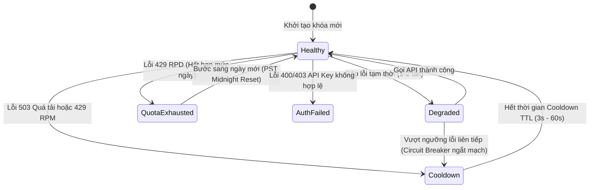

# Gemini Quota Authority, Scheduling & Multi-Key Health Management

## 1. Tổng quan Bộ điều phối Hạn mức (Gemini Quota Scheduler)

Phân hệ Quota Scheduler là trung tâm kiểm soát tải (**Admission & Pacing Authority**) cho tất cả các yêu cầu dịch thuật gửi đến Google Gemini API. Nó đảm bảo các API keys hoạt động an toàn trong giới hạn RPM, TPM và RPD của Google mà không bị quá tải.

---

## 2. Đồng hồ Reset Hạn mức Ngày theo Múi giờ PST (RPD Reset Clock)

> [!IMPORTANT]
> **Chuẩn hóa múi giờ**: Google AI Studio reset hạn mức ngày (**Requests Per Day - RPD**) vào đúng **00:00:00 PST/PDT** (múi giờ `America/Los_Angeles`).
> Hệ thống tính toán reset RPD độc lập với múi giờ của máy chủ hoặc trình duyệt người dùng thông qua hàm:
> ```typescript
> export function getDayInLosAngeles(timestamp: number = Date.now()): string {
>   return new Intl.DateTimeFormat('en-CA', {
>     timeZone: 'America/Los_Angeles',
>     year: 'numeric',
>     month: '2-digit',
>     day: '2-digit',
>   }).format(new Date(timestamp));
> }
> ```

---

## 3. Cửa sổ Trượt 60 Giây cho RPM và TPM (Sliding Window Tracking)

Hệ thống theo dõi số lượt gọi (RPM) và số lượng token (TPM) tiêu thụ của từng API key trong cửa sổ trượt 60 giây gần nhất:
- Mọi lượt gọi thành công hoặc thất bại đều được ghi nhận vào `recentCalls: Array<{ timestamp, tokens }>`.
- Các bản ghi cũ hơn $T - 60000\,\text{ms}$ được tự động lọc bỏ.
- Khi tổng số request hoặc token trong phút vượt quá ngưỡng cấu hình, bộ điều phối sẽ tính toán **Pacing Delay** hoặc tự động chuyển sang Key tiếp theo có sẵn.

---

## 4. Máy trạng thái Sức khỏe Khóa (Key Health State Machine)

Mỗi API key được quản lý bởi một máy trạng thái sức khỏe tự động phục hồi (**Self-Healing State Machine**):



### Các Trạng thái Chi tiết:
1. **Healthy**: Khóa hoạt động tốt, sẵn sàng tiếp nhận request mới với độ ưu tiên cao nhất.
2. **Degraded**: Khóa gặp lỗi mạng hoặc lỗi tạm thời nhưng chưa ngắt mạch.
3. **Cooldown**: Khóa tạm dừng nhận việc trong khoảng thời gian từ **3 giây đến 60 giây** (áp dụng khi gặp 503 Overloaded hoặc ngắt mạch Circuit Breaker).
4. **QuotaExhausted**: Khóa đã dùng hết hạn mức ngày (RPD = 1500/1500) hoặc 429 RPD từ Google; khóa bị đóng băng cho đến nửa đêm PST.
5. **AuthFailed**: Khóa API sai cú pháp hoặc bị vô hiệu hóa bởi Google.

---

## 5. Chiến lược Luân phiên Khóa Thông minh (Intelligent Key Rotation)

Khi có nhiều API keys được cấu hình, bộ điều phối lựa chọn key theo thứ tự ưu tiên:
1. **Trạng thái Sức khỏe**: Ưu tiên các key `Healthy` > `Degraded` (loại bỏ hoàn toàn các key `Cooldown`, `QuotaExhausted`, `AuthFailed`).
2. **Dung lượng Khả dụng**: Ưu tiên các key có số lượt gọi trong phút hiện tại (`requestsThisMinute`) thấp nhất.
3. **Chỉ số Lỗi**: Ưu tiên các key có `consecutiveErrors = 0`.
4. **Độ trễ Trung bình**: Ưu tiên các key có `avgLatencyMs` thấp hơn.
