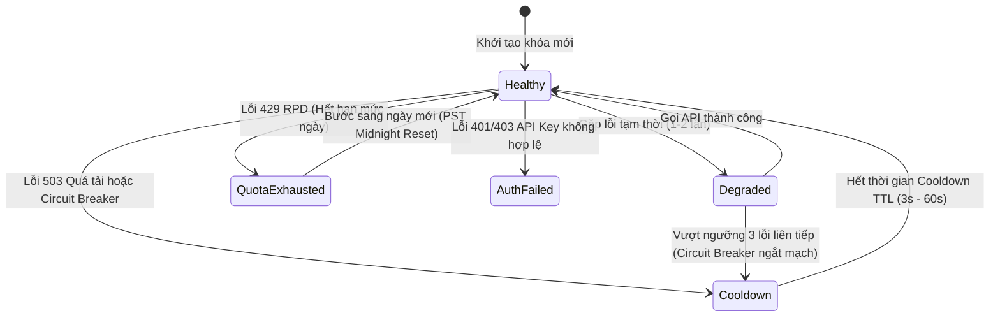

# Gemini Quota Authority, Scheduling & Multi-Key Health Management

## 1. Kiến trúc 5 Tầng Chuẩn hóa (5-Tier Architecture)

Phân hệ Quota Scheduler là trung tâm kiểm soát tải (**Admission & Pacing Authority**) cho tất cả các yêu cầu dịch thuật gửi đến Google Gemini API, vận hành theo mô hình phân tầng chặt chẽ:

```
┌────────────────────────────────────────────────────────┐
│                   Model Registry                       │
│  - Vòng đời: Active, Deprecated, Shutdown              │
│  - Năng lực: generateContent, structuredOutput, vision │
│  - Xác minh: Verified / Unverified (Singleflight)      │
└───────────────────────────┬────────────────────────────┘
                            │
                            ▼
┌────────────────────────────────────────────────────────┐
│                 Admission / Request                    │
│  - Validation, Token estimation, Request routing       │
└───────────────────────────┬────────────────────────────┘
                            │
                            ▼
┌────────────────────────────────────────────────────────┐
│                Quota Group / Project                   │
│  - Sở hữu hạn mức: Provider Quota (RPM / TPM / RPD)    │
│  - Thực thi điều phối: Observed Usage, Sliding Window  │
│  - Gợi ý điều phối: Scheduling Hint, Pacing Floor      │
└───────────────────────────┬────────────────────────────┘
                            │
                            ▼
┌────────────────────────────────────────────────────────┐
│                 API Key Health Pool                    │
│  - Máy trạng thái: Healthy, Degraded, Cooldown,        │
│    AuthFailed, Disabled                                │
│  - Sức khỏe độc lập: Circuit Breaker, LastUsedAt       │
└───────────────────────────┬────────────────────────────┘
                            │
                            ▼
┌────────────────────────────────────────────────────────┐
│                   Gemini Execution                     │
│  - Phân loại lỗi chuẩn hóa: Upstream Error Taxonomy    │
│  - Quản lý thử lại có điều kiện: Smart Retry & Pacing  │
│  - Thực thi gọi nhà cung cấp: Provider Dispatcher      │
└────────────────────────────────────────────────────────┘
```

---

## 2. Ba Quy tắc Bắt buộc (Core Invariants)

1. **API Key ≠ Quota Bucket**: Hạn ngạch nhà cung cấp (RPM, TPM, RPD) thuộc về cấp độ Google Cloud Project / `QuotaGroup`, không thuộc về từng API key riêng lẻ. Việc thêm nhiều key cùng dự án chỉ tăng tính sẵn sàng và khả năng xoay vòng khi lỗi, tuyệt đối không nhân ảo hạn ngạch của hệ thống.
2. **Provider Attempt ≠ Logical Request**: 1 yêu cầu dịch logic của người dùng có thể thực hiện nhiều lượt gọi provider (do xoay key, thử lại hoặc phân giải lỗi). Các tầng đo lường và ghi nhận quota tách bạch rõ ràng giữa hai khái niệm này.
3. **Pacing ≠ HTTP Rate Limit**: Khoảng cách an toàn giữa các lượt gửi (pacing / safety interval) là cơ chế chủ động phòng ngừa quá tải, độc lập với việc bị chặn lỗi 429 từ phía Google.

---

## 3. Đồng hồ Reset Hạn mức Ngày theo Múi giờ PST (RPD Reset Clock)

> [!IMPORTANT]
> **Chuẩn hóa múi giờ**: Google AI Studio reset hạn mức ngày (**Requests Per Day - RPD**) vào đúng **00:00:00 PST/PDT** (múi giờ `America/Los_Angeles`).
> Hệ thống tính toán reset RPD của QuotaGroup độc lập với múi giờ của máy chủ hoặc trình duyệt người dùng thông qua hàm:
> ```typescript
> export function getDayInLosAngeles(timestamp: number = Date.now()): string {
>   return new Intl.DateTimeFormat('en-CA', {
>     timeZone: 'America/Los_Angeles',
>     year: 'numeric',
>     month: '2-digit',
>     day: '2-digit',
>   }).format(new Date(timestamp));
> }
> ```

---

## 4. Cửa sổ Trượt 60 Giây cho RPM và TPM (Sliding Window Tracking)

Hệ thống theo dõi số lượt gọi (RPM) và số lượng token (TPM) tiêu thụ ở cấp độ `QuotaGroup` trong cửa sổ trượt 60 giây gần nhất:
- Mọi lượt gọi thành công hoặc thất bại đều được ghi nhận vào `callLog: Array<{ timestamp, tokens }>`.
- Các bản ghi cũ hơn $T - 60000\,\text{ms}$ được tự động lọc bỏ.
- Khi tổng số request hoặc token trong phút vượt quá ngưỡng cấu hình của nhóm, bộ điều phối sẽ hoãn request theo **Pacing Interval** hoặc tự động chuyển sang QuotaGroup tiếp theo.

---

## 5. Máy trạng thái Sức khỏe Khóa (Key Health State Machine)

Mỗi API key được quản lý bởi một máy trạng thái sức khỏe tự động phục hồi (**Self-Healing State Machine**):



### Các Trạng thái Chi tiết:
1. **Healthy**: Khóa hoạt động tốt, sẵn sàng tiếp nhận request mới với độ ưu tiên cao nhất.
2. **Degraded**: Khóa gặp lỗi mạng hoặc lỗi tạm thời nhưng chưa ngắt mạch.
3. **Cooldown**: Khóa tạm dừng nhận việc trong khoảng thời gian từ **3 giây đến 60 giây** (áp dụng khi gặp 503 Overloaded hoặc ngắt mạch Circuit Breaker).
4. **QuotaExhausted**: Nhóm/Khóa đã dùng hết hạn mức ngày (RPD) hoặc 429 RPD từ Google; bị đóng băng cho đến nửa đêm PST.
5. **AuthFailed**: Khóa API sai cú pháp hoặc bị vô hiệu hóa bởi Google (cô lập riêng key, nhóm vẫn hoạt động nếu còn key khác).
6. **Disabled**: Khóa bị vô hiệu hóa thủ công bởi người dùng.

---

## 6. Chiến lược Điều phối 2 Bước (Hierarchical 2-Step Scheduling)

Khi có yêu cầu dịch thuật, bộ điều phối thực hiện 2 bước tuần tự:
1. **Đánh giá Quota Group (`evaluateQuotaGroups`)**: Chấm điểm và xếp hạng các nhóm dự án dựa trên dung lượng RPM/TPM còn lại, thời gian nghỉ (idle time), nhịp độ pacing và điểm phạt lỗi.
2. **Chọn Khóa Tối Ưu trong Nhóm (`selectBestKeyInGroup`)**: Trong nhóm được chọn, tìm kiếm key `Healthy`, có thời gian nghỉ dài nhất (Least Recently Used) và ít lỗi nhất.

---

## 7. Phân Tách Ngữ Nghĩa: ProviderQuota vs SchedulingHint

Để đảm bảo tính đúng đắn dữ liệu:
- **`ProviderQuota` (Hạn ngạch nhà cung cấp)**: Chỉ tồn tại khi đã được kiểm định/xác minh chính thức từ Google AI Studio (`providerQuota = undefined` khi chưa có dữ liệu, tuyệt đối không gán giá trị mặc định giả lập 15 RPM / 1M TPM / 1500 RPD).
- **`SchedulingHint` (Gợi ý điều phối)**: Là thực thể riêng biệt mang nhãn nguồn gốc (`source: "provider" | "configured" | "model-fallback" | "safe-default"`).
- **Thứ tự ưu tiên tính nhịp độ pacing**:
  $$\text{Configured} \ (1) \longrightarrow \text{Provider} \ (2) \longrightarrow \text{Model-Fallback} \ (3) \longrightarrow \text{Safe-Default} \ (4)$$
- Tuyệt đối không có phần code nào được phép coi nhịp độ fallback an toàn là hạn ngạch chính thức của Google.

---

## 8. Single Scheduler Authority & Zero Double-Sleep

Hệ thống tuân thủ nghiêm ngặt nguyên tắc **Một Nguồn Sự Thật Duy Nhất**:
1. **`quotaService` (Cơ quan điều phối duy nhất)**:
   - Ban hành quyết định `scheduleAttempt(...)` trả về hợp đồng `ScheduleLease` hoàn chỉnh chứa: `selectedGroupId`, `selectedKey`, `delayMs`, `effectiveIntervalMs`.
   - Tính toán nhịp độ pacing và đặt chỗ mốc thời gian an toàn một cách nguyên tử (`nextAllowedTimeMs`).
2. **`geminiService` (Stateless Executor)**:
   - Chuẩn hóa luồng chấp hành 4 bước: $\text{Prepare Request} \longrightarrow \text{Ask Scheduler (Acquire Lease)} \longrightarrow \text{Sleep Once (if delayMs > 0)} \longrightarrow \text{Execute & Report Result}$.
   - Tuyệt đối không tự duy trì các bảng đồng hồ riêng (`nextAllowedTimeByKey`, `nextAllowedTimeByGroup`) hay tự tính toán các khoảng nghỉ phân tán, triệt tiêu 100% hiện tượng nghẽn kép (**Zero Double-Throttling / Zero Double-Sleep**).

---

## 9. Phân Vùng Phạm Vi Cooldown Quá Tải (4-Tier Scoped Cooldown Hierarchy)

Hệ thống cô lập vùng ảnh hưởng khi gặp sự cố, loại bỏ hoàn toàn việc dùng biến cooldown toàn cục làm nghẽn chéo các luồng không liên quan:
1. **`Model-Specific Cooldown` (Cấp Mô Hình)**:
   - Khi Model A (`gemini-2.5-pro`) gặp lỗi HTTP 503 Overloaded, Scheduler Authority chỉ tạm dừng Model A.
   - Các mô hình khác (`gemini-2.5-flash`, `gemini-3.1-flash-lite`) trên cùng hoặc khác QuotaGroup tiếp tục được cấp phép với `delayMs = 0`.
2. **`QuotaGroup Cooldown` (Cấp Nhóm Dự Án)**:
   - Khi Project A gặp lỗi 429 hoặc 503, chỉ Group A bị Cooldown; Group B (Project B) vẫn hoạt động song song độc lập.
3. **`Key-Specific Failure` (Cấp Khóa API)**:
   - Khóa bị lỗi xác thực 401 hoặc cạn hạn ngạch 429 chỉ cô lập riêng khóa đó; nhóm tiếp tục luân chuyển sang khóa khả dụng khác.
4. **`Provider-Wide Outage` (Cấp Toàn Nhà Cung Cấp)**:
   - Chỉ kích hoạt khi có bằng chứng sự cố diện rộng thực tế ($\ge 2$ mô hình khác nhau VÀ $\ge 2$ nhóm khác nhau đồng thời lỗi 503/Network Error trong 5 giây gần nhất).
5. **`Self-Healing Recovery` (Tự Động Chữa Lành)**:
   - Sau khi hết thời gian Cooldown TTL, các trạng thái tự động phục hồi về `Available` / `Healthy` mà không cần can thiệp thủ công.

---

## 10. Mã Hóa Khóa API Khi Lưu Trữ (API Key Encryption at Rest)

Bảo vệ toàn diện thông tin xác thực của người dùng trong bộ nhớ đệm máy chủ và Redis:
1. **Thuật Toán & Phong Bì Bản Mã (AES-256-GCM v1)**:
   - Khóa API được mã hóa xác thực đối xứng bằng **AES-256-GCM** với định dạng phong bì phiên bản:
     $$\text{enc:v1:}\langle\text{iv\_hex}\rangle\text{:}\langle\text{authTag\_hex}\rangle\text{:}\langle\text{ciphertext\_hex}\rangle$$
   - Vector khởi tạo IV (12 bytes) được sinh ngẫu nhiên cho mỗi phiên; thẻ xác thực Auth Tag (16 bytes) ngăn chặn 100% các cuộc tấn công can thiệp sửa đổi bản mã.
2. **Cô Lập Khóa Bí Mật (Secret Isolation)**:
   - Master Encryption Key được phái sinh an toàn từ biến môi trường qua hàm băm `scrypt` (32 bytes); **tuyệt đối không lưu trữ trong Redis hay trả về Client**.
3. **Di Trú Tự Động Không Downtime (Zero-Downtime Lazy Migration)**:
   - Khi đọc phiên làm việc cũ lưu plaintext hoặc format v0, hệ thống tự động giải mã, mã hóa lại sang chuẩn `enc:v1:` và lưu đè vào Redis để loại bỏ hoàn toàn dữ liệu thô mà không làm crash active session.
4. **Bảo Mật Đa Kênh (Zero-Leak Redaction)**:
   - Khóa API không bao giờ xuất hiện ở dạng plaintext trong console logs, error traces, URL query parameters, hoặc response payload.

---

## 11. Xác Thực Năng Lực Mô Hình (Tri-State Model Verification: Unknown ≠ True)

Đảm bảo chỉ các mô hình có năng lực sinh nội dung (`generateContent`) đã được chứng minh mới được cấp phép thực thi dịch thuật:
1. **Tri-State Capability Semantics**:
   - `supported` (`true`): Metadata trả về từ nhà cung cấp chứa rõ ràng phương thức `"generateContent"`.
   - `unsupported` (`false`): Metadata là mảng và không chứa `"generateContent"` (ví dụ chỉ có embedding).
   - `unknown`: Metadata bị thiếu (`undefined`/`null`), rỗng hoặc dị tật.
2. **Quy Tắc: Unknown ≠ True**:
   - Loại bỏ hoàn toàn các giả định sai lầm `supportedGenerationMethods === undefined -> true`. Trạng thái `unknown` tuyệt đối không được tự động cấp `verified = true`.
3. **Quy Trình Thăm Dò Thực Tế (Explicit Verification Probe)**:
   - Khi năng lực mô hình ở trạng thái `unknown`, hệ thống tự động gửi yêu cầu thăm dò tối giản (`Ping`) tới Google GenAI API để kiểm chứng khả năng chạy thực tế trước khi xác nhận `verified = true`.
4. **Xử Lý An Toàn Dị Tật (Malformed Resilience)**:
   - Toàn bộ dữ liệu metadata được xử lý qua bộ lọc an toàn, ngăn chặn hoàn toàn lỗi `TypeError` hoặc crash tiến trình.

---

## 12. Bảo Mật Xác Thực Header Cho Model Discovery (Zero URL Key Leakage)

Bảo vệ khóa API khỏi rò rỉ qua các tầng trung gian mạng (Web Server Access Logs, Proxy Logs, URL caches):
1. **Header Authentication Chuẩn Tắc**:
   - Toàn bộ các yêu cầu HTTP gửi tới Google AI Studio (`listModels`, `getSingleModel`, `probeGenerate`) sử dụng HTTP Header:
     $$\text{x-goog-api-key: }\langle\text{API\_KEY}\rangle$$
2. **Loại Bỏ Hoàn Toàn `?key=` Khỏi URL**:
   - 100% các URL gửi đi đều là URL REST chuẩn sạch, không chứa tham số truy vấn mang thông tin xác thực.
3. **Khử Nhiễm Nhật Ký Đa Kênh**:
   - Thông báo lỗi và đối tượng nhật ký luôn được làm sạch qua `redactApiKey`, đảm bảo không rò rỉ khóa bí mật ra hệ thống giám sát.

---

## 13. Gộp Yêu Cầu Khám Phá Mô Hình (Model Discovery SingleFlight & Dual-Tier Cache)

Loại bỏ hoàn toàn hiện tượng Thundering Herd và tối ưu hóa lưu lượng mạng khi nhiều clients cùng khám phá mô hình:
1. **Cơ Chế SingleFlight Deduplication**:
   - Khi có 20 (hoặc nhiều hơn) yêu cầu đồng thời cho cùng 1 API key khi cache miss, hệ thống chỉ gửi duy nhất **1 cuộc gọi HTTP thực tế** lên Google Upstream.
   - 19 yêu cầu còn lại cùng await một `inFlightDiscovery` Promise và nhận cùng một kết quả chính xác (Giảm 95% tải mạng).
2. **Dual-Tier Cache**:
   - **Success Cache**: TTL 15 phút (SWR Server Cache).
   - **Short Failure Cache**: TTL 30 giây để ngăn chặn các request dồn dập tiếp tục tấn công upstream khi gặp lỗi (401/403/500).
3. **Bounded Memory & Race-Safe**:
   - Tất cả các in-flight promises luôn được giải phóng trong khối `finally`.
   - Timer dọn dẹp định kỳ tự động loại bỏ các bản ghi hết hạn khỏi bộ nhớ.
