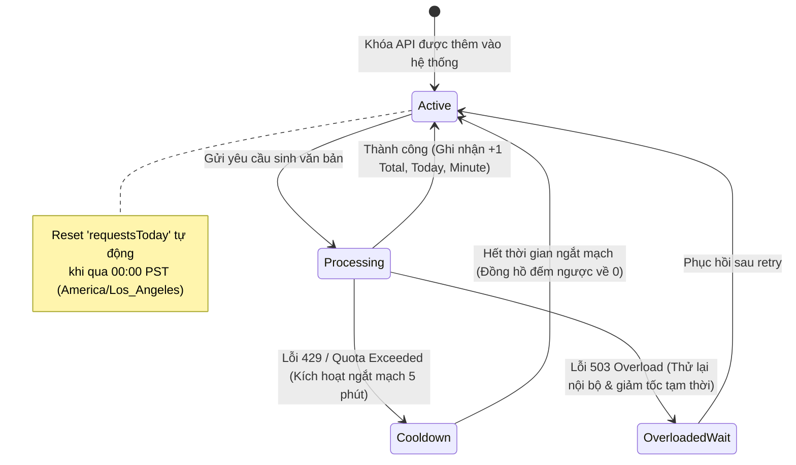

# Data Model: Quota & Usage Tracking Dashboard

**Feature**: [spec.md](./spec.md) | **Date**: 2026-08-19 | **Status**: Complete

## Core Entities & Interfaces

### 1. In-Memory Quota Tracking Structures (`server/services/quotaService.ts`)

```typescript
export type QuotaAttemptStatus = 'success' | 'overloaded' | 'quota_exceeded' | 'safety' | 'error';

export interface ModelUsageStats {
  requestsTotal: number;
  requestsToday: number;
  requestsThisMinute: number;
  errorsTotal: number;
}

export interface KeyQuotaInternalStats {
  keyHash: string;
  maskedKey: string;
  requestsTotal: number;
  requestsToday: number;
  requestsThisMinute: number;
  errorsTotal: number;
  byModel: Record<string, ModelUsageStats>;
  lastResetDay: string;      // Định dạng YYYY-MM-DD theo America/Los_Angeles
  minuteBuckets: Map<number, number>; // Minute timestamp -> count
  lastRequestTimestamp: number;
}

export interface KeyQuotaSnapshot {
  keyHash: string;
  maskedKey: string;
  requestsTotal: number;
  requestsToday: number;
  requestsThisMinute: number;
  errorsTotal: number;
  byModel: Record<string, ModelUsageStats>;
  lastRequestTimestamp?: number;
}
```

---

### 2. Runtime Status & Snapshot DTOs (`server/services/geminiService.ts` & `server/controllers/quotaController.ts`)

```typescript
export interface KeyRuntimeStatus {
  isBlacklisted: boolean;
  blacklistRemainingMs: number;
  isRateLimited: boolean;
  nextAllowedRemainingMs: number;
}

export interface KeyQuotaFullSnapshot extends KeyQuotaSnapshot {
  index: number;
  runtime: KeyRuntimeStatus;
}

export interface QuotaStatusResponse {
  timestamp: string;
  timezone: string; // "America/Los_Angeles"
  currentDayPST: string;
  keys: KeyQuotaFullSnapshot[];
}
```

---

### 3. Model Information & Capabilities (`server/services/modelInfoService.ts`)

```typescript
export interface ModelInfo {
  name: string;
  displayName: string;
  description?: string;
  supportedGenerationMethods?: string[];
  inputTokenLimit?: number;
  outputTokenLimit?: number;
}

export interface CachedModelList {
  timestamp: number;
  models: ModelInfo[];
}

export interface ModelsForKeyResponse {
  keyHash: string;
  maskedKey: string;
  models: ModelInfo[];
  cached: boolean;
}
```

---

### 4. Client-side User Preferences (`src/components/QuotaPanel.tsx`)

```typescript
export interface UserQuotaLimits {
  rpmLimit?: number; // Ví dụ 15 RPM
  rpdLimit?: number; // Ví dụ 1500 RPD
}

export interface UserCustomLimitStore {
  [keyHash: string]: UserQuotaLimits;
}
```

---

## State Lifecycle & Transitions



---

## Validation & Constraint Rules

1. **Khóa băm SHA-256**: Key hash luôn có độ dài đúng 64 ký tự hex viết thường.
2. **Masking Format**: Độ dài chuỗi hiển thị tối đa 13 ký tự (ví dụ `AIzaSy...4xQ`).
3. **Múi giờ**: Chuỗi `lastResetDay` luôn có định dạng `YYYY-MM-DD` được tính từ `Intl.DateTimeFormat` múi giờ `America/Los_Angeles`.
4. **Cache TTL**: Bộ nhớ đệm danh mục model tự hết hạn sau đúng 600,000ms (10 phút).
5. **Timeout**: Truy vấn Google upstream tự động bị ngắt bởi `AbortController` sau 15,000ms.
