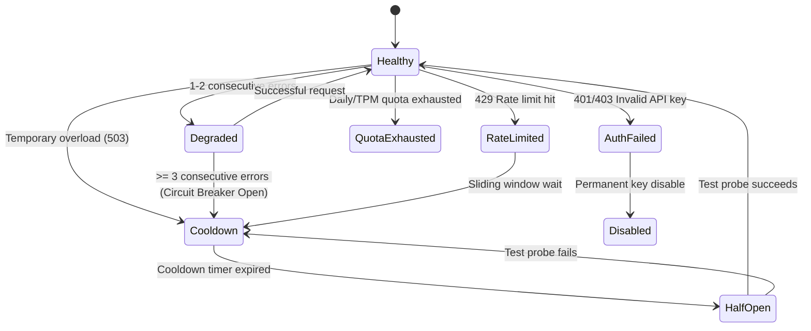

# Data Model & Schema Definitions: Model Quota & System Resilience

**Feature**: `013-model-quota-resilience`  
**Date**: 2026-08-19  
**Status**: Completed  

---

## 1. Core Model System Entities

### `ModelDefinition`
Canonical representation of an AI model across frontend and backend.

```typescript
export type ModelSource = 'preset' | 'discovered' | 'custom';
export type ModelStatus = 'active' | 'deprecated' | 'shutdown';

export interface ModelCapabilities {
  generateContent: boolean;
  structuredOutput?: boolean;
  vision?: boolean;
  thinking?: boolean;
}

export interface ModelLimits {
  defaultRpm: number;
  defaultTpm: number;
  defaultRpd?: number;
}

export interface ModelDefinition {
  id: string;
  label: string;
  source: ModelSource;
  status: ModelStatus;
  capabilities: ModelCapabilities;
  replacementId?: string;
  limits?: ModelLimits;
  description?: string;
  inputTokenLimit?: number;
  outputTokenLimit?: number;
  addedAt?: string;
  deprecatedAt?: string;
  shutdownAt?: string;
}
```

#### Validation Rules:
- `id`: Non-empty, 1-128 characters, matching `/^[a-zA-Z0-9_\-\.\/]{1,128}$/`, no path traversal (`..`), no control characters.
- `capabilities.generateContent`: Must be `true` for a model to be selectable for translation routes.
- `status`: Must be `'active'` for new selections; `'deprecated'` triggers UI warnings and migration hints; `'shutdown'` is blocked from new selections and triggers fallback migration.

---

## 2. API Key Health & Quota Scheduling Entities

### `KeyHealthState` & `KeyHealthRecord`

```typescript
export type KeyHealthState =
  | 'Healthy'
  | 'Degraded'
  | 'RateLimited'
  | 'QuotaExhausted'
  | 'AuthFailed'
  | 'Cooldown'
  | 'Disabled';

export interface KeyHealthRecord {
  keyHash: string;
  maskedKey: string;
  state: KeyHealthState;
  consecutiveErrors: number;
  lastUsedAt: number;
  cooldownUntil: number;
  rpmRemaining: number;
  tpmRemaining: number;
  rpdRemaining: number;
  supportedModels?: Set<string>;
  circuitBreakerState: 'Closed' | 'Open' | 'HalfOpen';
}
```

#### State Transition Machine:



---

## 3. Error Taxonomy Entity

### `AIErrorNormalized`

```typescript
export enum AIErrorCode {
  RATE_LIMITED = "RATE_LIMITED",
  QUOTA_EXCEEDED = "QUOTA_EXCEEDED",
  AUTH_FAILED = "AUTH_FAILED",
  MODEL_NOT_FOUND = "MODEL_NOT_FOUND",
  MODEL_UNSUPPORTED = "MODEL_UNSUPPORTED",
  INVALID_REQUEST = "INVALID_REQUEST",
  SAFETY_BLOCKED = "SAFETY_BLOCKED",
  SERVER_ERROR = "SERVER_ERROR",
  NETWORK_ERROR = "NETWORK_ERROR",
  TIMEOUT = "TIMEOUT",
}

export type AIRecommendedAction =
  | "retry"
  | "rotate_key"
  | "cooldown_key"
  | "disable_key"
  | "fail_immediately";

export interface AIErrorNormalized {
  code: AIErrorCode;
  message: string;
  isRetryable: boolean;
  recommendedAction: AIRecommendedAction;
  httpStatus: number;
  details?: Record<string, unknown>;
}
```

---

## 4. Request Tracing & Idempotency Entities

### `TranslationIdempotencyRecord`

```typescript
export type IdempotencyStatus = 'pending' | 'completed' | 'failed';

export interface TranslationIdempotencyRecord<T = unknown> {
  key: string;
  status: IdempotencyStatus;
  createdAt: number;
  expiresAt: number;
  result?: T;
  error?: string;
  promise?: Promise<T>;
}
```

### `RequestTraceMetadata`

```typescript
export interface RequestTraceMetadata {
  requestId: string;
  sessionId?: string;
  modelId: string;
  keyIndex?: number;
  queueWaitMs?: number;
  generationMs?: number;
  retryCount?: number;
  estimatedTokens?: number;
  actualTokens?: number;
  status: 'success' | 'failed' | 'rate_limited' | 'safety_blocked';
  errorCode?: AIErrorCode;
}
```
