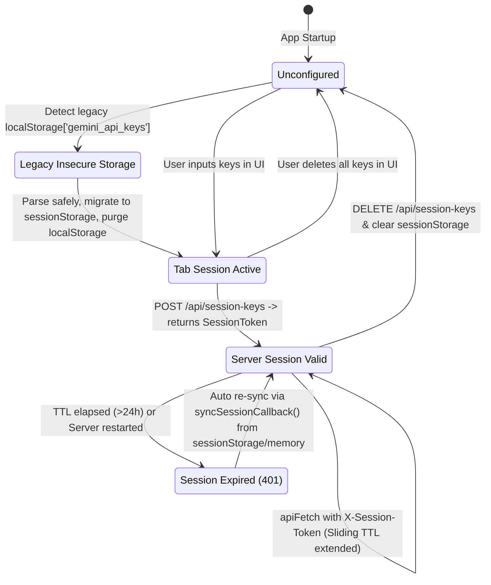

# Data Model & Storage Lifecycle: Protect API Key Storage

## 1. Entities & Data Structures

### 1.1 SessionData (Server Session Store)
Represents the active server-side credential record held in ephemeral memory or Redis.

```typescript
export interface SessionData {
  apiKeys: string[];        // Sanitized, non-empty Gemini API keys
  createdAt: number;        // Epoch timestamp (ms)
  lastAccessedAt: number;   // Epoch timestamp (ms) - updated on each valid request
  expiresAt: number;        // Epoch timestamp (ms) - sliding window deadline
}
```

**Lifecycle Rules**:
- **Creation**: Initialized when client sends `POST /api/session-keys` with an array of keys.
- **Access & Extension**: Every API request with a valid `X-Session-Token` updates `lastAccessedAt = Date.now()` and resets `expiresAt = Date.now() + DEFAULT_SESSION_TTL_MS` (24 hours).
- **Expiration**: Deleted automatically when `Date.now() > expiresAt` via Redis TTL (`PX`) or in-memory cleanup timer (every 10 minutes).
- **Revocation**: Deleted immediately on `DELETE /api/session-keys` or when client sends an empty key array.

---

### 1.2 SessionInfo (Client Public Inspection)
Response object returned to client to confirm session validity without leaking keys.

```typescript
export interface SessionInfo {
  valid: boolean;           // True if session exists and has not expired
  keyCount: number;         // Number of active keys registered in session
  expiresAt?: string;       // ISO 8601 string of upcoming expiration
}
```

---

### 1.3 MaskedKeyInfo (Quota & Observability)
Public projection of an API key for usage analytics and health tracking.

```typescript
export interface MaskedKeyInfo {
  index: number;            // Zero-based index within configured keys
  keyHash: string;          // Non-reversible SHA-256 hash (64 hex characters)
  maskedKey: string;        // Privacy-masked string (e.g. "AIzaSy...4xAb" or "***")
  healthState: 'Healthy' | 'Degraded' | 'RateLimited' | 'QuotaExhausted' | 'AuthFailed' | 'Cooldown' | 'Disabled';
  circuitBreakerStatus: 'Closed' | 'Open' | 'HalfOpen';
}
```

---

### 1.4 ClientStorageState (Browser Storage Scope)

| Storage Key | Storage Scope | Type | Description |
|---|---|---|---|
| `gemini_api_keys` | `sessionStorage` | `string[]` (JSON) | Active keys for current browser tab session |
| `gemini_session_token` | `localStorage` | `string` (UUID) | Opaque session identifier used to authenticate requests |
| `gemini_auth_token` | `localStorage` | `string` (Hex) | Server password authentication token (if password required) |
| `gemini_selected_model` | `localStorage` | `string` | User-selected LLM model identifier |
| `gemini_api_keys` (legacy) | `localStorage` | `string[]` (Deprecated) | **Purged immediately on startup upon migration** |

---

## 2. State Machine & Transition Diagram



---

## 3. Data Integrity & Validation Rules

1. **API Key Trimming & Sanitization**:
   - Every input key must be trimmed of leading and trailing whitespace.
   - Blank or whitespace-only keys must be filtered out before creating a session.
2. **Session Capacity**:
   - Maximum keys per session: `MAX_API_KEYS_PER_REQUEST = 50`.
   - Keys exceeding limit are rejected with HTTP 400.
3. **Legacy Migration Safeguard**:
   - `try-catch` wrapper around JSON parsing of legacy storage.
   - Non-array or malformed data MUST NOT crash the app; it must be safely deleted.
