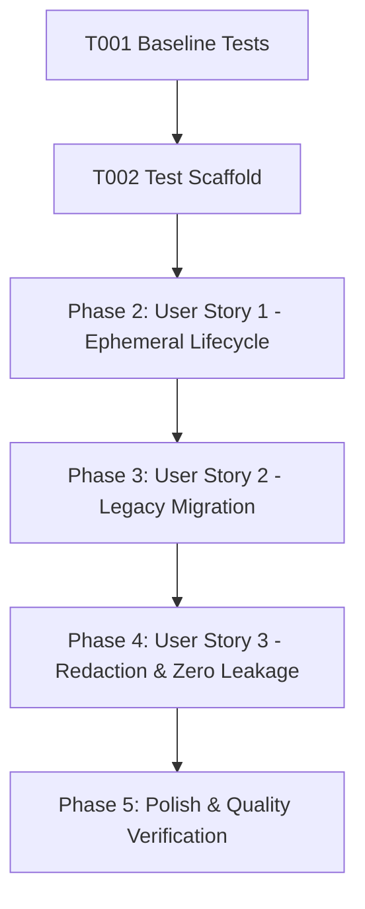

# Tasks: Protect API Key Storage and Secure Credential Lifecycle

**Feature**: Protect API Key Storage & Credential Lifecycle  
**Directory**: `specs/014-protect-api-key-storage/`  
**Plan**: [plan.md](./plan.md) | **Spec**: [spec.md](./spec.md)

## Phase 1: Setup & Foundational Prerequisites

**Purpose**: Baseline checks and test infrastructure for credential storage

- [X] T001 Verify baseline build and test suite passing (`npm test`, `npm run lint`)
- [X] T002 Create test scaffold for credential storage and migration in `src/utils/__tests__/credentialStorage.test.ts`

---

## Phase 2: User Story 1 - Secure Ephemeral Credential Lifecycle & Session Isolation (Priority: P1) 🎯 MVP

**Goal**: Move active API key storage from permanent `localStorage` to ephemeral `sessionStorage` and in-memory state, delegating authentication via `SessionToken`.

**Independent Test**: Configure keys in the UI, verify requests use `X-Session-Token`, confirm no `gemini_api_keys` are written to `localStorage`, and test automated session recovery when the server session expires.

### Tests for User Story 1
- [X] T003 [P] [US1] Add unit test in `src/utils/__tests__/credentialStorage.test.ts` verifying `apiFetch` removes `apiKeys` from payload body and attaches `X-Session-Token`
- [X] T004 [P] [US1] Add unit test in `src/utils/__tests__/credentialStorage.test.ts` verifying automatic 401 `sessionExpired` re-synchronization callback

### Implementation for User Story 1
- [X] T005 [US1] Update `src/hooks/useAIConfig.ts` to manage `apiKeys` in `sessionStorage` + in-memory state instead of `localStorage`
- [X] T006 [US1] Ensure `useAIConfig.ts` triggers `DELETE /api/session-keys` and clears `sessionStorage` when all keys are deleted
- [X] T007 [US1] Update `src/utils/apiClient.ts` to verify session sync and token caching lifecycle

**Checkpoint**: User Story 1 is complete. Keys are held ephemerally in the browser tab and delegated via `SessionToken` without persisting plaintext to `localStorage`.

---

## Phase 3: User Story 2 - Seamless Migration from Legacy Storage (Priority: P2)

**Goal**: Automatically detect, migrate, and purge legacy `localStorage['gemini_api_keys']` on application startup without crashing on corrupted data.

**Independent Test**: Seed `localStorage` with legacy keys or malformed data, reload the hook/app, and verify keys are safely migrated to active session state while legacy `localStorage` entries are cleanly purged.

### Tests for User Story 2
- [X] T008 [P] [US2] Add unit tests in `src/utils/__tests__/credentialStorage.test.ts` for legacy key migration (valid array, whitespace keys, empty array)
- [X] T009 [P] [US2] Add unit tests in `src/utils/__tests__/credentialStorage.test.ts` for corrupted / malformed legacy JSON handling without throwing errors

### Implementation for User Story 2
- [X] T010 [US2] Implement safe migration loader `migrateAndLoadApiKeys()` in `src/hooks/useAIConfig.ts`
- [X] T011 [US2] Add safeguards against malformed storage payloads and ensure immediate removal of legacy keys upon migration

**Checkpoint**: User Story 2 is complete. Existing users are seamlessly migrated to ephemeral storage with zero data loss or crashes.

---

## Phase 4: User Story 3 - Redaction and Zero Plaintext Exposure Across System Boundaries (Priority: P3)

**Goal**: Guarantee zero API key exposure in network responses, error messages, structured logs, and URL query strings.

**Independent Test**: Inspect server routes, controller responses (`/api/quota-status`, `/api/models-for-key`, `/api/session-keys/status`), and structured log outputs to confirm full redaction and masking.

### Tests for User Story 3
- [X] T012 [P] [US3] Add unit tests in `src/utils/__tests__/credentialStorage.test.ts` verifying `redactApiKey` and logger sanitization for `AIza...` key patterns and URL queries
- [X] T013 [P] [US3] Audit and enforce key masking in `server/controllers/quotaController.ts` and `server/services/quotaService.ts`
- [X] T014 [P] [US3] Verify upstream error redaction in `server/services/modelInfoService.ts` and `server/services/geminiService.ts`
- [X] T015 [US3] Audit `server/routes/api.ts` to confirm no endpoint accepts API keys as URL query parameters

**Checkpoint**: All three user stories are complete and validated.

---

## Phase 5: Polish & Quality Verification

**Purpose**: Cross-cutting quality checks and verification gates

- [X] T016 Run full test suite (`npm test`) and ensure all 274+ tests pass
- [X] T017 Run TypeScript type check (`npm run lint` / `tsc --noEmit`) to verify zero type errors
- [X] T018 Run production build (`npm run build`) to verify bundle compilation
- [X] T019 Execute manual walkthrough according to `specs/014-protect-api-key-storage/quickstart.md`

---

## Dependencies & Execution Order

### Parallel Opportunities

- **T003, T004**: Can be authored in parallel within User Story 1.
- **T008, T009**: Can be authored in parallel within User Story 2.
- **T012, T013, T014**: Can run in parallel across controller, service, and test boundaries.

---

## Implementation Strategy

### MVP Scope (User Story 1 + 2)
1. Complete Setup (T001, T002)
2. Implement User Story 1 (T003–T007)
3. Implement User Story 2 (T008–T011)
4. Validate credential lifecycle and migration
5. Add redaction audit (T012–T015)
6. Run full verification gates (T016–T019)
