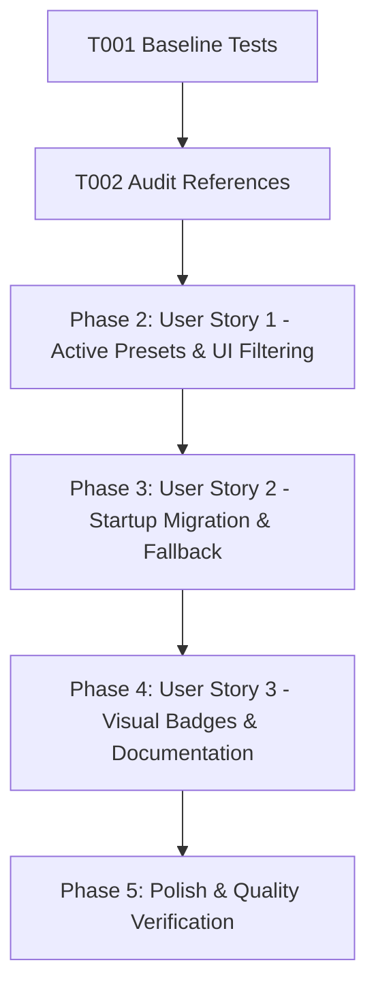

# Tasks: Model Lifecycle Management & Shutdown Model Deactivation

**Feature**: Model Lifecycle Management & Shutdown Deactivation  
**Directory**: `specs/015-model-lifecycle-management/`  
**Plan**: [plan.md](./plan.md) | **Spec**: [spec.md](./spec.md)

## Phase 1: Setup & Foundational Prerequisites

**Purpose**: Baseline verification and model catalog audit

- [X] T001 Verify baseline build and test suite passing (`npm test`, `npm run lint`)
- [X] T002 Audit all model references across `shared/models.ts`, `server/constants/models.ts`, `src/utils/modelRegistry.ts`, and `README.md`

---

## Phase 2: User Story 1 - Active Model Selection & Safe Presets Catalog (Priority: P1) 🎯 MVP

**Goal**: Exclusively present operational, active Gemini and local models in presets and UI dropdowns, removing decommissioned models from selectable choices.

**Independent Test**: Open AI Configuration modal, inspect model dropdown, and verify only active models are selectable (`gemini-3.1-flash-lite`, `gemini-2.5-flash`, `gemini-2.5-pro`, `gemma-4-31b-it`), with 0 shutdown models in the dropdown.

### Tests for User Story 1
- [X] T003 [P] [US1] Add unit tests in `src/utils/__tests__/modelRegistry.test.ts` verifying active preset models and exclusion of shutdown models from active presets list

### Implementation for User Story 1
- [X] T004 [US1] Update `shared/models.ts` catalog: set `gemini-2.0-flash`, `gemini-2.0-flash-lite`, `gemini-1.5-flash`, `gemini-1.5-pro` to `status: 'shutdown'` with `shutdownAt` and `replacementId`
- [X] T005 [US1] Update `src/components/ApiSettings.tsx` to filter out shutdown models from the selectable presets dropdown

**Checkpoint**: User Story 1 is complete. Only active models can be newly selected.

---

## Phase 3: User Story 2 - Automated Migration & Safe Fallback for Persisted Shutdown Models (Priority: P2)

**Goal**: Automatically detect persisted shutdown or invalid models on startup, migrate them to active replacements without crashing, and update local storage.

**Independent Test**: Seed `localStorage` with `gemini-2.0-flash` or malformed ID, initialize hook, and verify transparent migration to `gemini-2.5-flash` or `DEFAULT_MODEL_ID`.

### Tests for User Story 2
- [X] T006 [P] [US2] Add unit tests in `src/utils/__tests__/modelRegistry.test.ts` for `migrateModelSelection` with shutdown models (`gemini-2.0-flash` -> `gemini-2.5-flash`), invalid strings, and defaults

### Implementation for User Story 2
- [X] T007 [US2] Verify `migrateModelSelection` in `src/utils/modelRegistry.ts` and startup migration in `src/hooks/useAIConfig.ts`
- [X] T008 [US2] Verify `server/routes/api.ts` `validateModelMiddleware` and `server/services/geminiService.ts` compatibility with migrated model IDs

**Checkpoint**: User Story 2 is complete. Existing users with legacy selections are safely migrated with zero crashes.

---

## Phase 4: User Story 3 - Visual Lifecycle Indicators & Deprecation Warnings (Priority: P3)

**Goal**: Provide clear warning badges and replacement recommendations for deprecated models in the UI and documentation.

**Independent Test**: Inspect ModelSummaryCard for deprecated and shutdown models, verifying badge rendering and documentation accuracy.

### Tests for User Story 3
- [X] T009 [P] [US3] Add unit tests in `src/components/__tests__/ApiSettingsModelFlow.test.ts` for ModelSummaryCard lifecycle badges and UI preset filtering
- [X] T010 [US3] Update documentation in `README.md` to reference the active Gemini 2.5 and 3.1 model families

**Checkpoint**: All three user stories are complete and documented.

---

## Phase 5: Polish & Quality Verification

**Purpose**: Verification gates across the entire repository

- [X] T011 Run full test suite (`npm test`) and verify all tests pass
- [X] T012 Run TypeScript type check (`npm run lint` / `tsc --noEmit`)
- [X] T013 Run production build (`npm run build`)
- [X] T014 Execute quickstart scenarios in `specs/015-model-lifecycle-management/quickstart.md`

---

## Dependencies & Execution Order

### Parallel Opportunities

- **T003, T006, T009**: Unit test authoring across registry and component test suites can run in parallel.
- **T004, T010**: Schema updates and documentation updates can proceed in parallel.

---

## Implementation Strategy

### MVP Scope (User Story 1 + 2)
1. Complete Setup & Audit (T001, T002)
2. Update model definitions in `shared/models.ts` (T004)
3. Filter shutdown models from UI dropdown in `ApiSettings.tsx` (T005)
4. Verify migration logic and unit tests (T003, T006, T007)
5. Update docs & visual verification (T009, T010)
6. Run full verification gates (T011–T014)
