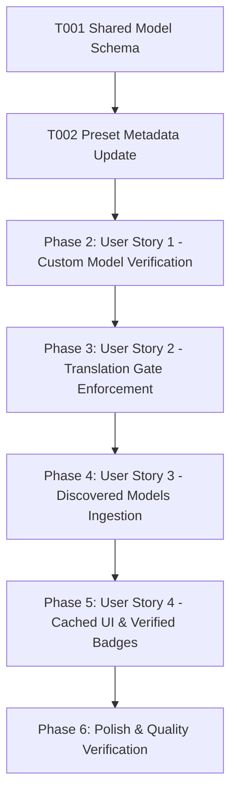

# Tasks: Verified Model Registry & Translation Compatibility Gate

**Feature**: Verified Model Registry & Translation Gate  
**Directory**: `specs/016-verified-model-registry/`  
**Plan**: [plan.md](./plan.md) | **Spec**: [spec.md](./spec.md)

## Phase 1: Setup & Foundational Prerequisites

**Purpose**: Core model schema extension with verification metadata across shared, frontend, and backend modules

- [X] T001 Extend `ModelDefinition` interface with `verified: boolean` and `lastVerifiedAt?: string` in `shared/models.ts`
- [X] T002 Update preset models in `shared/models.ts` and `src/utils/modelRegistry.ts` to include `verified: true` and `lastVerifiedAt` timestamps

---

## Phase 2: User Story 1 - Custom Model Verification & Controlled Registration (Priority: P1) 🎯 MVP

**Goal**: Enable users to add custom model IDs and have the system verify their existence and `generateContent` support via the AI provider before registering them in the active verified registry.

**Independent Test**: Add a valid custom model (`gemini-2.5-flash`) which verifies and registers with `verified: true`, and attempt an invalid/embedding model (`text-embedding-004`) which is rejected with an explanatory Vietnamese error.

### Tests for User Story 1
- [X] T003 [P] [US1] Add unit tests for backend single model verification and error responses in `server/services/__tests__/modelInfoService.test.ts`
- [X] T004 [P] [US1] Add unit tests for custom model verification and registry insertion in `src/utils/__tests__/modelRegistry.test.ts`

### Implementation for User Story 1
- [X] T005 [US1] Implement `verifySingleModel(modelId: string, apiKey: string)` in `server/services/modelInfoService.ts` to inspect model existence and `generateContent` method
- [X] T006 [US1] Implement `verifyModelHandler` in `server/controllers/quotaController.ts` and register endpoint `POST /api/verify-model` in `server/routes/api.ts`
- [X] T007 [US1] Add `verifyModel` helper method to `src/utils/apiClient.ts` for interacting with the verification endpoint
- [X] T008 [US1] Update `addCustomModel` in `src/utils/modelRegistry.ts` to store verified status, capabilities, and verification timestamp
- [X] T009 [US1] Update custom model input form in `src/components/ApiSettings.tsx` to execute verification before registration and display clear error feedback on failure

**Checkpoint**: User Story 1 is complete. Users can safely add and verify custom models with instant validation.

---

## Phase 3: User Story 2 - Translation Pipeline Security & Compatibility Gate (Priority: P1)

**Goal**: Enforce backend validation gate on all translation endpoints (`/translate-raw`, `/polish-translation`, `/qa-critique`, etc.) so only verified, translation-compatible models can execute.

**Independent Test**: Submit translation requests with verified model IDs (succeeds) versus unverified/arbitrary IDs (rejected with HTTP 400/422 and structured error payload).

### Tests for User Story 2
- [X] T010 [P] [US2] Update unit tests in `server/services/__tests__/modelValidation.test.ts` to assert that unverified or non-generative models are rejected by `validateModelMiddleware`
- [X] T011 [P] [US2] Update route validation tests in `server/routes/__tests__/apiValidation.test.ts` to verify HTTP 400/422 responses for unverified model IDs

### Implementation for User Story 2
- [X] T012 [US2] Implement `isModelVerified` helper and server-side verified cache check in `server/services/modelInfoService.ts`
- [X] T013 [US2] Update `validateModelMiddleware` in `server/routes/api.ts` to enforce that requested model IDs are either verified presets or cached verified models (with on-demand verification fallback)

**Checkpoint**: User Story 2 is complete. Backend strictly guards all translation endpoints against unverified models without relying on a static whitelist.

---

## Phase 4: User Story 3 - Discovered Models Ingestion & Verification Normalization (Priority: P2)

**Goal**: Automatically ingest models discovered from API keys into the verified registry with `verified: true`, active status, and normalized capability metadata.

**Independent Test**: Trigger API key model discovery in settings, inspect discovered models list, and verify models have `source: 'discovered'`, `verified: true`, and complete token limits.

### Tests for User Story 3
- [X] T014 [P] [US3] Add unit tests in `src/components/__tests__/ApiSettingsModelFlow.test.ts` for discovered models ingestion with verified metadata

### Implementation for User Story 3
- [X] T015 [US3] Update `saveDiscoveredModels` in `src/utils/modelRegistry.ts` to populate `verified: true`, `lastVerifiedAt`, and verified capabilities for all discovered generative models

**Checkpoint**: User Story 3 is complete. Discovered models from API keys are automatically marked as verified and ready for translation.

---

## Phase 5: User Story 4 - Cached Registry & Low-Overhead UI Rendering (Priority: P3)

**Goal**: Ensure the UI reads model metadata from synchronous local storage and memory cache without firing redundant Gemini verification requests during dialog opens or re-renders.

**Independent Test**: Open and toggle AI Configuration modal repeatedly, verifying 0 outbound verification API calls and proper rendering of green `Đã xác minh` badges.

### Tests for User Story 4
- [X] T016 [P] [US4] Add tests in `src/components/__tests__/ApiSettingsModelFlow.test.ts` verifying UI cache isolation and zero-network overhead on re-render

### Implementation for User Story 4
- [X] T017 [US4] Update ModelSummaryCard and custom/discovered model lists in `src/components/ApiSettings.tsx` to display verified status badges, verification date, and retry verification actions

**Checkpoint**: User Story 4 is complete. UI rendering is instantaneous with rich verified model diagnostics.

---

## Phase 6: Polish & Quality Verification

**Purpose**: Verification gates and cross-cutting assurance

- [X] T018 Run full test suite (`npm test`) and verify all tests pass
- [X] T019 Run TypeScript type check (`npm run lint` / `npx tsc --noEmit`)
- [X] T020 Run production build (`npm run build`)
- [X] T021 Execute validation scenarios in `specs/016-verified-model-registry/quickstart.md`

---

## Dependencies & Execution Order

### Parallel Opportunities

- **T003, T004, T010, T011, T014, T016**: Unit test authoring across backend services, routes, and client registry can run in parallel.
- **T007, T008**: API client method and client model registry helper updates can proceed in parallel.

---

## Implementation Strategy

### MVP Scope (User Story 1 + User Story 2)
1. Complete Phase 1: Shared Schema (T001, T002)
2. Complete Phase 2: Custom Model Verification Backend & Frontend (T003–T009)
3. Complete Phase 3: Translation Gate Enforcement (T010–T013)
4. Validate MVP with automated tests and quickstart scenarios
5. Complete Phase 4 & Phase 5: Discovered Models Ingestion & UI Polish (T014–T017)
6. Run full verification gates (T018–T021)
