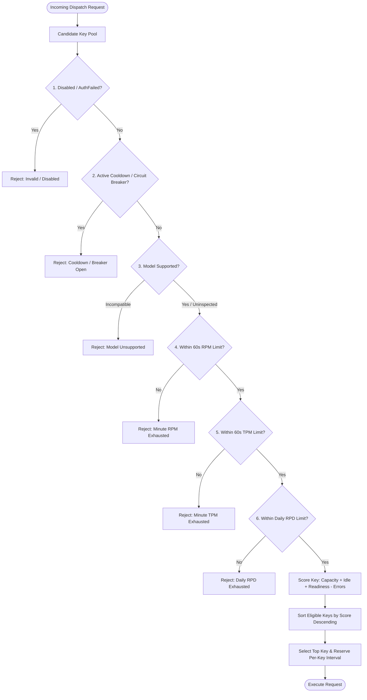

# Data Model: Quota-Aware Per-Key RPM Scheduler & Rotation Pipeline

## 1. Entities & Type Definitions

### 1.1 KeyPacingConfig

```typescript
export interface KeyPacingConfig {
  key: string;                      // Raw or hashed key identifier
  rpm: number;                      // Effective RPM limit (e.g. 15, 60, 120)
  maxTpm: number;                   // Effective TPM limit (default: 1,000,000)
  maxRpd?: number;                  // Effective daily request limit (default: 1,500)
  intervalMs: number;               // Safety dispatch interval (ms)
  nextAllowedTimestamp: number;     // Monotonic timestamp when key is next ready
}
```

---

### 1.2 CandidateKeyEvaluation

```typescript
export interface CandidateKeyEvaluation {
  key: string;
  originalIndex: number;
  isEligible: boolean;
  rejectReason?: string;
  pacingDelayMs: number;
  score: number;
  scoreBreakdown: {
    rpmCapacityScore: number;
    tpmCapacityScore: number;
    idleTimeScore: number;
    pacingReadinessBonus: number;
    errorPenalty: number;
    modelSupportBonus: number;
  };
}
```

---

### 1.3 KeySchedulerResult

```typescript
export interface KeySchedulerResult {
  selectedKey: string;
  selectedKeyIndex: number;
  pacingDelayMs: number;
  sortedCandidates: CandidateKeyEvaluation[];
  exhaustedCandidates: CandidateKeyEvaluation[];
}
```

---

## 2. Decision Tree & Filtering Pipeline


