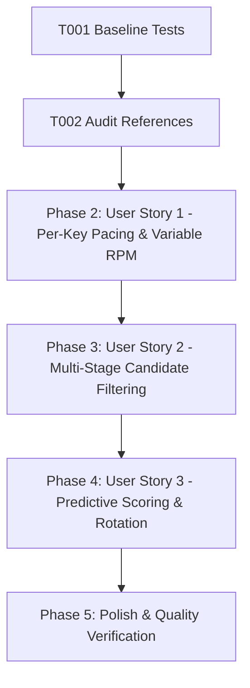

# Tasks: Quota-Aware Per-Key RPM Scheduler

**Feature**: Quota-Aware Per-Key RPM Scheduler  
**Directory**: `specs/017-per-key-rpm-scheduler/`  
**Plan**: [plan.md](./plan.md) | **Spec**: [spec.md](./spec.md)

## Phase 1: Setup & Foundational Prerequisites

**Purpose**: Baseline verification and scheduling pipeline setup

- [X] T001 Verify baseline build and test suite passing (`npm test`, `npm run lint`)
- [X] T002 Audit scheduling references in `server/services/geminiService.ts` and `server/services/quotaService.ts`

---

## Phase 2: User Story 1 - Independent Per-Key Pacing & Variable RPM Scheduling (Priority: P1) 🎯 MVP

**Goal**: Calculate and enforce pacing intervals individually per key (`Key A -> RPM A -> Interval A`, `Key B -> RPM B -> Interval B`) so that high-throughput keys run fast without being throttled by low-tier keys.

**Independent Test**: Provide two keys with 15 RPM and 60 RPM, execute sequential calls, and verify Key 2 operates on ~1.1s interval while Key 1 operates on ~4.5s interval without cross-key clock interference.

### Tests for User Story 1
- [X] T003 [P] [US1] Create unit tests in `server/services/__tests__/keyScheduler.test.ts` for per-key variable interval calculation (`computePerKeyIntervalMs`) and independent pacing clocks

### Implementation for User Story 1
- [X] T004 [US1] Implement per-key interval calculation (`computePerKeyIntervalMs`) and independent pacing clock map in `server/services/geminiService.ts`
- [X] T005 [US1] Connect per-key RPM options and fallback tier models to pacing calculation in `server/services/geminiService.ts`

**Checkpoint**: User Story 1 is complete. Keys operate on separate individual pacing clocks.

---

## Phase 3: User Story 2 - Multi-Dimensional Candidate Key Filtering & Model Support Routing (Priority: P2)

**Goal**: Filter candidate keys across health states, active cooldowns, model compatibility, and capacity constraints (RPM, TPM, RPD) prior to upstream invocation.

**Independent Test**: Test filtering with one key in cooldown, one key exceeding RPM, and one key lacking model support, verifying only eligible keys proceed.

### Tests for User Story 2
- [X] T006 [P] [US2] Add unit tests in `server/services/__tests__/keyScheduler.test.ts` for 6-stage candidate filtering (disabled, cooldown, model support, RPM limit, TPM limit, RPD limit)

### Implementation for User Story 2
- [X] T007 [US2] Implement comprehensive candidate filter pipeline in `server/services/quotaService.ts` and `server/services/geminiService.ts`
- [X] T008 [US2] Integrate model compatibility lookup with `modelInfoService` in key candidate filtering

**Checkpoint**: User Story 2 is complete. Ineligible and capacity-exhausted keys are preemptively filtered.

---

## Phase 4: User Story 3 - Predictive Key Scoring, Automatic Rotation & Parallel Load Balancing (Priority: P3)

**Goal**: Dynamically score eligible keys using remaining capacity, idle time (`now - lastUsedAt`), error history, and pacing readiness for balanced rotation and seamless fallback.

**Independent Test**: Dispatch concurrent requests across multiple keys, verifying balanced round-robin distribution and instant fallback upon simulated transient failure.

### Tests for User Story 3
- [X] T009 [P] [US3] Add unit tests in `server/services/__tests__/keyScheduler.test.ts` for composite scoring, idle-time round-robin rotation, and concurrent request pacing reservations

### Implementation for User Story 3
- [X] T010 [US3] Implement multi-factor key scoring (`calculateKeyScore`) in `server/services/quotaService.ts`
- [X] T011 [US3] Implement automatic rotation and fault-tolerant fallback across sorted candidates in `server/services/geminiService.ts`

**Checkpoint**: All three user stories are complete and validated.

---

## Phase 5: Polish & Quality Verification

**Purpose**: Verification gates across the entire repository

- [X] T012 Run full test suite (`npm test`) and verify all tests pass
- [X] T013 Run TypeScript type check (`npm run lint` / `tsc --noEmit`)
- [X] T014 Run production build (`npm run build`)
- [X] T015 Execute quickstart validation scenarios in `specs/017-per-key-rpm-scheduler/quickstart.md`

---

## Dependencies & Execution Order

### Parallel Opportunities

- **T003, T006, T009**: Test authoring for each user story can proceed in parallel.
- **T004, T010**: Gemini pacing functions and QuotaService scoring logic can be authored in parallel.

---

## Implementation Strategy

### MVP Scope (User Story 1 + 2)
1. Complete Setup & Audit (T001, T002)
2. Implement Per-Key Interval & Pacing (T003–T005)
3. Implement 6-Stage Candidate Filtering (T006–T008)
4. Implement Predictive Scoring & Fallback Rotation (T009–T011)
5. Run full verification gates (T012–T015)
