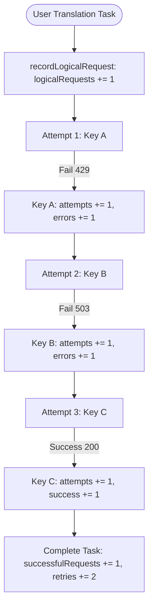

# Research: Decoupling Logical Requests and Provider Attempts

## Phase 0: Technical Analysis & Metric Semantics

### 1. Problem Space

In a multi-key rotation and resilient fallback architecture:
- A single user operation (e.g. "Dịch 1 đoạn văn" / 1 Translation Task) may require multiple upstream API attempts across candidate keys due to transient 429/503 rate limits or load balancing.
- Previously, counting each upstream API attempt as a generic "Request" created confusion:
  - Users perceived that 3 separate translations occurred when in reality 1 translation experienced 2 retries across 3 keys.
  - Dashboards conflated user throughput with upstream provider consumption.

---

### 2. Architectural Solution & Metric Taxonomy

#### Level 1: Logical Translation Requests (User Dimension)
- **`logicalRequestsTotal`**: Total user-initiated translation jobs dispatched.
- **`successfulRequestsTotal`**: Translation jobs that completed and returned translated text.
- **`failedRequestsTotal`**: Translation jobs that failed after exhausting all candidate keys.
- **`retriesTotal`**: Cumulative fallback retries performed across all logical requests ($\sum \max(0, \text{attempts} - 1)$).

#### Level 2: Provider Attempts & Quota Consumption (Key/API Dimension)
- **`providerAttemptsTotal`**: Total physical HTTP/gRPC calls made to the Gemini API.
- **`successfulAttemptsTotal`**: Upstream API calls that returned HTTP 200 / success.
- **`failedAttemptsTotal`**: Upstream API calls that failed with error responses (429, 503, 500, etc.).
- **Per-Key Provider Quota**:
  - `requestsToday`, `requestsThisMinute`, `tokensToday`, `tokensThisMinute` accurately reflect physical API consumption on that specific key for rate-limiting calculations (RPM/TPM/RPD).

---

### 3. Metric Aggregation & Synchronization

