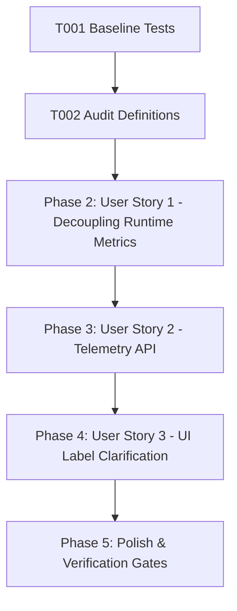

# Tasks: Decoupling Logical Requests and Provider Attempts

**Feature**: Decoupling Logical Requests and Provider Attempts  
**Directory**: `specs/018-logical-vs-provider-metrics/`  
**Plan**: [plan.md](./plan.md) | **Spec**: [spec.md](./spec.md)

## Phase 1: Setup & Foundational Prerequisites

**Purpose**: Baseline verification and metric schema audit

- [X] T001 Verify baseline build and test suite passing (`npm test`, `npm run lint`)
- [X] T002 Audit metric definitions across `server/services/quotaService.ts` and `server/services/geminiService.ts`

---

## Phase 2: User Story 1 - Decoupling Logical Requests from Provider Attempts (Priority: P1) 🎯 MVP

**Goal**: Track logical translation requests, provider API attempts, and fallback retries distinctly (`1 translation, 3 keys -> 1 logicalRequest, 3 providerAttempts, 2 retries`).

**Independent Test**: Execute 1 translation that fails on Key 1 and Key 2 before succeeding on Key 3. Assert `logicalRequests = 1`, `providerAttempts = 3`, `retries = 2`, `successfulRequests = 1`.

### Tests for User Story 1
- [X] T003 [P] [US1] Create unit tests in `server/services/__tests__/logicalMetrics.test.ts` for single attempt success, single retry, multi-key rotation, and all attempts failure

### Implementation for User Story 1
- [X] T004 [US1] Implement `LogicalSummaryStats`, `ModelLogicalStats`, and `recordLogicalRequest` in `server/services/quotaService.ts`
- [X] T005 [US1] Integrate `recordLogicalRequest` lifecycle inside `generateWithRotation` in `server/services/geminiService.ts`

**Checkpoint**: User Story 1 is complete. Logical requests and provider attempts are decoupled at runtime.

---

## Phase 3: User Story 2 - Comprehensive Telemetry & Observability API (Priority: P2)

**Goal**: Expose both high-level user productivity summaries and low-level per-key quota telemetry via `/api/quota-status`.

**Independent Test**: Query `/api/quota-status` after requests and verify payload contains both `summary` (logical metrics) and per-key `keys` snapshots.

### Tests for User Story 2
- [X] T006 [P] [US2] Add unit tests in `server/services/__tests__/logicalMetrics.test.ts` for `/api/quota-status` response payload structure (system summary + per-key provider stats)

### Implementation for User Story 2
- [X] T007 [US2] Update `getQuotaSnapshot` in `server/services/quotaService.ts` to include `LogicalSummaryStats` and per-model summaries
- [X] T008 [US2] Update `/api/quota-status` route in `server/routes/api.ts` to expose structured telemetry

**Checkpoint**: User Story 2 is complete. API exposes rich logical and provider metrics.

---

## Phase 4: User Story 3 - UI Dashboard Label Clarification (Priority: P3)

**Goal**: Update QuotaPanel UI cards and headers to clearly display Vietnamese terminology ("Yêu cầu dịch", "Lượt gọi API", "Lượt thử lại") without design system violations.

**Independent Test**: Render `QuotaPanel` and verify distinct metrics cards for Translation Requests, API Attempts, and Retries.

### Tests for User Story 3
- [X] T009 [P] [US3] Add unit test in `src/components/__tests__/QuotaPanelMetrics.test.ts` validating card labels and tooltip descriptions

### Implementation for User Story 3
- [X] T010 [US3] Update `src/components/QuotaPanel.tsx` metric labels to clearly distinguish "Yêu cầu dịch" (Logical Requests), "Lượt gọi API" (Provider Attempts), and "Lượt thử lại" (Retries)

**Checkpoint**: All user stories are complete and validated.

---

## Phase 5: Polish & Quality Verification

**Purpose**: Repository-wide quality gates

- [X] T011 Run full test suite (`npm test`) and verify all tests pass
- [X] T012 Run TypeScript type check (`npm run lint` / `tsc --noEmit`)
- [X] T013 Run production build (`npm run build`)
- [X] T014 Execute quickstart validation scenarios in `specs/018-logical-vs-provider-metrics/quickstart.md`

---

## Dependencies & Execution Order

### Parallel Opportunities

- **T003, T006, T009**: Test suites can be authored in parallel.
- **T004, T010**: Server-side metrics and client UI can be developed in parallel.

---

## Implementation Strategy

### MVP Scope (User Story 1 + 2)
1. Complete Setup & Audit (T001, T002)
2. Implement Logical vs Provider Metrics Engine (T003–T005)
3. Expose Unified Telemetry Payload (T006–T008)
4. Clarify Dashboard Terminology in UI (T009, T010)
5. Run full verification gates (T011–T014)
