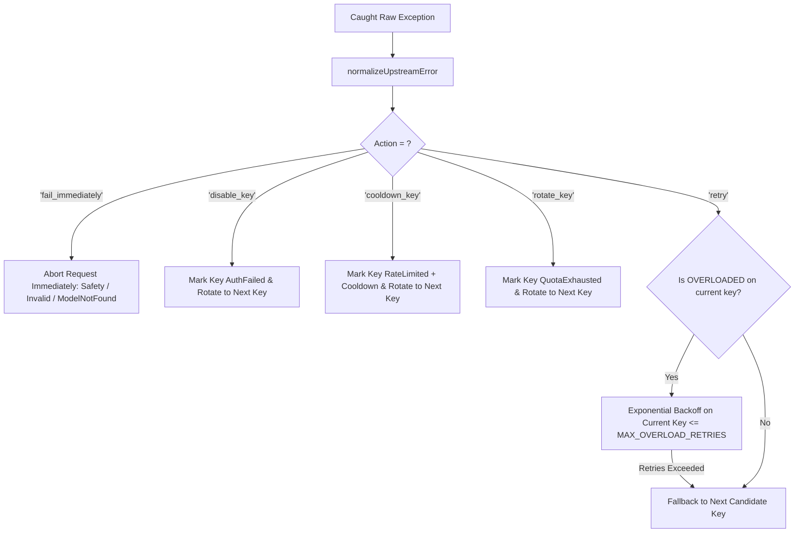

# Research: Centralized Error Taxonomy & Smart Retry Engine

## Phase 0: Technical Architecture & Deep Inspection

### 1. Problem Space

Previously, error handling and retry decisions suffered from two major architectural flaws:
1. **Scattered Pattern Matching**: Ad-hoc `message.includes('safety')` and `message.includes('503')` were repeated across `geminiService.ts`, controllers, and test mocks.
2. **Missing Granularity in Error Taxonomy**: Overload errors were mixed with generic 500 server errors, and quota exhaustion (RPD) wasn't cleanly separated from minute rate limits (RPM/TPM) in retry policies.

---

### 2. Standardized 12-Category Error Taxonomy

```typescript
export enum AIErrorCode {
  RATE_LIMITED = 'RATE_LIMITED',         // 429 RPM/TPM sliding window limit
  QUOTA_EXCEEDED = 'QUOTA_EXCEEDED',     // 429 RPD daily quota exhausted
  AUTH_FAILED = 'AUTH_FAILED',           // 401/403 Invalid API key or permission denied
  MODEL_NOT_FOUND = 'MODEL_NOT_FOUND',   // 404 Model not found / retired
  MODEL_UNSUPPORTED = 'MODEL_UNSUPPORTED',// 400 Model does not support generateContent
  INVALID_REQUEST = 'INVALID_REQUEST',   // 400 Invalid argument / schema
  SAFETY_BLOCKED = 'SAFETY_BLOCKED',     // 400 Safety / Recitation / Blocklist filter
  OVERLOADED = 'OVERLOADED',             // 503 Model overloaded / High demand
  NETWORK_ERROR = 'NETWORK_ERROR',       // 502 Connection reset / DNS failure / Fetch failed
  TIMEOUT = 'TIMEOUT',                   // 504 AbortError / Gateway timeout
  SERVER_ERROR = 'SERVER_ERROR',         // 500 Internal server error
  UNKNOWN = 'UNKNOWN',                   // Fallback unknown exception
}
```

---

### 3. Normalize-First Smart Retry Decision Flow


