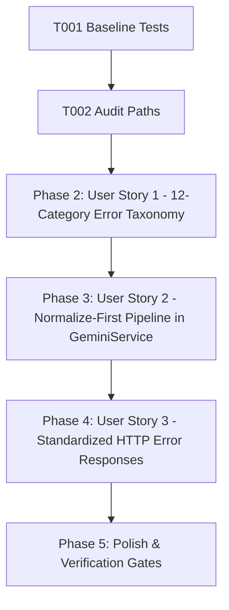

# Tasks: Error Taxonomy & Smart Retry Engine

**Feature**: Error Taxonomy & Smart Retry Engine  
**Directory**: `specs/019-error-taxonomy-smart-retry/`  
**Plan**: [plan.md](./plan.md) | **Spec**: [spec.md](./spec.md)

## Phase 1: Setup & Foundational Prerequisites

**Purpose**: Baseline verification and error handling audit

- [X] T001 Verify baseline build and test suite passing (`npm test`, `npm run lint`)
- [X] T002 Audit all error handling paths across `server/` to identify scattered string matches

---

## Phase 2: User Story 1 - Structured Error Classification & Smart Retry Policy (Priority: P1) 🎯 MVP

**Goal**: Standardize 12-category `AIErrorCode` enum and normalize raw upstream exceptions into structured `AIErrorNormalized` objects.

**Independent Test**: Test normalization for all 12 categories (RATE_LIMITED, QUOTA_EXCEEDED, AUTH_FAILED, MODEL_NOT_FOUND, MODEL_UNSUPPORTED, INVALID_REQUEST, SAFETY_BLOCKED, OVERLOADED, NETWORK_ERROR, TIMEOUT, SERVER_ERROR, UNKNOWN), asserting expected `isRetryable`, `recommendedAction`, and `httpStatus`.

### Tests for User Story 1
- [X] T003 [P] [US1] Create unit tests in `server/utils/__tests__/errorClassifier.test.ts` for all 12 taxonomy categories, structural inspection, and smart retry policies

### Implementation for User Story 1
- [X] T004 [US1] Update `AIErrorCode` and `AIRecommendedAction` in `server/constants/errors.ts` with `OVERLOADED` and `UNKNOWN`
- [X] T005 [US1] Implement structural error normalization and smart action mapping in `server/utils/errorClassifier.ts`

**Checkpoint**: User Story 1 is complete. All 12 error categories normalize deterministically.

---

## Phase 3: User Story 2 - Normalize-First Centralized Pipeline (Priority: P2)

**Goal**: Eliminate scattered `message.includes(...)` substring checks from `geminiService.ts` and controllers in favor of centralized normalization.

**Independent Test**: Assert that `isOverloadError` and `isSafetyOrEmptyError` delegate directly to `normalizeUpstreamError` and `geminiService` executes actions based on `normalized.recommendedAction`.

### Tests for User Story 2
- [X] T006 [P] [US2] Update unit tests in `server/services/__tests__/geminiService.test.ts` for delegate functions and retry action execution
- [X] T007 [US2] Refactor `server/services/geminiService.ts` to eliminate scattered string checks and execute smart retry actions (`fail_immediately`, `disable_key`, `cooldown_key`, `rotate_key`, `retry`)
- [X] T008 [US2] Update `server/services/quotaService.ts` error handling to support `OVERLOADED` and all 12 error codes

**Checkpoint**: User Story 2 is complete. Zero scattered ad-hoc string checks remain in core services.

---

## Phase 4: User Story 3 - Predictable HTTP Error Responses (Priority: P3)

**Goal**: Standardize controller catch blocks to return consistent HTTP status codes and structured `{ error, code, isRetryable, retryAfterSec }` responses.

**Independent Test**: Send failing requests through translation controllers, verifying serialized error JSON structure and HTTP status.

### Tests for User Story 3
- [X] T009 [P] [US3] Update controller tests in `server/controllers/__tests__/glossaryController.test.ts` to assert normalized error responses
- [X] T010 [US3] Standardize controller catch blocks across translation controllers (`translateController.ts`, `polishController.ts`, `rawController.ts`, `glossaryController.ts`, `qaController.ts`)

**Checkpoint**: All user stories are complete and validated.

---

## Phase 5: Polish & Quality Verification

**Purpose**: Repository-wide quality verification gates

- [X] T011 Run full test suite (`npm test`) and verify all tests pass
- [X] T012 Run TypeScript type check (`npm run lint` / `tsc --noEmit`)
- [X] T013 Run production build (`npm run build`)
- [X] T014 Execute quickstart validation scenarios in `specs/019-error-taxonomy-smart-retry/quickstart.md`

---

## Dependencies & Execution Order

### Parallel Opportunities

- **T003, T006, T009**: Test suites can be authored in parallel.
- **T004, T005**: Enum extensions and classifier implementation can be written in parallel.

---

## Implementation Strategy

### MVP Scope (User Story 1 + 2)
1. Complete Setup & Audit (T001, T002)
2. Implement 12-Category Taxonomy & Classifier (T003–T005)
3. Refactor GeminiService & QuotaService to Normalize-First (T006–T008)
4. Standardize Controller Responses (T009, T010)
5. Run full verification gates (T011–T014)
