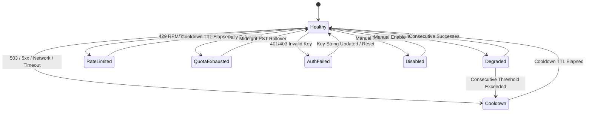

# Research: Key Health State Machine & Recovery Engine

## Phase 0: Technical Architecture & Analysis

### 1. Problem Space & Motivations

1. **Dual / Divergent Tracking**: `geminiService.ts` maintained a local `blacklistedKeys` Map alongside `quotaService.ts`'s health states, creating synchronization overhead and confusion in runtime telemetry.
2. **Missing Transition Reasons & Explicit Recovery Policies**: Transitions occurred implicitly without recording the triggering cause (401, 429, 503, Network, Quota, Manual), and recovery policies were partially implicit.

---

### 2. State Machine Diagram

---

### 3. State & Recovery Rules

| Health State | `isAvailable` | Trigger Cause | Recovery Policy |
|---|:---:|---|---|
| `Healthy` | **true** | Initial / Probe success | Active state |
| `Degraded` | **true** | 1–2 transient errors | Recovers to `Healthy` after 2 consecutive successes |
| `RateLimited` | **false** | 429 RPM/TPM limit | Recovers to `Healthy` after TTL (5s) |
| `QuotaExhausted` | **false** | 429 RPD daily exhausted | Recovers to `Healthy` at 00:00 PST (next day window) |
| `AuthFailed` | **false** | 401/403 Invalid API key | **Permanent** (No auto-recovery; requires key update) |
| `Cooldown` | **false** | 503 / 5xx / Network / Timeout | Recovers to `Healthy` after TTL (3–8s) |
| `Disabled` | **false** | Manual toggle | Manual re-enable only |
