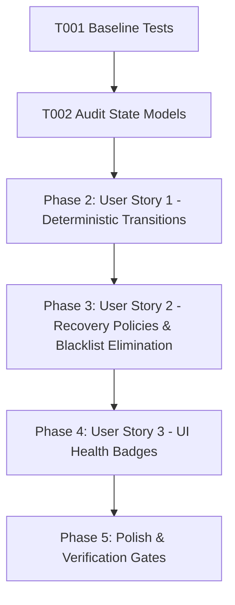

# Tasks: Key Health State Machine & Recovery Engine

**Feature**: Key Health State Machine & Recovery Engine  
**Directory**: `specs/020-key-health-state-machine/`  
**Plan**: [plan.md](./plan.md) | **Spec**: [spec.md](./spec.md)

## Phase 1: Setup & Foundational Prerequisites

**Purpose**: Baseline verification and key health audit

- [X] T001 Verify baseline build and test suite passing (`npm test`, `npm run lint`)
- [X] T002 Audit key health state models in `quotaService.ts` and `geminiService.ts`

---

## Phase 2: User Story 1 - Deterministic Key Health State Machine Transitions (Priority: P1) 🎯 MVP

**Goal**: Implement canonical 7-state State Machine (`Healthy`, `Degraded`, `RateLimited`, `QuotaExhausted`, `AuthFailed`, `Cooldown`, `Disabled`) with transition cause recording.

**Independent Test**: Simulate 401, 429, 503, RPD exhaustion, network errors, and manual disables; assert exact state transitions and recorded `transitionReason`.

### Tests for User Story 1
- [X] T003 [P] [US1] Create unit tests in `server/services/__tests__/keyHealthStateMachine.test.ts` for all state transitions (401 AuthFailed, 429 RateLimited, RPD QuotaExhausted, 503 Cooldown, Degraded, and Disabled)

### Implementation for User Story 1
- [X] T004 [US1] Enhance `KeyUsageStatsInternal` in `server/services/quotaService.ts` to track `transitionReason`, `lastTransitionAt`, and `consecutiveSuccesses`
- [X] T005 [US1] Implement deterministic transition logic in `recordCategorizedError` and `recordUsage` in `server/services/quotaService.ts`

**Checkpoint**: User Story 1 is complete. State transitions record reasons and timestamps deterministically.

---

## Phase 3: User Story 2 - State Machine Recovery Policies (Priority: P2)

**Goal**: Execute designated recovery policies (TTL elapsed, midnight PST daily reset, success probe, and permanent non-recovery for AuthFailed). Remove legacy `blacklistedKeys` map.

**Independent Test**: Advance time and assert that `Cooldown`/`RateLimited` recover to `Healthy`, `QuotaExhausted` recovers on next day, while `AuthFailed` never auto-recovers.

### Tests for User Story 2
- [X] T006 [P] [US2] Create unit tests in `server/services/__tests__/keyHealthStateMachine.test.ts` for recovery policies (TTL recovery, PST midnight rollover, success probes, and permanent non-recovery of AuthFailed)
- [X] T007 [US2] Implement explicit recovery evaluation in `getKeyHealth` in `server/services/quotaService.ts`
- [X] T008 [US2] Remove legacy `blacklistedKeys` map from `server/services/geminiService.ts` and delegate 100% of runtime health checks to `quotaService.getKeyHealth(key)`

**Checkpoint**: User Story 2 is complete. Redundant blacklist map removed; recovery policies active.

---

## Phase 4: User Story 3 - Unification of Runtime Status & UI Dashboard Telemetry (Priority: P3)

**Goal**: Display real health state (`Healthy`, `Degraded`, `RateLimited`, `QuotaExhausted`, `AuthFailed`, `Cooldown`, `Disabled`) with existing Design System Badges in `QuotaPanel.tsx`.

**Independent Test**: Render `QuotaPanel` with keys in various health states and verify badge tones (`polish`, `warning`, `neutral`) and cooldown countdowns.

### Tests for User Story 3
- [X] T009 [P] [US3] Add unit tests in `src/components/__tests__/QuotaPanelHealthBadges.test.ts` for rendering live health state badges

### Implementation for User Story 3
- [X] T010 [US3] Update `src/components/QuotaPanel.tsx` to render real health state badges with transition reasons using Design System primitives

**Checkpoint**: All user stories are complete and validated.

---

## Phase 5: Polish & Quality Verification

**Purpose**: Repository-wide quality verification gates

- [X] T011 Run full test suite (`npm test`) and verify all tests pass
- [X] T012 Run TypeScript type check (`npm run lint` / `tsc --noEmit`)
- [X] T013 Run production build (`npm run build`)
- [X] T014 Execute quickstart validation scenarios in `specs/020-key-health-state-machine/quickstart.md`

---

## Dependencies & Execution Order

### Parallel Opportunities

- **T003, T006, T009**: Test suites can be authored in parallel.
- **T004, T005, T008**: Service enhancements and map cleanup can proceed in parallel.

---

## Implementation Strategy

### MVP Scope (User Story 1 + 2)
1. Complete Setup & Audit (T001, T002)
2. Implement 7-State Transitions & Transition Reasons (T003–T005)
3. Implement Recovery Policies & Remove Blacklist Map (T006–T008)
4. Update UI Status Badges (T009, T010)
5. Run full verification gates (T011–T014)
