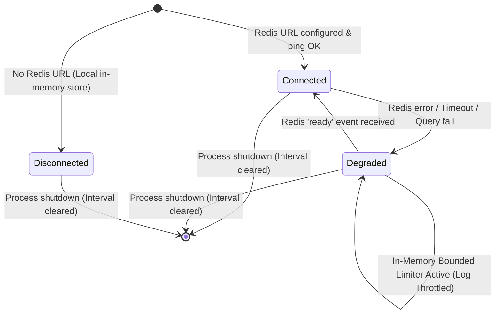

# Research: Redis Graceful Degradation & Differentiated Local Fallback

## Phase 0: Technical Architecture & Analysis

### 1. Problem Space & Motivations

1. **Failure Modes in Distributed Limiting**:
   - **Fail-Open Risk**: If Redis fails and limiter blindly calls `next()`, unthrottled abusive traffic can overwhelm downstream Gemini APIs and exhaust quotas.
   - **Fail-Dead Risk**: If Redis errors propagate unhandled or throw 500s, the entire translation service halts.
   - **Log Saturation**: Logging every Redis timeout or connection error per request under high throughput causes I/O thrashing.
2. **Endpoint Differentiation**:
   - Authentication brute-force protection (`/api/auth/login`) requires strict limits (5 req/15min) even in outage.
   - Translation endpoints (`/api/translate`, `/api/polish`, etc.) require standard capacity (60 req/min).
   - Non-critical routes (models lookup, status checks) can allow higher throughput (120 req/min).

---

### 2. State Machine & Transition Lifecycle

---

### 3. Degradation Policy Matrix

| Policy Type | Target Routes | Normal (Redis) Limit | Degraded (In-Memory) Limit | Action on Exceed |
|---|---|:---:|:---:|:---:|
| `auth` | `POST /api/auth/login` | 5 req / 15 min | 5 req / 15 min | 429 `{ code: 'RATE_LIMITED' }` |
| `translation` | `POST /api/translate`, `polish`, `raw`, `qa`, `glossary` | 60 req / 1 min | 60 req / 1 min | 429 `{ code: 'RATE_LIMITED' }` |
| `non-critical` | `GET /api/models`, status checks | 120 req / 1 min | 120 req / 1 min | 429 `{ code: 'RATE_LIMITED' }` |
