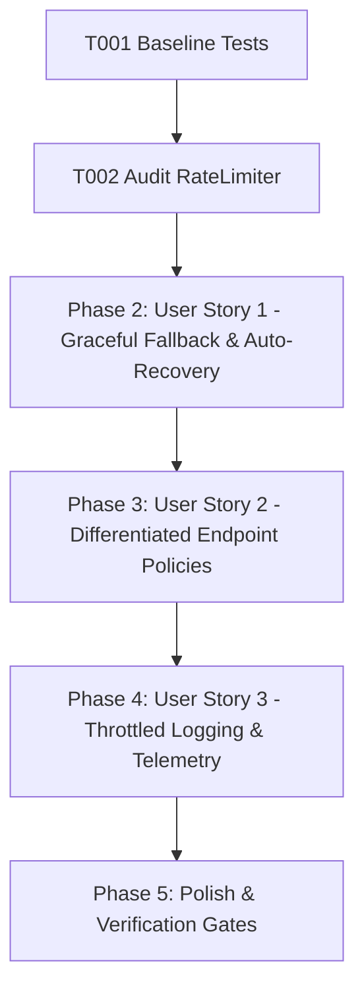

# Tasks: Redis Graceful Degradation & Differentiated Local Fallback

**Feature**: Redis Graceful Degradation & Differentiated Local Fallback  
**Directory**: `specs/021-redis-graceful-degradation/`  
**Plan**: [plan.md](./plan.md) | **Spec**: [spec.md](./spec.md)

## Phase 1: Setup & Foundational Prerequisites

**Purpose**: Baseline verification and rate limiter audit

- [X] T001 Verify baseline build and test suite passing (`npm test`, `npm run lint`)
- [X] T002 Audit existing rate limiter implementation in `server/middleware/rateLimiter.ts` and `server/routes/api.ts`

---

## Phase 2: User Story 1 - Graceful In-Memory Fallback & Automatic Redis Recovery (Priority: P1) 🎯 MVP

**Goal**: Seamless transition to bounded in-memory fallback during Redis outages and immediate self-healing on reconnection.

**Independent Test**: Simulate Redis disconnections/query failures and assert that rate limiting continues in-memory (rejecting floods > threshold without application crashes), and auto-switches back to Redis on `ready` event.

### Tests for User Story 1
- [X] T003 [P] [US1] Create unit tests in `server/middleware/__tests__/rateLimiterDegradation.test.ts` for Redis outage fallback, bounded memory capacity (10,000 max), TTL cleanup, and auto-reconnection recovery

### Implementation for User Story 1
- [X] T004 [US1] Implement bounded fallback map, auto-reconnection listener, and recovery logic in `server/middleware/rateLimiter.ts`

**Checkpoint**: User Story 1 is complete. Redis outages degrade gracefully to in-memory store without fail-open or fail-dead.

---

## Phase 3: User Story 2 - Differentiated Endpoint Failure Policies (Priority: P2)

**Goal**: Support endpoint-specific policies (`auth` strict 5 req/15min, `translation` conservative 60 req/min, `non-critical` 120 req/min).

**Independent Test**: Send excess requests to auth vs translation endpoints in degraded mode, asserting that auth enforces strict 5 req/15min while translation allows standard 60 req/min.

### Tests for User Story 2
- [X] T005 [P] [US2] Create unit tests in `server/middleware/__tests__/rateLimiterDegradation.test.ts` for endpoint-specific policies (`auth`, `translation`, `non-critical`)

### Implementation for User Story 2
- [X] T006 [US2] Update `RateLimiterOptions` in `server/middleware/rateLimiter.ts` with `endpointType` presets and apply to routes in `server/routes/api.ts` and `server.ts`

**Checkpoint**: User Story 2 is complete. Endpoint-specific degradation policies active.

---

## Phase 4: User Story 3 - Throttled Logging & Telemetry Observability (Priority: P3)

**Goal**: Suppress per-request error log spam during Redis outages and export runtime health telemetry (`getRateLimiterStatus`).

**Independent Test**: Send 100 requests during Redis outage and assert $\le 2$ warning log emissions, while `getRateLimiterStatus()` reports `redisStatus = 'degraded'`.

### Tests for User Story 3
- [X] T007 [P] [US3] Create unit tests for log spam throttling and telemetry query (`getRateLimiterStatus`) in `server/middleware/__tests__/rateLimiterDegradation.test.ts`

### Implementation for User Story 3
- [X] T008 [US3] Implement throttled log warnings and export `getRateLimiterStatus()` in `server/middleware/rateLimiter.ts`

**Checkpoint**: All user stories are complete and validated.

---

## Phase 5: Polish & Quality Verification

**Purpose**: Repository-wide quality verification gates

- [X] T009 Run full test suite (`npm test`) and verify all tests pass
- [X] T010 Run TypeScript type check (`npm run lint` / `tsc --noEmit`)
- [X] T011 Run production build (`npm run build`)
- [X] T012 Execute quickstart validation scenarios in `specs/021-redis-graceful-degradation/quickstart.md`

---

## Dependencies & Execution Order

### Parallel Opportunities

- **T003, T005, T007**: Test suites can be authored in parallel.
- **T004, T006, T008**: Core middleware enhancements can proceed concurrently.

---

## Implementation Strategy

### MVP Scope (User Story 1 + 2)
1. Complete Setup & Audit (T001, T002)
2. Implement Bounded Fallback & Reconnection Recovery (T003, T004)
3. Implement Endpoint Differentiation (`auth`, `translation`, `non-critical`) (T005, T006)
4. Implement Log Throttling & Telemetry (T007, T008)
5. Run full verification gates (T009–T012)
