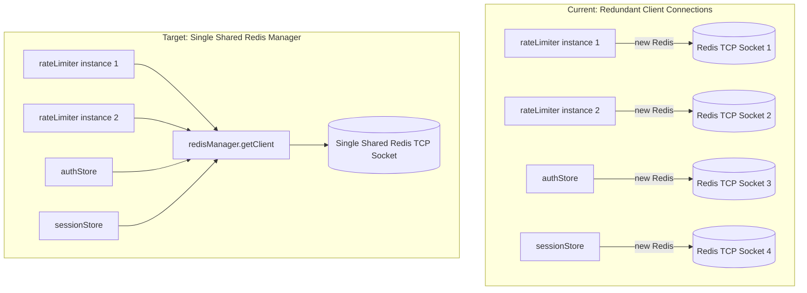
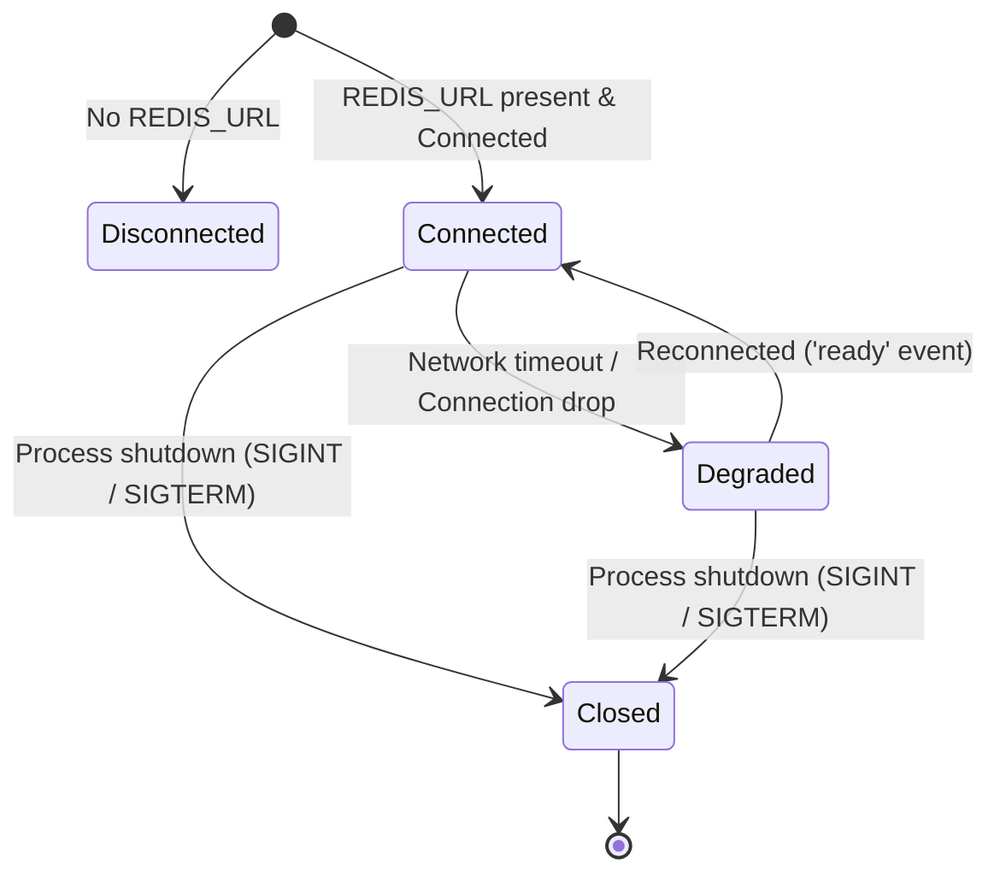

# Research: Shared Redis Connection Manager & Lifecycle Engine

## Phase 0: Technical Architecture & Analysis

### 1. Current State vs Target Architecture

---

### 2. Connection Lifecycle & Graceful Shutdown

---

### 3. Graceful Shutdown & Resource Cleanup

- `redisManager.close()` invokes `await client.quit()`, ensuring any pending commands are flushed and the TCP socket closes cleanly.
- `server.ts` registers a unified shutdown handler listening for `SIGINT` and `SIGTERM`.
