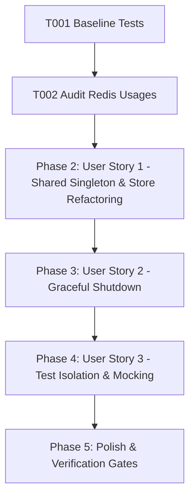

# Tasks: Shared Redis Connection Manager & Lifecycle Engine

**Feature**: Shared Redis Connection Manager & Lifecycle Engine  
**Directory**: `specs/022-shared-redis-connection/`  
**Plan**: [plan.md](./plan.md) | **Spec**: [spec.md](./spec.md)

## Phase 1: Setup & Foundational Prerequisites

**Purpose**: Baseline verification and Redis client audit

- [X] T001 Verify baseline build and test suite passing (`npm test`, `npm run lint`)
- [X] T002 Audit all `new Redis(...)` usages in `server/middleware/rateLimiter.ts`, `server/services/authStore.ts`, and `server/services/sessionStore.ts`

---

## Phase 2: User Story 1 - Shared Redis Connection Singleton & Reuse (Priority: P1) 🎯 MVP

**Goal**: Centralize all Redis connections into a single shared singleton client instance managed by `redisManager`.

**Independent Test**: Initialize `authStore`, `sessionStore`, and `rateLimiter` and assert that all consume the identical `Redis` client instance (`client1 === client2`).

### Tests for User Story 1
- [X] T003 [P] [US1] Create unit tests in `server/services/__tests__/redisService.test.ts` for singleton client reuse, null return when `REDIS_URL` is absent, and connection failure handling

### Implementation for User Story 1
- [X] T004 [US1] Implement `RedisManager` and singleton `redisManager` export in `server/services/redisService.ts`
- [X] T005 [US1] Refactor `server/services/authStore.ts`, `server/services/sessionStore.ts`, and `server/middleware/rateLimiter.ts` to consume `redisManager.getClient()` instead of instantiating `new Redis(...)`

**Checkpoint**: User Story 1 is complete. 100% of Redis connections consolidated into the single shared client.

---

## Phase 3: User Story 2 - Graceful Shutdown & Process Lifecycle Management (Priority: P2)

**Goal**: Cleanly terminate Redis connections on process termination signals (`SIGINT`, `SIGTERM`) or manual `close()`.

**Independent Test**: Call `redisManager.close()` and assert `client.quit()` is invoked and status transitions to `'closed'`.

### Tests for User Story 2
- [X] T006 [P] [US2] Create unit tests in `server/services/__tests__/redisService.test.ts` for graceful `close()` execution and status transition to `'closed'`

### Implementation for User Story 2
- [X] T007 [US2] Implement `close()` on `RedisManager` in `server/services/redisService.ts` and hook into process termination signals (`SIGINT`, `SIGTERM`) in `server.ts`

**Checkpoint**: User Story 2 is complete. Graceful connection shutdown registered.

---

## Phase 4: User Story 3 - Test Isolation & Mocking Support (Priority: P3)

**Goal**: Enable clean mock injection and state reset without cross-test contamination.

**Independent Test**: Inject mock Redis client via `redisManager.setMockClient(...)` and verify consuming services query the mock; reset via `resetForTesting()` to verify clean state.

### Tests for User Story 3
- [X] T008 [P] [US3] Create unit tests in `server/services/__tests__/redisService.test.ts` for `setMockClient` and `resetForTesting()` isolation helpers

### Implementation for User Story 3
- [X] T009 [US3] Implement `setMockClient` and `resetForTesting` in `server/services/redisService.ts`

**Checkpoint**: All user stories are complete and validated.

---

## Phase 5: Polish & Quality Verification

**Purpose**: Repository-wide quality verification gates

- [X] T010 Run full test suite (`npm test`) and verify all tests pass
- [X] T011 Run TypeScript type check (`npm run lint` / `tsc --noEmit`)
- [X] T012 Run production build (`npm run build`)
- [X] T013 Execute quickstart validation scenarios in `specs/022-shared-redis-connection/quickstart.md`

---

## Dependencies & Execution Order

### Parallel Opportunities

- **T003, T006, T008**: Test suites can be authored in parallel.
- **T005**: `authStore.ts`, `sessionStore.ts`, and `rateLimiter.ts` refactoring can proceed concurrently after `T004`.

---

## Implementation Strategy

### MVP Scope (User Story 1 + 2)
1. Complete Setup & Audit (T001, T002)
2. Implement `redisService.ts` Singleton Manager (T003, T004)
3. Refactor `authStore.ts`, `sessionStore.ts`, and `rateLimiter.ts` (T005)
4. Implement Graceful Shutdown & Signal Handlers (T006, T007)
5. Implement Test Isolation Helpers (T008, T009)
6. Run full verification gates (T010–T013)
