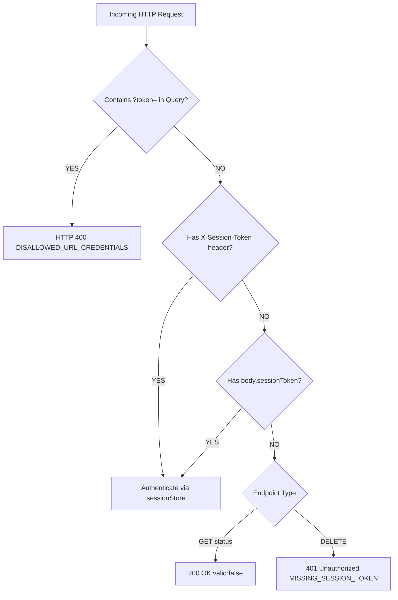

# Research: Secure Session Tokens (Zero URL Query Credentials)

## Phase 0: Technical Architecture & Security Analysis

### 1. OWASP Security Assessment: URL Query Credentials

1. **Vulnerabilities with Credentials in Query Strings**:
   - **Access Log Exposure**: Nginx/Cloudflare/AWS ALB and Node.js access logs capture full request URLs including query strings (`/api/session-keys/status?token=...`).
   - **Referrer Header Leakage**: If an external link or resource is fetched, `Referer` headers broadcast the query string to third parties.
   - **Browser History & Shoulder Surfing**: URLs containing credentials are saved in browser autocomplete, bookmarks, and histories.
2. **Current Codebase State**:
   - Frontend `apiClient.ts` already communicates 100% via `X-Session-Token` HTTP headers.
   - `resolveApiKeysMiddleware` in `server/routes/api.ts` already extracts `req.headers['x-session-token']` and `req.body.sessionToken`.
   - Only `getSessionStatusHandler` and `deleteSessionHandler` in `sessionController.ts` contained legacy fallbacks to `req.query.token`.

---

### 2. Elimination & Rejection Policy

