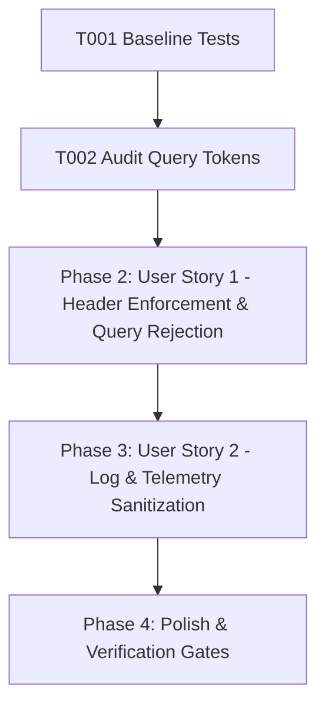

# Tasks: Secure Session Tokens (Zero URL Query Credentials)

**Feature**: Secure Session Tokens (Zero URL Query Credentials)  
**Directory**: `specs/023-session-token-no-url/`  
**Plan**: [plan.md](./plan.md) | **Spec**: [spec.md](./spec.md)

## Phase 1: Setup & Foundational Prerequisites

**Purpose**: Baseline verification and query credential audit

- [X] T001 Verify baseline build and test suite passing (`npm test`, `npm run lint`)
- [X] T002 Audit all query token occurrences in `server/controllers/sessionController.ts` and `server/routes/api.ts`

---

## Phase 2: User Story 1 - Header-Based Session Token Enforcement & Disallowing URL Query Tokens (Priority: P1) 🎯 MVP

**Goal**: Exclusively extract session tokens from `X-Session-Token` headers (and body `sessionToken`), and reject any `?token=...` query parameters with HTTP 400 `DISALLOWED_URL_CREDENTIALS`.

**Independent Test**: Send requests with `X-Session-Token` (200 OK), send requests with `?token=...` (400 Bad Request), and send requests with missing/invalid headers (401 Unauthorized / valid: false).

### Tests for User Story 1
- [X] T003 [P] [US1] Create unit tests in `server/controllers/__tests__/sessionController.test.ts` for header authentication (`X-Session-Token`), explicit HTTP 400 rejection for `?token=...`, and 401 for missing token on deletion

### Implementation for User Story 1
- [X] T004 [US1] Update `server/controllers/sessionController.ts` to strictly require header/body tokens and reject `req.query.token` with HTTP 400 `DISALLOWED_URL_CREDENTIALS`

**Checkpoint**: User Story 1 is complete. Session endpoints reject URL query credentials and enforce header authentication.

---

## Phase 3: User Story 2 - Zero URL Credential Leaks in Logs & Telemetry (Priority: P2)

**Goal**: Ensure zero credential tokens leak into server access logs, metrics paths, or telemetry.

**Independent Test**: Send requests with query parameters through `metricsMiddleware` and assert that recorded route paths and meta logs strip secrets.

### Tests for User Story 2
- [X] T005 [P] [US2] Create unit tests in `server/middleware/__tests__/metricsMiddleware.test.ts` verifying query credential stripping

### Implementation for User Story 2
- [X] T006 [US2] Verify and sanitize query parameters in `server/middleware/metricsMiddleware.ts` and `server/utils/logger.ts`

**Checkpoint**: All user stories are complete and validated.

---

## Phase 4: Polish & Quality Verification

**Purpose**: Repository-wide quality verification gates

- [X] T007 Run full test suite (`npm test`) and verify all tests pass
- [X] T008 Run TypeScript type check (`npm run lint` / `tsc --noEmit`)
- [X] T009 Run production build (`npm run build`)
- [X] T010 Execute quickstart validation scenarios in `specs/023-session-token-no-url/quickstart.md`

---

## Dependencies & Execution Order

### Parallel Opportunities

- **T003, T005**: Test suites can be authored in parallel.
- **T004, T006**: Controller update and middleware verification can proceed concurrently.

---

## Implementation Strategy

### MVP Scope (User Story 1)
1. Complete Setup & Audit (T001, T002)
2. Implement Header Enforcement & 400 Query Rejection in `sessionController.ts` (T003, T004)
3. Verify Log Sanitization (T005, T006)
4. Run full verification gates (T007–T010)
