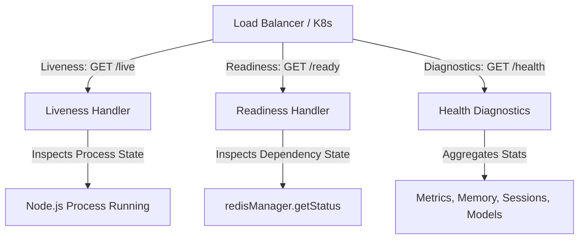

# Research: Real Health, Liveness & Readiness Endpoints

## Phase 0: Technical Architecture & Analysis

### 1. Probe Taxonomy & Separation of Concerns

---

### 2. Status Resolution Matrix

| `process.env.REDIS_URL` | `redisManager.getStatus()` | `/api/live` | `/api/ready` | `/api/health` | HTTP Code |
|---|---|:---:|:---:|:---:|:---:|
| Unset | `'disconnected'` | `alive` | `healthy` (`standalone-in-memory`) | `healthy` | 200 |
| Set | `'connected'` | `alive` | `healthy` (`redis: connected`) | `healthy` | 200 |
| Set | `'degraded'` | `alive` | `degraded` (`redis: degraded`) | `degraded` | 200 |
| Any | `'closed'` (Shutdown) | `alive` | `unavailable` | `unavailable` | 503 |
