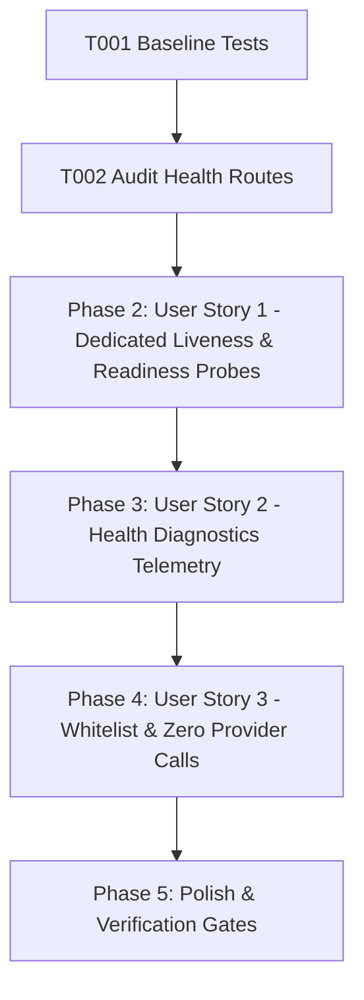

# Tasks: Real Health, Liveness & Readiness Endpoints

**Feature**: Real Health, Liveness & Readiness Endpoints  
**Directory**: `specs/024-health-readiness-endpoints/`  
**Plan**: [plan.md](./plan.md) | **Spec**: [spec.md](./spec.md)

## Phase 1: Setup & Foundational Prerequisites

**Purpose**: Baseline verification and health route audit

- [X] T001 Verify baseline build and test suite passing (`npm test`, `npm run lint`)
- [X] T002 Audit existing `/health` route in `server/routes/api.ts` and `PUBLIC_API_PATHS` in `server/middleware/authMiddleware.ts`

---

## Phase 2: User Story 1 - Dedicated Liveness & Readiness Probes (Priority: P1) 🎯 MVP

**Goal**: Implement dedicated `/api/live` (Liveness) and `/api/ready` (Readiness) probes evaluating real process and dependency state.

**Independent Test**: Query `/api/live` (200 OK `{ status: "alive" }`), query `/api/ready` with Redis connected (200 OK `{ status: "healthy" }`), and query `/api/ready` with Redis failing (200 OK `{ status: "degraded" }`).

### Tests for User Story 1
- [X] T003 [P] [US1] Create unit tests in `server/routes/__tests__/healthEndpoints.test.ts` for `/api/live` and `/api/ready` under healthy, degraded, and unavailable states

### Implementation for User Story 1
- [X] T004 [US1] Implement `/api/live` and `/api/ready` route handlers in `server/routes/api.ts`

**Checkpoint**: User Story 1 is complete. Dedicated liveness and readiness probe handlers active.

---

## Phase 3: User Story 2 - Real System Health & Diagnostic Telemetry (Priority: P2)

**Goal**: Update `/api/health` to report real aggregated runtime health rather than static `!!process.env.REDIS_URL` checks.

**Independent Test**: Query `/api/health` during Redis connected vs degraded modes and verify dynamic `redis.status` and `status` values.

### Tests for User Story 2
- [X] T005 [P] [US2] Create unit tests in `server/routes/__tests__/healthEndpoints.test.ts` for `/api/health` diagnostics reflecting live Redis status

### Implementation for User Story 2
- [X] T006 [US2] Update `GET /api/health` in `server/routes/api.ts` to aggregate real `redisManager.getStatus()`, sessions, memory, and uptime

**Checkpoint**: User Story 2 is complete. Diagnostics endpoint accurately reports runtime health.

---

## Phase 4: User Story 3 - Zero Provider Call Invariant & Public Whitelist (Priority: P3)

**Goal**: Whitelist probe endpoints for unauthenticated monitoring queries and enforce zero upstream Gemini calls during health checks.

**Independent Test**: Send 50 requests across probe routes on a password-protected server; assert 200 OK with zero calls to `geminiService.ts`.

### Tests for User Story 3
- [X] T007 [P] [US3] Create unit tests in `server/routes/__tests__/healthEndpoints.test.ts` asserting 0 Gemini API calls and unauthenticated access for probe paths

### Implementation for User Story 3
- [X] T008 [US3] Whitelist `/live`, `/ready`, `/health`, `/api/live`, `/api/ready`, `/api/health` in `server/middleware/authMiddleware.ts`

**Checkpoint**: All user stories are complete and validated.

---

## Phase 5: Polish & Quality Verification

**Purpose**: Repository-wide quality verification gates

- [X] T009 Run full test suite (`npm test`) and verify all tests pass
- [X] T010 Run TypeScript type check (`npm run lint` / `tsc --noEmit`)
- [X] T011 Run production build (`npm run build`)
- [X] T012 Execute quickstart validation scenarios in `specs/024-health-readiness-endpoints/quickstart.md`

---

## Dependencies & Execution Order

### Parallel Opportunities

- **T003, T005, T007**: Test suites can be authored in parallel.
- **T004, T006, T008**: Probe implementation and whitelist updates can proceed concurrently.

---

## Implementation Strategy

### MVP Scope (User Story 1 + 2)
1. Complete Setup & Audit (T001, T002)
2. Implement `/api/live` and `/api/ready` (T003, T004)
3. Update `/api/health` Diagnostics (T005, T006)
4. Update Probe Whitelist in `authMiddleware.ts` (T007, T008)
5. Run full verification gates (T009–T012)
