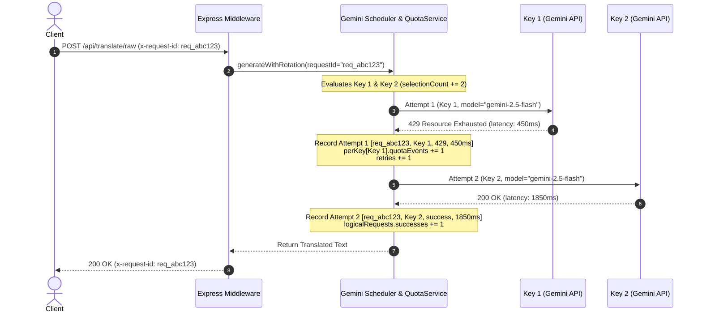

# Research: Observability and Explainable Telemetry for Gemini Scheduler

## Phase 0: Technical Analysis & Observability Architecture

### 1. Problem Statement & Motivation

In a resilient, multi-key AI translation service, high availability is achieved through intelligent candidate key ranking, rate-limiting pacing, error classification, and automatic failover rotation. However, without fine-grained telemetry, operational behaviors appear as a "black box":
- **Slow Requests**: When a translation takes 12 seconds, operators cannot tell whether the delay was caused by queue pacing (waiting for key rate limits), upstream Gemini inference delay, or consecutive retry backoffs.
- **Key Skipping**: When a key is not selected, operators cannot immediately see whether it was due to health cooldown, circuit breaker tripping, unsupported model capabilities, or daily token quota exhaustion.
- **Retries**: When retries happen, the trigger reason (429 Rate Limit vs 503 Overload vs Safety Filter Block) is lost if not correlated with a single transaction ID.
- **Model Failures**: Global error counters do not differentiate whether errors are isolated to a specific model family (e.g. Gemini 2.5 Pro experiencing 503s while Flash 2.5 is healthy).

---

### 2. The Four Explainability Dimensions

#### Dimension 1: "Why is this request slow?"
A translation request's total wall-clock duration ($T_{\text{total}}$) is decomposed into:
$$T_{\text{total}} = T_{\text{queue/pacing}} + \sum_{i=1}^{N} (T_{\text{inference}, i} + T_{\text{backoff}, i})$$
- **`queueWait` / Pacing Delay**: Time spent waiting for key RPM rate limiter (`nextAllowedTimeByKey`) or global concurrency backpressure.
- **Upstream Inference Latency**: Time from dispatching `ai.models.generateContent` to receiving the response candidate.
- **Retry Backoff**: Intentional sleep duration between transient failures (e.g. exponential backoff on 503 overload).

#### Dimension 2: "Why was this key not chosen?"
During `calculateKeyScore` and the rotation loop, candidate keys are evaluated. When a key is disqualified or bypassed, the scheduler increments `scheduler.rejected` and categorizes the root cause:
- `in_cooldown`: Key is in active cooldown due to recent failures.
- `circuit_breaker_open`: Consecutive errors exceeded threshold.
- `unsupported_model`: Key cache indicates the requested model is not available or disabled for this key.
- `quota_exhausted`: Key reached daily RPD or TPM limits.
- `rate_limited_pacing`: Key is eligible but skipped in favor of a candidate with 0ms pacing delay.

#### Dimension 3: "Why did a retry happen?"
Every provider attempt is captured in an attempt trace linked by a single `requestId`. If attempt $i$ fails:
- The normalized `errorCode` (`RATE_LIMITED`, `OVERLOADED`, `AUTH_FAILED`, `SAFETY_BLOCKED`, `SERVER_ERROR`, etc.) is recorded.
- Attempt duration ($T_{\text{attempt}}$) is logged.
- The scheduler transitions the key and increments `retriesTotal`.

#### Dimension 4: "Why did a model fail?"
Model telemetry is segregated into `perModel`:
- `requestsTotal`, `errorsTotal`, `errorRatePercent`.
- `latency` profile: `totalLatencyMs`, `avgLatencyMs`, `minLatencyMs`, `maxLatencyMs`.
- Differentiates model-specific issues from key-specific quota exhaustion.

---

### 3. Correlation & Tracing Architecture

---

### 4. Security & Privacy Invariants (Zero Leakage)

To ensure operational telemetry can be logged, shipped to log analyzers, and viewed in dashboards without security or privacy risks:
1. **API Keys**: Raw key strings are NEVER emitted in log text or metrics payloads. Keys are strictly masked (`maskApiKey`: `AIzaSy...ABCD`) or hashed with SHA-256 (`hashApiKey`).
2. **Session Tokens**: JWTs, session tokens, and Authorization headers are omitted from telemetry logs.
3. **Prompts & Manuscripts**: Full prompt texts, untrusted user inputs, and translated manuscripts are excluded from operational logs (only token counts and character lengths are recorded).
