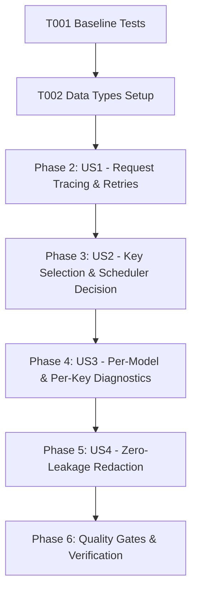

# Tasks: Observability and Explainable Telemetry for Gemini Scheduler

**Feature**: Observability and Explainable Telemetry for Gemini Scheduler  
**Directory**: `specs/025-scheduler-observability/`  
**Plan**: [plan.md](./plan.md) | **Spec**: [spec.md](./spec.md)

---

## Phase 1: Setup & Foundational Prerequisites

**Purpose**: Baseline verification, shared interfaces, and telemetry scaffolding

- [X] T001 Verify baseline build and test suite passing (`npm test`, `npm run lint`)
- [X] T002 Define `RequestAttemptLog`, `SchedulerTelemetry`, `ModelObservabilityMetrics`, and `KeyObservabilityMetrics` interfaces in `server/services/quotaService.ts`

---

## Phase 2: User Story 1 - Request Tracing and Retries Explainability (Priority: P1) 🎯 MVP

**Goal**: Trace every translation request with a persistent `requestId` across all rotation attempts, capturing attempt number, model ID, masked key identifier, attempt latency, and error code.

**Independent Test**: Dispatch a multi-attempt translation (Key 1 fails with 429, Key 2 succeeds). Assert both attempts share the same `requestId`, Attempt 1 logs `errorCode = "RATE_LIMITED"`, Attempt 2 logs success, and attempt latencies are recorded.

### Tests for User Story 1
- [X] T003 [P] [US1] Create unit tests in `server/services/__tests__/schedulerObservability.test.ts` verifying `requestId` preservation across retries and attempt telemetry logging

### Implementation for User Story 1
- [X] T004 [US1] Implement `recordAttemptTrace` and bounded in-memory rolling buffer for recent attempt logs in `server/services/quotaService.ts`
- [X] T005 [US1] Propagate `requestId` parameter through `generateWithRotation` and record attempt start/duration/status in `server/services/geminiService.ts`
- [X] T006 [US1] Update translation controllers (`server/controllers/translation/rawController.ts`, `polishController.ts`, `qaController.ts`) to pass `req.id` to `geminiService.ts`

**Checkpoint**: User Story 1 is complete. Request tracing and retries explainability are functional end-to-end.

---

## Phase 3: User Story 2 - Key Selection & Scheduler Decision Transparency (Priority: P2)

**Goal**: Record metrics explaining why keys were selected or rejected during candidate scoring (`in_cooldown`, `circuit_breaker_open`, `rate_limited_pacing`, `unsupported_model`, `quota_exhausted`) and measure cumulative `queueWait` duration.

**Independent Test**: Simulate key scoring with a key in cooldown and a key in pacing delay. Assert `scheduler.selectionCount` increments, `scheduler.rejectedByReason.in_cooldown` is recorded, and `scheduler.queueWaitTotalMs` tracks pacing delay.

### Tests for User Story 2
- [X] T007 [P] [US2] Add unit tests in `server/services/__tests__/schedulerObservability.test.ts` validating key rejection categorization and queue wait accumulation

### Implementation for User Story 2
- [X] T008 [US2] Implement `recordKeySelection`, `recordKeyRejection`, and `recordQueueWait` methods in `server/services/quotaService.ts`
- [X] T009 [US2] Instrument key scoring loop and candidate filtering in `server/services/geminiService.ts` to record rejection reasons and selection counts
- [X] T010 [US2] Instrument rate-limiting pacing delays (`keyDelay`) and overload cooldown pauses in `server/services/geminiService.ts` to record `queueWait`

**Checkpoint**: User Story 2 is complete. Scheduler decisions, key rejections, and queue wait times are fully observable.

---

## Phase 4: User Story 3 - Per-Model & Per-Key Diagnostic Telemetry Breakdown (Priority: P3)

**Goal**: Maintain granular per-model performance distributions (requests, errors, min/max/avg latency) and per-key event counters (quota events, cooldown events), exposing them via `/api/quota-status`.

**Independent Test**: Query `/api/quota-status` after executing requests on multiple models and keys. Assert response contains `scheduler` telemetry, `byModel` latency stats, and `keys` quota/cooldown event tallies.

### Tests for User Story 3
- [X] T011 [P] [US3] Add unit tests in `server/services/__tests__/schedulerObservability.test.ts` for per-model latency calculations and per-key event tracking

### Implementation for User Story 3
- [X] T012 [US3] Extend `InternalModelStats` in `server/services/quotaService.ts` to compute cumulative, average, min, and max latency per model
- [X] T013 [US3] Extend `InternalKeyStats` in `server/services/quotaService.ts` to track `quotaEventsTotal` and `cooldownEventsTotal` on state transitions and error recordings
- [X] T014 [US3] Update `getQuotaSnapshot` in `server/services/quotaService.ts` and endpoint handler in `server/controllers/quotaController.ts` to expose `scheduler`, `byModel` latency, and `recentAttempts`

**Checkpoint**: User Story 3 is complete. Granular per-model and per-key diagnostics are accessible via API.

---

## Phase 5: User Story 4 - Strict Sensitive Data Redaction & Security Invariant (Priority: P4)

**Goal**: Guarantee 100% zero-leakage security: raw API keys are strictly masked or hashed, session tokens are excluded, and prompt manuscript text is omitted from telemetry logs.

**Independent Test**: Inspect all attempt logs and telemetry payloads generated during translation. Assert raw key strings, session tokens, and prompt bodies never appear.

### Tests for User Story 4
- [X] T015 [P] [US4] Add unit tests in `server/services/__tests__/schedulerObservability.test.ts` asserting strict redaction of raw keys, session tokens, and prompts across all logging outputs

### Implementation for User Story 4
- [X] T016 [US4] Implement structured telemetry logger helper in `server/utils/telemetryLogger.ts` enforcing `maskApiKey` and prompt exclusion
- [X] T017 [US4] Audit error handlers and log statements in `server/services/geminiService.ts` and `server/services/quotaService.ts` to ensure full compliance with zero-leakage invariants

**Checkpoint**: User Story 4 is complete. Zero-leakage security invariants are enforced and verified.

---

## Phase 6: Polish & Quality Verification

**Purpose**: Repository-wide verification and quality gate compliance

- [X] T018 Run full test suite (`npm test`) and ensure 100% pass rate
- [X] T019 Run TypeScript type checks (`npm run lint` / `tsc --noEmit`)
- [X] T020 Run production build (`npm run build`)
- [X] T021 Execute validation scenarios from `specs/025-scheduler-observability/quickstart.md`

---

## Dependencies & Execution Order

### Parallel Opportunities

- **T003, T007, T011, T015**: Test suites can be authored in parallel.
- **T004, T008, T012, T013**: Core QuotaService data methods can be built concurrently.
- **T016, T017**: Redaction logger and sanitization audit can run in parallel with telemetry endpoints.

---

## Implementation Strategy

### MVP Scope (User Story 1 Only)
1. Complete Setup & Type Definitions (T001, T002)
2. Implement Request Tracing & Attempt Logging (T003–T006)
3. Validate independent test criteria for User Story 1

### Full Incremental Delivery
1. Foundation & US1 (Tracing & Retry Explainability)
2. Add US2 (Key Selection & Rejection Reason Tracking)
3. Add US3 (Per-Model Latency & Per-Key Diagnostics via API)
4. Add US4 (Strict Redaction & Zero-Leakage Audit)
5. Run full quality gates (T018–T021)
