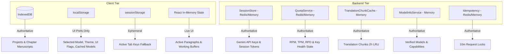

# Data Model: State Ownership & Storage Tiers

**Feature**: State Ownership & Storage Cleanup  
**Directory**: `specs/026-state-ownership-cleanup/`  
**Date**: 2026-08-20  

---

## 1. Storage Tiers Overview

---

## 2. Storage Entities & Schemas

### Tier 1: Client IndexedDB (`src/services/db.ts`)

#### Entity: `StoryProject` (Object Store: `projects`)
- **Key**: `id: string` (UUID / timestamp string)
- **Fields**:
  - `id`: Unique project identifier
  - `title`: Novel title
  - `author`: Author name
  - `genre`: Genre key (xianxia, wuxia, etc.)
  - `tone`: Translation tone
  - `description`: Context summary
  - `glossary`: Array of custom `GlossaryItem` entities
  - `chapters`: Array of `ChapterMetadata` summaries (id, title, status, timestamps)
  - `createdAt`: ISO timestamp
  - `updatedAt`: ISO timestamp
- **Invariant**: Chapter body texts are normalized and stored separately in the `chapters` object store to prevent memory bloat during project list queries.

#### Entity: `Chapter` (Object Store: `chapters`)
- **Key**: `id: string` (UUID)
- **Index**: `projectId` (string)
- **Fields**:
  - `id`: Chapter ID
  - `projectId`: Foreign key linking to parent `StoryProject`
  - `title`: Chapter title
  - `sourceText`: Raw Chinese source manuscript
  - `rawTranslation`: Phase 1 raw translation text
  - `polishedTranslation`: Phase 2 edited translation text
  - `paragraphs`: Structured array of bilingual paragraph segments
  - `status`: `'not_started' | 'translating' | 'translated' | 'polishing' | 'completed' | 'error'`
  - `createdAt`: ISO timestamp
  - `updatedAt`: ISO timestamp

---

### Tier 2: Client LocalStorage (`localStorage`)

| Storage Key | Type | Owner | TTL / Expiry | Purpose |
|:---|:---|:---|:---|:---|
| `gemini_selected_model` | `string` | Client UI | Persistent | User's active model preference |
| `gemini_discovered_models` | `{ timestamp: number, models: ModelInfoItem[] }` | Client Cache | 1 hour | Cached list of available Gemini models |
| `gemini_quota_custom_limits` | `Record<string, CustomLimit>` | Client UI | Persistent | User-configured RPM/TPM/RPD thresholds |
| `warning_paragraph_mismatch` | `boolean` | Client UI | Persistent | Toggle for paragraph count mismatch warnings |
| `enable_ai_qa_critique` | `boolean` | Client UI | Persistent | Toggle for automated QA critique phase |
| `enable_segment_translation` | `boolean` | Client UI | Persistent | Toggle for line-by-line segment translation |
| `app_locale` | `string` | Client UI | Persistent | Selected language (`vi` / `zh` / `en`) |
| `gemini_session_token` | `string` | Client Pointer | 24 hours (Server) | Opaque session token referencing server session |
| `gemini_auth_token` | `string` | Client Pointer | 24 hours (Server) | Server access password authentication token |

**Strict Deny-List for `localStorage`**:
- ❌ No raw API keys (`gemini_api_keys` is forbidden; legacy entries are migrated and wiped).
- ❌ No novel chapters, paragraphs, or manuscript texts.
- ❌ No global project glossaries or database dumps.

---

### Tier 3: Server Session Store (`server/services/sessionStore.ts`)

#### Entity: `ServerSession`
- **Key Format**: `session:<sessionToken>`
- **Storage**: Redis (primary) or in-memory LRU Map (fallback)
- **Fields**:
  - `sessionToken`: Opaque crypto-secure UUID
  - `apiKeys`: Array of valid Gemini API keys
  - `createdAt`: Timestamp
  - `lastActiveAt`: Timestamp
- **TTL**: 24 hours (86,400 seconds); auto-refreshed on active API calls.

---

### Tier 4: Server Quota & Health Store (`server/services/quotaService.ts`)

#### Entity: `InternalKeyStats`
- **Key Format**: Key hash / memory map entry
- **Fields**:
  - `keyHash`: SHA-256 hash of API key
  - `requestsTotal`, `requestsToday`, `tokensTotal`, `tokensToday`
  - `healthState`: `'Healthy' | 'Degraded' | 'Cooldown' | 'RateLimited' | 'AuthFailed' | 'Disabled'`
  - `consecutiveErrors`: Error count before circuit breaker trips
  - `cooldownUntil`: Target timestamp when cooldown expires
  - `quotaEventsTotal`, `cooldownEventsTotal`: Event counters
  - `byModel`: Map of per-model statistics (`requestsTotal`, `errorsTotal`, `totalLatencyMs`, etc.)
- **TTL / Reset**: Daily reset at 00:00 PST (America/Los_Angeles); sliding window 60s for RPM/TPM.

---

## 3. State Invariants & Consistency Rules

1. **Rule of Single Origin**: No data attribute may be authored in more than one storage tier simultaneously.
2. **Rule of Read-Only Projections**: Client projections of server state (e.g. quota snapshots, cooldown countdowns) are read-only and never write back to overwrite server authoritative values.
3. **Rule of Clean Re-Sync**: When a server session or auth token expires, the client MUST clear its local pointer and trigger a graceful re-sync without crashing the active UI workspace.
4. **Rule of Non-Blocking Persistence**: All IndexedDB operations MUST execute asynchronously with exponential-backoff retry (`withRetry`) to prevent database lock contention.
