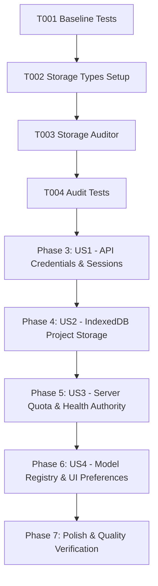

# Tasks: State Ownership & Storage Cleanup

**Feature**: State Ownership & Storage Cleanup  
**Directory**: `specs/026-state-ownership-cleanup/`  
**Plan**: [plan.md](./plan.md) | **Spec**: [spec.md](./spec.md)

---

## Phase 1: Setup (Shared Infrastructure)

**Purpose**: Baseline verification, storage domain constants, and contract definition

- [X] T001 Verify baseline build and test suite passing (`npm test`, `npm run lint`)
- [X] T002 Define `StorageDomain` and `StorageTierContract` interfaces in `src/utils/storageAudit.ts`

---

## Phase 2: Foundational (Blocking Prerequisites)

**Purpose**: Storage integrity audit utility and automated invariant test harness

- [X] T003 [P] Implement storage integrity verification helper `verifyStorageIntegrity` in `src/utils/storageAudit.ts`
- [X] T004 [P] Create unit test suite for storage integrity verification in `src/utils/__tests__/storageAudit.test.ts`

**Checkpoint**: Foundation ready — user story audits and implementations can now proceed.

---

## Phase 3: User Story 1 - Single Source of Truth for API Credentials & Sessions (Priority: P1) 🎯 MVP

**Goal**: Guarantee that runtime API keys are authoritatively stored in server `sessionStore.ts` or client ephemeral `sessionStorage`; no plain keys persist in `localStorage`; session expirations (401) trigger clean recovery.

**Independent Test**: Simulate legacy `localStorage` keys and verify automatic migration to `sessionStorage` and immediate purge from `localStorage`. Verify expired session tokens receive `401 sessionExpired: true` and prompt clean re-sync.

### Tests for User Story 1
- [X] T005 [P] [US1] Add test cases in `src/utils/__tests__/credentialStorage.test.ts` verifying legacy key purge from `localStorage` and session recovery

### Implementation for User Story 1
- [X] T006 [US1] Audit and enforce `src/hooks/useAIConfig.ts` to guarantee `apiKeys` are only stored in `sessionStorage` and synced with server `sessionStore.ts`
- [X] T007 [US1] Update `src/utils/apiClient.ts` to handle `401 sessionExpired: true` by clearing `gemini_session_token` and notifying active state
- [X] T008 [US1] Audit `server/middleware/authMiddleware.ts` and `server/services/sessionStore.ts` for clean 24h expiration and zero plain key logging

**Checkpoint**: User Story 1 is complete. API credentials and authentication tokens have an unambiguous single source of truth.

---

## Phase 4: User Story 2 - Authoritative Project & Content Storage in IndexedDB (Priority: P2)

**Goal**: Guarantee that story projects, chapter texts, split paragraphs, and custom glossaries live exclusively in client IndexedDB; 0 KB of manuscript data resides in `localStorage`.

**Independent Test**: Load a large multi-chapter project into IndexedDB. Verify chapter bodies are stored in the `chapters` store and that `localStorage` contains zero chapter texts or paragraph arrays.

### Tests for User Story 2
- [X] T009 [P] [US2] Add unit tests in `src/services/__tests__/dbStorageAudit.test.ts` asserting chapter bodies reside in `chapters` store and never leak to `localStorage`

### Implementation for User Story 2
- [X] T010 [US2] Audit `src/services/db.ts` and `src/services/dbMigration.ts` to ensure atomic transactions, chapter normalization, and versioned migrations
- [X] T011 [US2] Audit `src/hooks/useProjectStorage.ts` and `src/components/TranslatorWorkspace.tsx` to verify in-memory editor buffers commit directly to IndexedDB
- [X] T012 [US2] Audit `src/components/GlossaryManager.tsx` to remove any legacy `localStorage` glossary caches in favor of IndexedDB project glossaries

**Checkpoint**: User Story 2 is complete. Creative manuscript data is authoritatively stored in IndexedDB without dual-write drift.

---

## Phase 5: User Story 3 - Server-Owned Quota, Rate Limiting & Circuit Breakers (Priority: P3)

**Goal**: Ensure quota metrics (RPM, TPM, RPD), sliding windows, circuit breakers, and key health states are authoritatively calculated on the server with read-only client countdown projections.

**Independent Test**: Dispatch simulated requests across multiple keys. Assert server QuotaService tracks sliding-window RPM/TPM and daily PST resets, and that client `QuotaPanel` only renders read-only server projections.

### Tests for User Story 3
- [X] T013 [P] [US3] Add unit tests in `server/services/__tests__/quotaAuthority.test.ts` validating server authority over RPM/TPM/RPD, daily PST resets, and circuit breakers

### Implementation for User Story 3
- [X] T014 [US3] Verify `server/services/quotaService.ts` maintains 60s sliding windows, key health transitions, and daily PST midnight resets independently of client clocks
- [X] T015 [US3] Audit `src/components/QuotaPanel.tsx` and `src/hooks/useModelObservability.ts` to confirm client badges are read-only countdown projections of server cooldown values
- [X] T016 [US3] Verify `server/services/translationChunkCache.ts` enforces 2h sliding window LRU eviction without memory leak

**Checkpoint**: User Story 3 is complete. Quota and rate-limiting authority is centralized on the server.

---

## Phase 6: User Story 4 - Model Registry & UI Preference Hierarchy (Priority: P4)

**Goal**: Enforce 1-hour TTL expiration for cached discovered models and restrict `localStorage` to validated UI preferences with fallback to `DEFAULT_MODEL_ID`.

**Independent Test**: Cache discovered models with an expired timestamp. Verify that opening the model selector triggers a refresh and that obsolete model IDs fall back to `DEFAULT_MODEL_ID`.

### Tests for User Story 4
- [X] T017 [P] [US4] Add tests in `src/utils/__tests__/modelRegistryAudit.test.ts` verifying 1h TTL cache expiry and fallback on deprecated model ID

### Implementation for User Story 4
- [X] T018 [US4] Update `src/utils/modelRegistry.ts` and `src/hooks/useModelObservability.ts` to enforce 1-hour TTL expiration on `gemini_discovered_models`
- [X] T019 [US4] Audit `src/components/ApiSettings.tsx` and `src/i18n/I18nContext.tsx` to ensure UI preferences (`gemini_selected_model`, custom limits, `app_locale`) are validated on load

**Checkpoint**: User Story 4 is complete. Model registry caching and UI preferences adhere to strict lifecycle boundaries.

---

## Phase 7: Polish & Quality Verification

**Purpose**: Repository-wide verification and quality gate compliance

- [X] T020 Run full test suite (`npm test`) and ensure 100% pass rate
- [X] T021 Run TypeScript type checks (`npm run lint` / `tsc --noEmit`)
- [X] T022 Run production build (`npm run build`)
- [X] T023 Execute validation scenarios from `specs/026-state-ownership-cleanup/quickstart.md`

---

## Dependencies & Execution Order

### Parallel Opportunities

- **T003, T004**: Auditor implementation and test harness can be authored together.
- **T005, T009, T013, T017**: Unit test suites across all 4 user stories can be authored in parallel.
- **T006–T008, T010–T012, T014–T016, T018–T019**: Component audits can be processed concurrently once foundational types exist.

---

## Implementation Strategy

### MVP Scope (User Story 1 Only)
1. Complete Setup & Storage Auditor (T001–T004)
2. Implement Credential Single Source of Truth (T005–T008)
3. Validate independent test criteria for User Story 1

### Full Incremental Delivery
1. Foundation & US1 (API Credentials & Sessions)
2. Add US2 (IndexedDB Manuscript & Chapter Storage)
3. Add US3 (Server Quota & Key Health Authority)
4. Add US4 (Model Registry & UI Preference Boundaries)
5. Run full quality gates (T020–T023)
