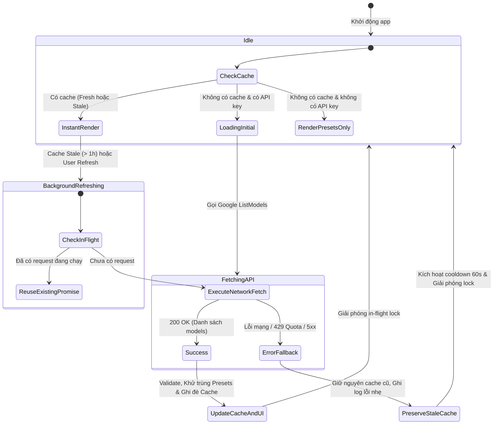

# Data Model: Model Discovery Cache (Resilient & SWR Lifecycle)

**Feature**: Model Discovery Cache & SWR Lifecycle  
**Branch**: `027-task-14-model` | **Date**: 2026-08-20  

---

## 1. Entity Definitions & Schemas

### 1.1 Discovered Models Storage Payload (`localStorage: gemini_discovered_models`)

```typescript
export interface DiscoveredModelsStoragePayload {
  /** Phiên bản schema lưu trữ */
  version: 1;
  /** Epoch timestamp khi dữ liệu được lưu thành công (ms) */
  timestamp: number;
  /** Thời điểm làm mới định dạng ISO 8601 */
  lastRefreshedAt: string;
  /** Danh sách các model đã khám phá, đã lọc và chuẩn hóa */
  models: RegisteredModelDef[];
  /** Hash an toàn của API Key dùng để khám phá (tùy chọn) */
  sourceKeyHash?: string;
  /** Lỗi gần nhất nếu lần background refresh trước đó thất bại (không làm mất models) */
  lastError?: string;
}
```

---

### 1.2 Model Discovery Hook State (`useModelDiscovery`)

```typescript
export interface ModelDiscoveryState {
  /** Toàn bộ danh sách model đã đăng ký (Presets + Discovered + Custom) */
  models: RegisteredModelDef[];
  /** Danh sách riêng các model được khám phá từ API */
  discoveredModels: RegisteredModelDef[];
  /** True khi chưa có cache và đang thực hiện truy vấn lần đầu */
  isLoading: boolean;
  /** True khi đang thực hiện background refresh hoặc manual refresh */
  isRefreshing: boolean;
  /** True nếu dữ liệu trong cache đã vượt quá TTL 1 giờ */
  isStale: boolean;
  /** Thời điểm làm mới thành công gần nhất */
  lastRefreshedAt: Date | null;
  /** Thông điệp lỗi nếu lần làm mới gần nhất thất bại */
  error: string | null;
  /** Hàm kích hoạt làm mới danh sách model */
  refresh: (force?: boolean) => Promise<RegisteredModelDef[]>;
}
```

---

### 1.3 In-Flight Concurrency Control Entity

```typescript
export interface InFlightDiscoveryState {
  /** Promise đang thực thi (hoặc null nếu không có request nào đang chạy) */
  activePromise: Promise<RegisteredModelDef[]> | null;
  /** Timestamp bắt đầu request gần nhất */
  startedAt: number;
  /** Cờ cho biết request này là do người dùng ép buộc (force) hay chạy ngầm */
  isForced: boolean;
}
```

---

## 2. State Transition Lifecycle



---

## 3. Storage Tier Mapping & Invariants

| Storage Tier | Dữ liệu lưu trữ | Cơ chế TTL / Hết hạn | Quyền sở hữu (Ownership) |
|:---|:---|:---|:---|
| **Client LocalStorage** | `gemini_discovered_models` (JSON Payload) | 1 giờ (`DISCOVERED_MODELS_TTL_MS`) | Server Model Registry Cache client projection |
| **Client Memory** | `inFlightDiscoveryPromise`, `activeModelsMap` | Vòng đời trang / tab | `useModelDiscovery` hook & `modelRegistry.ts` |
| **Server Memory** | `cachedDiscoveredModels`, `pendingFetchMap` | 15 phút | `server/services/modelInfoService.ts` |

### Invariant Rules:
1. **Zero-Wipe Invariant**: Lỗi mạng hay lỗi 429 không bao giờ được xóa entry `gemini_discovered_models` khỏi `localStorage`.
2. **Preset Priority Invariant**: Model trùng lặp giữa Preset và Discovered luôn ưu tiên dùng cấu hình Preset.
3. **Format Validation Invariant**: Chỉ lưu các model có `generateContent` và ID khớp `MODEL_ID_REGEX`.
