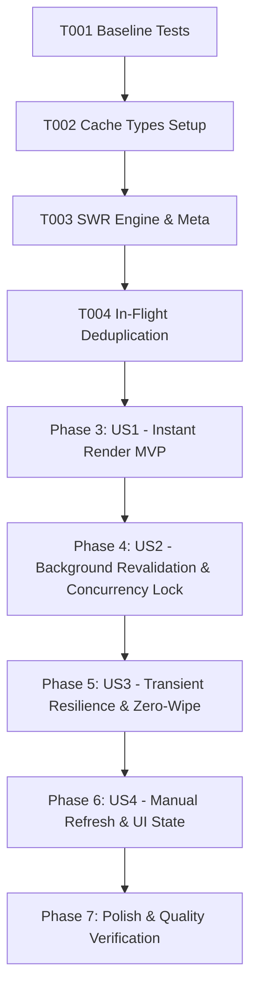

# Tasks: Model Discovery Cache (Resilient & SWR Lifecycle)

**Feature**: Model Discovery Cache & SWR Lifecycle  
**Directory**: `specs/027-task-14-model/`  
**Plan**: [plan.md](./plan.md) | **Spec**: [spec.md](./spec.md)

---

## Phase 1: Setup (Shared Infrastructure)

**Purpose**: Baseline verification, cache payload schema, and metadata interfaces

- [X] T001 Verify baseline build and test suite passing (`npm test`, `npm run lint`)
- [X] T002 Define `DiscoveredModelsStoragePayload` and `DiscoveredCacheMeta` interfaces in `src/utils/modelRegistry.ts`

---

## Phase 2: Foundational (Blocking Prerequisites)

**Purpose**: Core SWR cache engine and in-flight request deduplication lock

- [X] T003 [P] Implement `getDiscoveredCacheMeta()`, `getDiscoveredModels()` with stale data preservation, and `recordDiscoveryError()` in `src/utils/modelRegistry.ts`
- [X] T004 [P] Implement in-flight deduplication singleton `fetchAndCacheDiscoveredModels()` in `src/utils/modelRegistry.ts`

**Checkpoint**: Foundation ready — user story implementation can now proceed in parallel.

---

## Phase 3: User Story 1 - Instant UI Render via Stale Cache (Priority: P1) 🎯 MVP

**Goal**: Ensure the UI renders models instantly (< 10ms) from cached storage without blocking on network roundtrips.

**Independent Test**: Load a page with existing cached models in `localStorage`. Verify `getDiscoveredModels()` returns cached models synchronously and `getDiscoveredCacheMeta()` identifies cache freshness/staleness.

### Tests for User Story 1
- [X] T005 [P] [US1] Create unit test suite in `src/utils/__tests__/modelDiscoveryCache.test.ts` for instant stale cache retrieval and metadata calculation

### Implementation for User Story 1
- [X] T006 [US1] Update `src/utils/modelRegistry.ts` to ensure `getDiscoveredModels()` returns stale data immediately instead of empty array when cache is stale

**Checkpoint**: User Story 1 is complete. Models render instantaneously from storage.

---

## Phase 4: User Story 2 - Non-Blocking Background Revalidation & Concurrency Lock (Priority: P2)

**Goal**: Automatically revalidate stale cache in the background when TTL expires, while deduplicating simultaneous requests across multiple components.

**Independent Test**: Trigger concurrent discovery requests from multiple callers. Verify only 1 network request is dispatched and all callers receive the updated model list.

### Tests for User Story 2
- [X] T007 [P] [US2] Add unit test cases in `src/utils/__tests__/modelDiscoveryCache.test.ts` verifying concurrent calls reuse the single in-flight Promise

### Implementation for User Story 2
- [X] T008 [US2] Implement `useModelDiscovery` hook in `src/hooks/useModelDiscovery.ts` with SWR non-blocking background revalidation
- [X] T009 [US2] Ensure server `server/services/modelInfoService.ts` implements 15-minute in-memory cache and in-flight Promise deduplication

**Checkpoint**: User Story 2 is complete. Background revalidation operates smoothly without duplicate network requests.

---

## Phase 5: User Story 3 - Transient Failure Resilience & Zero-Wipe Fallback (Priority: P3)

**Goal**: Guarantee that transient Google API errors (429 Quota Exceeded, 503, network disconnect) never wipe existing cached models or reset the selected model.

**Independent Test**: Mock a failed Google API call (429/500/offline) during a refresh attempt. Assert that previously cached models remain 100% intact in `localStorage` and `modelRegistry`.

### Tests for User Story 3
- [X] T010 [P] [US3] Add unit test cases in `src/utils/__tests__/modelDiscoveryCache.test.ts` asserting 429/500/offline errors preserve existing cache without wiping registry

### Implementation for User Story 3
- [X] T011 [US3] Implement error preservation logic in `modelRegistry.ts` and `useModelDiscovery.ts` that retains stale cache and enforces 60s cooldown

**Checkpoint**: User Story 3 is complete. System exhibits high resilience against transient API disruptions.

---

## Phase 6: User Story 4 - Manual Refresh & Visual Sync State (Priority: P4)

**Goal**: Provide a user-facing manual refresh button with visual loading indicators and clear status feedback.

**Independent Test**: Click "Làm mới danh sách mô hình" in `ApiSettings`. Verify that loading spinner displays, cache is bypassed, and new models are rendered.

### Tests for User Story 4
- [X] T012 [P] [US4] Add unit tests in `src/hooks/__tests__/useModelDiscovery.test.ts` for `refresh(force)` manual trigger and loading states

### Implementation for User Story 4
- [X] T013 [US4] Integrate `useModelDiscovery` into `src/components/ApiSettings.tsx` with manual refresh button, spinning loader, and toast/status feedback
- [X] T014 [US4] Update `src/hooks/useModelObservability.ts` to consume resilient model discovery

**Checkpoint**: User Story 4 is complete. Users can interactively refresh model lists with clear visual feedback.

---

## Phase 7: Polish & Quality Verification

**Purpose**: Repository-wide verification and quality gate compliance

- [X] T015 Run full test suite (`npm test`) and ensure 100% pass rate
- [X] T016 Run TypeScript type checks (`npm run lint` / `tsc --noEmit`)
- [X] T017 Run production build (`npm run build`)
- [X] T018 Execute validation scenarios from `specs/027-task-14-model/quickstart.md`

---

## Dependencies & Execution Order

### Parallel Opportunities

- **T003, T004**: SWR cache reader and in-flight deduplicator can be authored together.
- **T005, T007, T010, T012**: Test suites across user stories can be authored in parallel.
- **T008, T009**: Client hook and server service cache can be implemented concurrently.

---

## Implementation Strategy

### MVP Scope (User Story 1 Only)
1. Complete Setup & Foundational (T001–T004)
2. Implement Instant Stale Cache Reader (T005–T006)
3. Validate independent test criteria for User Story 1

### Full Incremental Delivery
1. Foundation & US1 (Instant Stale Render)
2. Add US2 (Non-blocking Background Revalidation & In-Flight Lock)
3. Add US3 (Zero-Wipe Transient Error Resilience)
4. Add US4 (Manual UI Refresh & Visual States)
5. Run full quality verification (T015–T018)
