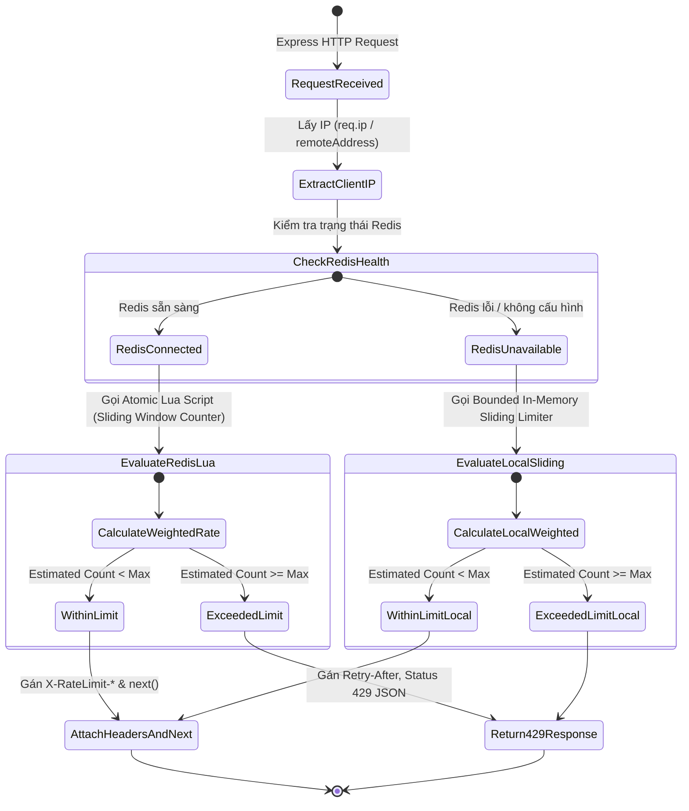

# Data Model: HTTP Rate Limiter Upgrade (Sliding Window Counter)

**Feature**: HTTP Rate Limiter Upgrade & Boundary Protection  
**Branch**: `028-task-15-http` | **Date**: 2026-08-20  

---

## 1. Entity Models & Interfaces

### 1.1 In-Memory Sliding Window Entry (`localCounts` Map)

```typescript
export interface LocalSlidingWindowEntry {
  /** Timestamp bắt đầu của window hiện tại (epoch ms) */
  currentWindowStart: number;
  /** Số request đã nhận trong window hiện tại */
  currentCount: number;
  /** Số request đã nhận trong window liền kề trước đó */
  previousCount: number;
}
```

---

### 1.2 Rate Limiter Assessment Result

```typescript
export interface RateLimitCheckResult {
  /** Cho phép request tiếp tục hay không */
  allowed: boolean;
  /** Tổng giới hạn trong 1 window */
  limit: number;
  /** Số request còn lại trong window trượt hiện tại */
  remaining: number;
  /** Thời điểm reset window tính bằng epoch seconds */
  resetEpochSec: number;
  /** Số giây cần chờ nếu bị rate limit (làm tròn lên tối thiểu 1) */
  retryAfterSec?: number;
  /** Số lượng request ước tính theo trọng số cửa sổ trượt */
  estimatedCount: number;
}
```

---

### 1.3 Rate Limiter Status & Telemetry (`getRateLimiterStatus`)

```typescript
export interface RateLimiterStatus {
  redisStatus: 'connected' | 'degraded' | 'disconnected';
  isDegraded: boolean;
  degradedFallbackCount: number;
  localEntriesCount: number;
  algorithm: 'sliding-window-counter';
  lastRedisError?: string;
  lastRedisTransitionAt?: number;
}
```

---

## 2. Redis Key Structure & Lifecycle

```text
Key Format:
  ratelimit:<endpointType>:<ip>:<window_bucket_timestamp>

Ví dụ:
  Window 1 (08:30:00 - 08:31:00): ratelimit:translation:192.168.1.10:1724142600000
  Window 2 (08:31:00 - 08:32:00): ratelimit:translation:192.168.1.10:1724142660000

TTL Rule:
  Mỗi key tự động expire sau: windowMs * 2 (tức 120 giây với window 60 giây).
  Đảm bảo khi bước sang window 2, dữ liệu window 1 vẫn còn để tính trọng số trượt,
  và tự động bị Redis dọn dẹp khi bước sang window 3.
```

---

## 3. Rate Limiter State Machine


