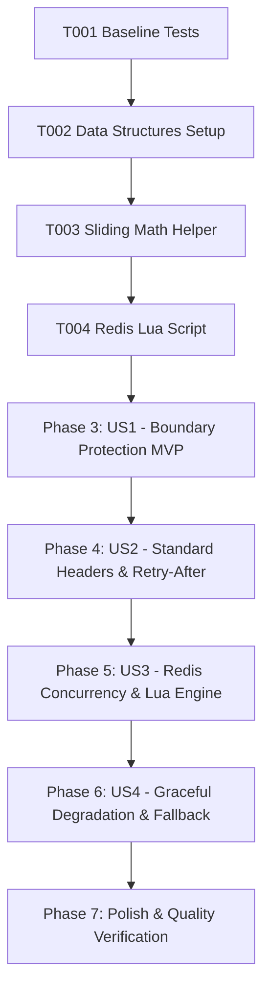

# Tasks: HTTP Rate Limiter Upgrade (Sliding Window Counter)

**Feature**: HTTP Rate Limiter Upgrade & Boundary Protection  
**Directory**: `specs/028-task-15-http/`  
**Plan**: [plan.md](./plan.md) | **Spec**: [spec.md](./spec.md)

---

## Phase 1: Setup (Shared Infrastructure)

**Purpose**: Baseline verification and sliding window data structures

- [X] T001 Verify baseline build and test suite passing (`npm test`, `npm run lint`)
- [X] T002 Define `LocalSlidingWindowEntry`, `RateLimitCheckResult`, and `RateLimiterStatus` interfaces in `server/middleware/rateLimiter.ts`

---

## Phase 2: Foundational (Blocking Prerequisites)

**Purpose**: Mathematical sliding window engine and atomic Redis Lua script

- [X] T003 [P] Implement weighted sliding window mathematical calculation helper `calculateSlidingWindowCount` in `server/middleware/rateLimiter.ts`
- [X] T004 [P] Implement atomic Sliding Window Counter Lua script for Redis in `server/middleware/rateLimiter.ts`

**Checkpoint**: Foundation ready — user story implementations can now proceed.

---

## Phase 3: User Story 1 - Smooth Boundary Protection without 2x Bursts (Priority: P1) 🎯 MVP

**Goal**: Eliminate the 2x burst vulnerability at window boundaries using sliding window weighted calculation.

**Independent Test**: Send 50 requests at second 58 of window 1 and 20 requests at second 02 of window 2. Verify that total weighted count exceeds 60 and requests are properly rate limited with HTTP 429.

### Tests for User Story 1
- [X] T005 [P] [US1] Create unit test suite in `server/middleware/__tests__/rateLimiterSlidingWindow.test.ts` for boundary burst elimination across 60s windows

### Implementation for User Story 1
- [X] T006 [US1] Implement bounded in-memory sliding window fallback `applyLocalSlidingLimit` in `server/middleware/rateLimiter.ts`

**Checkpoint**: User Story 1 is complete. Boundary burst vulnerability is eliminated.

---

## Phase 4: User Story 2 - Standard HTTP Headers & Precise Retry-After (Priority: P2)

**Goal**: Expose standard rate limit headers (`X-RateLimit-*`, `Retry-After`) on all HTTP responses and return formatted 429 JSON payloads.

**Independent Test**: Dispatch allowed and exceeded requests. Verify `X-RateLimit-Limit`, `X-RateLimit-Remaining`, and `X-RateLimit-Reset` on 200 responses, and `Retry-After` on 429 responses.

### Tests for User Story 2
- [X] T007 [P] [US2] Add unit test cases in `server/middleware/__tests__/rateLimiterSlidingWindow.test.ts` verifying `X-RateLimit-Limit`, `X-RateLimit-Remaining`, `X-RateLimit-Reset` and `Retry-After`

### Implementation for User Story 2
- [X] T008 [US2] Update `createRateLimiter` middleware in `server/middleware/rateLimiter.ts` to attach standard headers on allowed requests and format 429 response with `Retry-After`

**Checkpoint**: User Story 2 is complete. HTTP headers strictly comply with rate limiting standards.

---

## Phase 5: User Story 3 - High Concurrency & Race-Condition Freedom in Redis (Priority: P3)

**Goal**: Ensure atomic execution of sliding window rate limiting in Redis under high concurrent load.

**Independent Test**: Fire 100 concurrent requests from the same IP to a Redis-backed rate limiter. Verify exactly 60 requests succeed and 40 requests receive HTTP 429.

### Tests for User Story 3
- [X] T009 [P] [US3] Add unit test cases in `server/middleware/__tests__/rateLimiterSlidingWindow.test.ts` simulating 100 concurrent requests against Redis Lua evaluator

### Implementation for User Story 3
- [X] T010 [US3] Update Redis execution branch in `server/middleware/rateLimiter.ts` to invoke atomic Lua script with 2x window TTL

**Checkpoint**: User Story 3 is complete. Distributed rate limiting is atomic and free from race conditions.

---

## Phase 6: User Story 4 - Seamless Graceful Degradation & Memory Protection (Priority: P4)

**Goal**: Guarantee instant zero-downtime failover to in-memory sliding limiter when Redis is disconnected or degraded, with 10,000 max capacity bounds.

**Independent Test**: Simulate Redis disconnection events. Assert `getRateLimiterStatus().isDegraded` becomes `true` and that subsequent requests are seamlessly throttled by memory fallback.

### Tests for User Story 4
- [X] T011 [P] [US4] Add unit tests in `server/middleware/__tests__/rateLimiterDegradation.test.ts` for instant failover to in-memory sliding limiter and 10,000 capacity bounds

### Implementation for User Story 4
- [X] T012 [US4] Ensure `server/middleware/rateLimiter.ts` maintains telemetry counters (`degradedFallbackCount`, `algorithm: 'sliding-window-counter'`) and log throttling

**Checkpoint**: User Story 4 is complete. System exhibits high resilience and memory safety under Redis failure.

---

## Phase 7: Polish & Quality Verification

**Purpose**: Repository-wide verification and quality gate compliance

- [X] T013 Run full test suite (`npm test`) and ensure 100% pass rate
- [X] T014 Run TypeScript type checks (`npm run lint` / `tsc --noEmit`)
- [X] T015 Run production build (`npm run build`)
- [X] T016 Execute validation scenarios from `specs/028-task-15-http/quickstart.md`

---

## Dependencies & Execution Order

### Parallel Opportunities

- **T003, T004**: In-memory math helper and Redis Lua script can be authored concurrently.
- **T005, T007, T009, T011**: Test suites across user stories can be authored in parallel.
- **T008, T010, T012**: Header formatting and failover handling can be integrated into the middleware concurrently.

---

## Implementation Strategy

### MVP Scope (User Story 1 Only)
1. Complete Setup & Foundational (T001–T004)
2. Implement Sliding Window Math & Memory Fallback (T005–T006)
3. Validate independent test criteria for User Story 1

### Full Incremental Delivery
1. Foundation & US1 (Boundary Protection)
2. Add US2 (Standard Headers & Retry-After)
3. Add US3 (Redis Concurrency & Lua Script)
4. Add US4 (Graceful Degradation & Memory Protection)
5. Run full quality verification (T013–T016)
