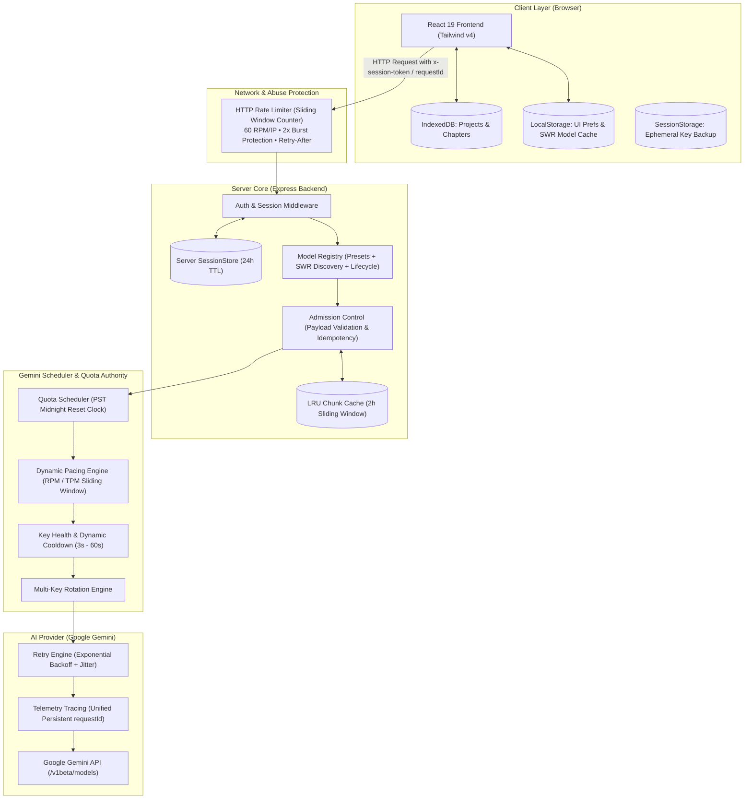

# Feature Specification: Documentation & Architecture Map

**Feature**: Comprehensive Documentation & Architecture Map Update  
**Branch**: `030-task-17-documentation` | **Status**: `Draft` | **Created**: 2026-08-20  

---

## 1. Feature Overview & Objectives

### 1.1 Context
Qua 16 tasks phát triển chuyên sâu, hệ thống dịch truyện AI đã được nâng cấp với các kiến trúc kỹ thuật hiện đại:
- **Model Registry & SWR Discovery**: Bộ đệm danh mục mô hình Stale-While-Revalidate, khử trùng lặp in-flight, tự động di chuyển model ngừng hoạt động (Shutdown Migration).
- **Gemini Quota Scheduler**: Đồng hồ RPD theo múi giờ PST (`America/Los_Angeles`), cửa sổ trượt 60s RPM/TPM, dynamic pacing, điều phối đa key theo sức khỏe (Key Health).
- **HTTP Sliding Window Rate Limiter**: Ngăn chặn tấn công DoS và lạm dụng mạng (Abuse Protection) với thuật toán Sliding Window Counter loại bỏ lỗ hổng 2x boundary burst.
- **Bảo mật & Storage Audit**: Zero-plain-key trong `localStorage`, phiên làm việc tạm thời trên server session 24h, IndexedDB là Single Source of Truth cho bản thảo.
- **Phục hồi & Quan sát (Observability)**: Tự động suy biến mượt mà khi mất Redis, truy vết xuyên suốt bằng `requestId`, log an toàn không lộ secret.

### 1.2 Purpose
Cập nhật toàn diện tài liệu hệ thống (`README.md`, `docs/architecture.md`, `docs/api.md`, `docs/model-system.md`...) để phản ánh 100% hiện trạng mã nguồn thực tế, xóa bỏ các placeholder cũ, chuẩn hóa đường dẫn và cung cấp sơ đồ kiến trúc logic trực quan.

---

## 2. Architecture Map & Logical Separation

### 2.1 Logical Flow Diagram

### 2.2 Ranh giới Phân định Rõ ràng (Architectural Boundaries)

| Phân hệ (Subsystem) | Phạm vi & Trách nhiệm | Đơn vị định danh | Thuật toán & Cơ chế |
|:---|:---|:---|:---|
| **HTTP Rate Limiter** | **Bảo vệ máy chủ (Abuse Protection)**: Ngăn chặn spam request DoS, brute-force endpoint. | Địa chỉ IP máy khách (`req.ip`) | **Sliding Window Counter**: 60 RPM/IP, trả về `HTTP 429` + `Retry-After`. |
| **Gemini Quota Scheduler** | **Điều phối tải AI Provider**: Quản lý hạn mức của từng API key Gemini từ Google. | Khóa API Key Hash (`keyHash`) | **PST Midnight Clock + Sliding RPM/TPM**: Pacing delay, key rotation, dynamic cooldown. |

---

## 3. Scope of Documentation Updates

### 3.1 `README.md` (Main Project Overview)
- Cập nhật mô tả tổng quan, tính năng nổi bật (Dịch 2 giai đoạn, Multi-key rotation, SWR Model Cache, Quota Observatory).
- Cập nhật hướng dẫn cài đặt, cấu hình biến môi trường (`.env.example`), khởi chạy dev (`npm run dev`) và production (`npm run build && npm run start`).
- Bổ sung bảng các lệnh kiểm chuẩn bắt buộc (`npm run lint`, `npm test`, `npm run build`).
- Cập nhật danh sách toàn bộ API Endpoints thực tế (Auth, Translation, Dictionary, Quota, Health, Models).
- Tích hợp sơ đồ kiến trúc tổng quan.

### 3.2 `docs/architecture.md` (Deep Architectural Blueprint)
- Mô tả chi tiết 5 phân hệ: Client Architecture, HTTP Ingress & Abuse Protection, Core Services & State Ownership Matrix, Scheduler & Quota Authority, Observability & Error Tracing.
- Tài liệu hóa Storage Tier Invariant (IndexedDB, Server Session, Redis, LocalStorage).

### 3.3 `docs/model-system.md` (Model Registry & Discovery Lifecycle)
- Chi tiết cơ chế SWR Cache, TTL 1 giờ, In-Flight Deduplication, Zero-Wipe Fallback.
- Danh mục model Presets, Discovered, Custom và quy tắc di chuyển khi model ngừng hoạt động (Shutdown Migration).

### 3.4 `docs/api.md` (API Reference & Error Contract)
- Chi tiết request/response payload, headers (`X-RateLimit-*`, `Retry-After`, `x-request-id`, `x-session-token`), và mã lỗi chuẩn (`RATE_LIMITED`, `QUOTA_EXHAUSTED`, `AUTH_FAILED`).

---

## 4. Measurable Success Criteria

- **SC-001 (Zero Stale References)**: 100% các đường dẫn, tên package, scripts trong `README.md` và `docs/` khớp chính xác với mã nguồn thực tế.
- **SC-002 (Clear Boundary Demarcation)**: Phân biệt rõ ràng giữa HTTP Rate Limiter và Gemini Quota Scheduler trong sơ đồ và tài liệu.
- **SC-003 (Quality Gates)**: Đạt 100% test pass (`npm test`), 0 lỗi TypeScript (`npm run lint`), và build thành công (`npm run build`).
