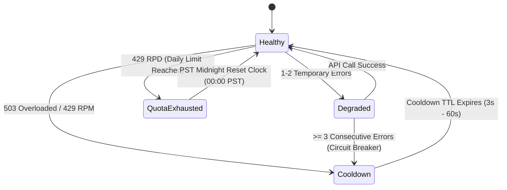

# Final Audit Data Model & System State

## 1. Storage Tier Source of Truth Matrix

```text
┌─────────────────────────┬────────────────────────────┬────────────────────────────┐
│ Domain                  │ Primary Source of Truth    │ Secondary / Cache Layer    │
├─────────────────────────┼────────────────────────────┼────────────────────────────┤
│ Manuscripts & Chapters  │ IndexedDB (db.ts)          │ React Component Memory     │
│ Runtime Credentials     │ Server SessionStore        │ sessionStorage             │
│ Model Registry Cache    │ Server Model Registry      │ LocalStorage (1h SWR)      │
│ Quota & Token Counts    │ Server QuotaService        │ React Dashboard Query      │
│ Key Health States       │ Server QuotaService        │ In-Memory Health State     │
│ Translation Chunks      │ Server ChunkCache          │ In-Memory 2h Sliding LRU   │
│ UI Preferences          │ LocalStorage               │ React State                │
└─────────────────────────┴────────────────────────────┴────────────────────────────┘
```

## 2. Key Health State Transitions


