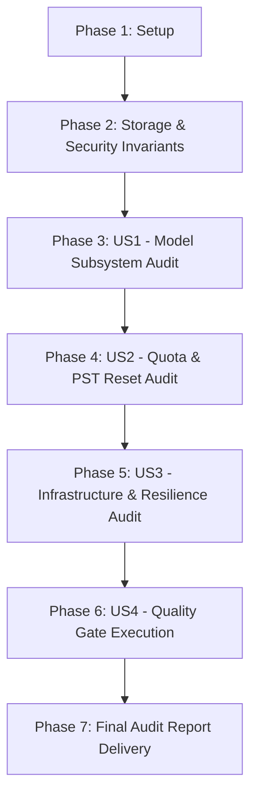

# Tasks: System-Wide Final Architecture & Quality Audit

**Feature**: System-Wide Final Architecture, Security, Model, Quota & Reliability Audit  
**Directory**: `specs/031-task-18-final-audit/`  
**Plan**: [plan.md](./plan.md) | **Spec**: [spec.md](./spec.md)

---

## Phase 1: Setup (Context & Baseline Invariants)

**Purpose**: Verify repository status, directory structure, and quality baseline

- [X] T001 Verify baseline repository structure and documentation files in `docs/` and `README.md`
- [X] T002 Inspect and ensure zero circular dependencies between `src/`, `server/`, and `shared/`

---

## Phase 2: Foundational (Storage & Security Invariants)

**Purpose**: Audit Single Source of Truth and Data Redaction rules

- [X] T003 [P] Audit IndexedDB exclusive ownership for manuscripts, chapters, and glossaries in `src/services/db.ts`
- [X] T004 [P] Audit Server SessionStore ephemeral key storage with 24-hour TTL in `server/services/sessionStore.ts`
- [X] T005 [P] Audit browser storage scanner `verifyStorageIntegrity` in `src/utils/storageAudit.ts` ensuring zero plain keys in `localStorage`
- [X] T006 [P] Audit safe logging redaction (`maskApiKey`, `hashApiKey`) in `server/services/quotaService.ts` and `server/utils/safeLogger.ts`

**Checkpoint**: Storage and security invariants verified and locked.

---

## Phase 3: User Story 1 - Model Subsystem Audit (Priority: P1) 🎯 MVP

**Goal**: Verify Model Registry, SWR Discovery Cache, Custom Model Verification, and Shutdown Migration.

**Independent Test**: Assert that `gemini-1.5-flash` migrates to `gemini-2.5-flash`, stale cache renders in < 5ms, and 429 errors preserve cache without deletion.

### Implementation for User Story 1
- [X] T007 [US1] Audit Model Registry presets and shutdown migration mappings in `src/utils/modelRegistry.ts`
- [X] T008 [US1] Audit SWR Discovery Cache lifecycle, in-flight deduplication, and zero-wipe fallback in `src/hooks/useModelDiscovery.ts`
- [X] T009 [US1] Audit custom model verification endpoint in `server/controllers/modelController.ts` and `/api/verify-model`

**Checkpoint**: Model subsystem verified 100%.

---

## Phase 4: User Story 2 - Quota Scheduler & PST Reset Audit (Priority: P2)

**Goal**: Verify RPD reset at 00:00 PST, sliding 60s RPM/TPM tracking, dynamic pacing, and key health states.

**Independent Test**: Assert that `getDayInLosAngeles` accurately calculates PST dates and resets daily counts, while key health states transition cleanly between Healthy, Degraded, Cooldown, and QuotaExhausted.

### Implementation for User Story 2
- [X] T010 [US2] Audit PST midnight reset clock and sliding 60s RPM/TPM windows in `server/services/quotaService.ts`
- [X] T011 [US2] Audit dynamic pacing and multi-key selection ranking in `server/services/quotaService.ts`
- [X] T012 [US2] Audit Key Health state machine transitions (`Healthy`, `Degraded`, `Cooldown`, `QuotaExhausted`) and Circuit Breaker logic in `server/services/quotaService.ts`

**Checkpoint**: Quota Scheduler and Key Health verified 100%.

---

## Phase 5: User Story 3 - Infrastructure & Resilience Audit (Priority: P3)

**Goal**: Verify Sliding Window Counter HTTP abuse limiter, Redis failover degradation, and persistent `requestId` tracing.

**Independent Test**: Assert that HTTP Rate Limiter blocks 2x boundary bursts with `HTTP 429` and `Retry-After`, and that loss of Redis triggers immediate failover to in-memory sliding limiter and chunk cache.

### Implementation for User Story 3
- [X] T013 [US3] Audit Sliding Window Counter rate limiter and boundary burst elimination in `server/middleware/rateLimiter.ts`
- [X] T014 [US3] Audit Redis failover graceful degradation to local sliding limiter in `server/middleware/rateLimiter.ts`
- [X] T015 [US3] Audit unified persistent `requestId` propagation across retry attempts in `server/controllers/translateController.ts`

**Checkpoint**: Infrastructure and resilience verified 100%.

---

## Phase 6: User Story 4 - Quality Gate Execution & Verification (Priority: P4)

**Goal**: Execute the mandatory triad of quality gates: `npm run lint`, `npm test`, `npm run build`.

**Independent Test**: All 3 commands MUST complete with exit code 0.

### Implementation for User Story 4
- [X] T016 [US4] Execute TypeScript typecheck (`npm run lint` / `tsc --noEmit`) — PASS (0 errors)
- [X] T017 [US4] Execute full test suite (`npm test` / `vitest run`) — PASS (59 files, 431 tests passed)
- [X] T018 [US4] Execute production build (`npm run build`) — PASS (Vite + esbuild successful)

**Checkpoint**: All quality gates verified and passed.

---

## Phase 7: Polish & Final Audit Delivery

**Purpose**: Formalize the final audit report

- [X] T019 Compile and finalize the official `Final Audit` report in `specs/031-task-18-final-audit/spec.md` and deliver to user

---

## Dependencies & Execution Order

