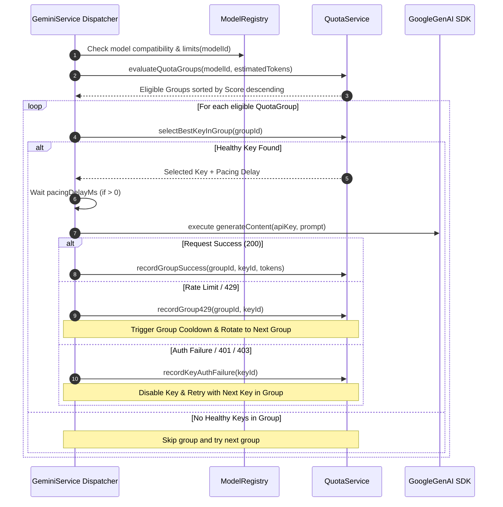

# Contract: Hierarchical Scheduler Pipeline

## Core Method: `scheduleNextRequest()`

### Interface Specification

```typescript
export interface ScheduleRequestParams {
  modelId: string;
  estimatedPromptTokens?: number;
  candidateKeys: string[];
  groupConfigs?: Array<{
    id: string;
    projectId?: string;
    configuredRpm?: number;
    configuredTpm?: number;
    configuredRpd?: number;
    keyIds: string[];
  }>;
  now?: number;
}

export interface SchedulerExecutionPlan {
  selectedGroupId: string;
  selectedKeyId: string;
  selectedRawKey: string;
  keyIndex: number;
  pacingDelayMs: number;
  groupScore: number;
  keyScore: number;
}
```

---

### Pipeline Execution Order


