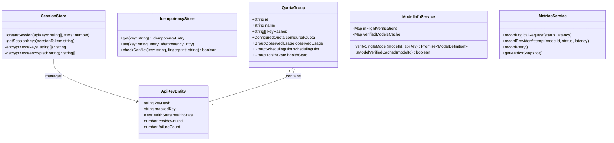

# Data Model: Infrastructure, Security & Resiliency Hardening

## 1. Entity Relationship Diagram



---

## 2. Encrypted Session Data Structure

### `EncryptedSessionPayload` (Stored in Redis / Memory)
```typescript
export interface EncryptedSessionData {
  encryptedKeys: string;     // Format: "iv_hex:authTag_hex:ciphertext_hex"
  createdAt: number;
  lastAccessedAt: number;
  expiresAt: number;
}
```

---

## 3. Scoped Idempotency Entry

```typescript
export interface IdempotencyEntry {
  key: string;               // "idemp:session:hash123:POST:/api/translate-raw:user-client-key"
  fingerprint: string;       // sha256(canonicalJson(body))
  status: 'pending' | 'completed' | 'failed';
  createdAt: number;
  statusCode?: number;
  responseBody?: any;
  listeners: Array<(result: IdempotencyListenerResult) => void>;
}
```

---

## 4. Key Health State Machine Transitions

```text
[HEALTHY] ─── (HTTP 429 / 503 Overload) ───► [COOLDOWN] (auto-recovers after cooldownExpiry)
   │
   ├────────── (HTTP 401 / 403) ────────────► [AUTH_FAILED] (permanently isolated from rotation)
   │
   ├────────── (Repeated Transient Errors) ─► [DEGRADED] (deprioritized in scheduling)
   │
   └────────── (User action) ───────────────► [DISABLED]
```
