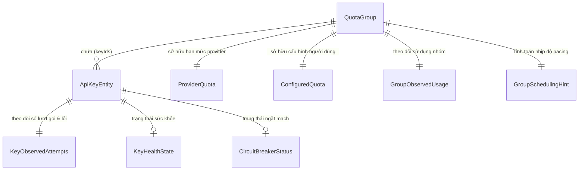
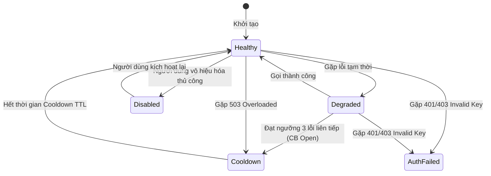
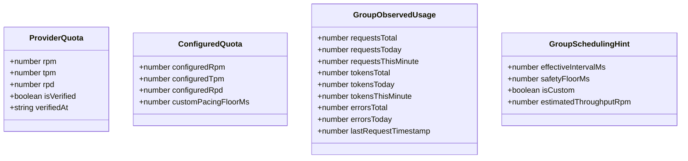

# Data Model: Loại bỏ Legacy Per-Key Quota Ownership & Chuẩn hóa Quota Group Authority

**Feature Branch**: `038-remove-legacy-per-key-quota`  
**Created**: 2026-08-20  
**Status**: Completed  
**Spec Reference**: [spec.md](file:///e:/tailieuhoctap/laptrinhnangcao/th/merged/specs/038-remove-legacy-per-key-quota/spec.md)

---

## 1. Sơ đồ Quan hệ Thực thể (Entity Relationship Diagram)

---

## 2. Chi tiết Cấu trúc Dữ liệu & Thực thể

### 2.1 Thực thể `QuotaGroup` (Thực thể Quản trị Hạn mức Trung tâm)

Đại diện cho một Google Cloud Project hoặc cụm hạn mức chung. Quản lý toàn bộ hạn mức RPM, TPM, RPD và danh sách các key trực thuộc.

| Thuộc tính | Kiểu dữ liệu | Bắt buộc | Mô tả |
|---|---|---|---|
| `id` | `string` | Có | Định danh duy nhất của Quota Group (ví dụ: `group_project_a`) |
| `projectId` | `string` | Không | ID của Google Cloud Project nếu người dùng cung cấp |
| `name` | `string` | Không | Tên hiển thị thân thiện trên giao diện |
| `keyIds` | `string[]` | Có | Danh sách raw API keys hoặc key hashes thuộc nhóm này |
| `configuredLimits` | `ConfiguredQuota` | Có | Hạn ngạch tùy chỉnh do người dùng cấu hình |
| `providerQuota` | `ProviderQuota` | Có | Hạn ngạch định danh của nhà cung cấp (mặc định unverified) |
| `observedUsage` | `GroupObservedUsage` | Có | Số liệu sử dụng thực tế (Sliding Window 60s & Tổng ngày) |
| `schedulingHint` | `GroupSchedulingHint` | Có | Gợi ý nhịp độ pacing và thông lượng tính toán |
| `healthState` | `GroupHealthState` | Có | Trạng thái sức khỏe của toàn nhóm |
| `cooldownUntilMs` | `number` | Có | Timestamp hết hạn Cooldown của nhóm (khi gặp 429) |
| `nextAllowedTimeMs` | `number` | Có | Timestamp sớm nhất được phép gửi request tiếp theo |
| `callLog` | `Array<{ timestamp: number, tokens: number }>` | Không | Nhật ký cuộc gọi trong 60 giây phục vụ Sliding Window |

#### Các trạng thái `GroupHealthState`:
- `Available`: Nhóm sẵn sàng nhận request.
- `RateLimited`: Nhóm đang tạm hoãn do chạm ngưỡng RPM/TPM trong phút hiện tại.
- `Exhausted`: Nhóm đã chạm trần RPD trong ngày theo múi giờ PST.
- `InCooldown`: Nhóm đang trong thời gian chờ sau khi gặp lỗi 429 từ Google.
- `NoHealthyKeys`: Tất cả các key trong nhóm đều bị lỗi xác thực hoặc vô hiệu hóa.
- `Disabled`: Toàn bộ nhóm bị vô hiệu hóa thủ công.

---

### 2.2 Thực thể `ApiKeyEntity` (Điểm Kết nối trong Health Pool)

Đại diện cho một API key riêng lẻ. **Tuyệt đối không chứa hạn mức quota độc lập**.

| Thuộc tính | Kiểu dữ liệu | Bắt buộc | Mô tả |
|---|---|---|---|
| `id` | `string` | Có | Key hash (SHA-256) của API Key |
| `groupId` | `string` | Có | ID của QuotaGroup mà key này trực thuộc |
| `maskedKey` | `string` | Có | Chuỗi che giấu an toàn (ví dụ: `AIzaSy...4xQ1`) |
| `healthState` | `KeyHealthState` | Có | Trạng thái sức khỏe tức thời của key |
| `circuitBreaker` | `CircuitBreakerStatus` | Có | Trạng thái ngắt mạch (`Closed`, `Open`, `HalfOpen`) |
| `circuitBreakerFailures` | `number` | Có | Số lỗi liên tiếp đã ghi nhận trên key |
| `cooldownUntilMs` | `number` | Có | Timestamp hết hạn tạm dừng riêng của key |
| `lastUsedAtMs` | `number` | Có | Timestamp của lần gọi gần nhất (dùng cho Round-Robin) |
| `transitionReason` | `string` | Không | Lý do chuyển đổi trạng thái gần nhất |
| `observedAttempts` | `KeyObservedAttempts` | Có | Thống kê số lượt gọi, thành công, thất bại của key |

#### Máy trạng thái `KeyHealthState`:

---

### 2.3 Thực thể Phân loại Dữ liệu 4 Tầng

---

## 3. Quy tắc Xác thực & Ràng buộc Nghiệp vụ (Validation Rules)

1. **Ràng buộc Sở hữu Quota**:
   - Mọi API key PHẢI thuộc về chính xác 1 `QuotaGroup`.
   - Tổng RPM của QuotaGroup không phụ thuộc vào số lượng key trong `keyIds`.
   - Nếu $N$ keys thuộc cùng 1 Group có hạn mức 15 RPM, tổng số request của toàn bộ $N$ keys trong 60 giây không được vượt quá 15.

2. **Ràng buộc Pacing An toàn**:
   - `GroupSchedulingHint.effectiveIntervalMs` luôn được tính bằng:
     $$\text{intervalMs} = \max\left(400, \left\lceil \frac{60000}{\text{RPM} \times 0.9} \right\rceil\right)$$
   - Ngưỡng sàn bảo vệ tối thiểu trên server là `400ms`.

3. **Ràng buộc Phục hồi Ngày Mới**:
   - Bộ đếm `requestsToday` và `tokensToday` của QuotaGroup được đối chiếu với ngày theo múi giờ `America/Los_Angeles`.
   - Khi bước sang ngày mới PST, `requestsToday = 0`, `tokensToday = 0`, và nếu group đang ở trạng thái `Exhausted` sẽ tự động chuyển về `Available`.

4. **Ràng buộc Loại bỏ Legacy**:
   - Cấm định nghĩa các thuộc tính `keyRpm`, `keyMaxTpm`, `keyMaxRpd`, `perKeyRpm`, `independentProviderRpm/Tpm/Rpd` trên thực thể API Key.
   - Cấm gọi phương thức `calculateKeyScore()` trên thực thể API Key đơn lẻ.
