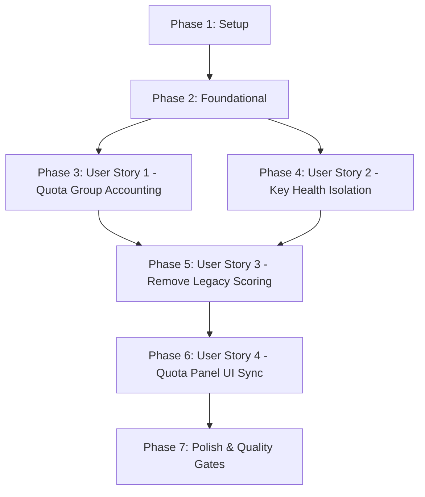

# Tasks: Loại bỏ Legacy Per-Key Quota Ownership & Chuẩn hóa Kiến trúc Quota Group Authority

**Branch**: `038-remove-legacy-per-key-quota` | **Spec**: [spec.md](file:///e:/tailieuhoctap/laptrinhnangcao/th/merged/specs/038-remove-legacy-per-key-quota/spec.md) | **Plan**: [plan.md](file:///e:/tailieuhoctap/laptrinhnangcao/th/merged/specs/038-remove-legacy-per-key-quota/plan.md)

---

## Phase 1: Setup & Data Model Alignment (Shared Infrastructure)

**Purpose**: Dọn dẹp các kiểu dữ liệu legacy, đảm bảo schema phản ánh đúng 100% quyền sở hữu hạn ngạch tại QuotaGroup và sức khỏe độc lập tại ApiKeyEntity.

- [x] T001 Rà soát và loại bỏ các trường quota per-key legacy khỏi interface trong `shared/models.ts`
- [x] T002 [P] Đồng bộ hóa các kiểu DTO snapshot client-side trong `src/utils/apiClient.ts`

---

## Phase 2: Foundational Architecture & Invariant Enforcement

**Purpose**: Loại bỏ hoàn toàn phương thức tính điểm per-key cũ (`calculateKeyScore`), tái cấu trúc hàm tính pacing an toàn sang cấp độ Quota Group.

- [x] T003 Loại bỏ `calculateKeyScore()` và `KeyScoreOptions` trong `server/services/quotaService.ts`
- [x] T004 Tái cấu trúc hàm tính pacing an toàn sang `computeGroupIntervalMs` và dọn dẹp tham số legacy trong `server/services/geminiService.ts`

**Checkpoint**: Nền tảng kiến trúc đã sẵn sàng — các User Stories có thể bắt đầu triển khai độc lập.

---

## Phase 3: User Story 1 - Tập trung Hạn ngạch theo Quota Group / Dự án (Priority: P1) 🎯 MVP

**Goal**: Toàn bộ hạn ngạch (RPM/TPM/RPD) được quản lý và ghi nhận độc quyền ở cấp độ QuotaGroup, loại bỏ hoàn toàn việc nhân ảo hạn ngạch khi thêm key cùng dự án.

**Independent Test**: Gửi 15 requests qua 2 keys thuộc cùng một Project A (15 RPM) $\to$ QuotaGroup đạt 15 RPM, request tiếp theo bị hoãn theo nhịp độ pacing; Project B độc lập vẫn xử lý bình thường.

### Tests for User Story 1

- [x] T005 [P] [US1] Bổ sung các ca kiểm thử dự án dùng chung quota bucket (Same project + 2 keys, Different projects, Group quota exhaustion) trong `server/services/__tests__/quotaGroup.test.ts`

### Implementation for User Story 1

- [x] T006 [US1] Chuẩn hóa cơ chế tính toán Sliding Window 60s (RPM/TPM) và reset ngày theo múi giờ PST tại `server/services/quotaService.ts`
- [x] T007 [US1] Cập nhật logic đánh giá và chấm điểm Quota Group (`evaluateQuotaGroups`) trong `server/services/quotaService.ts`

**Checkpoint**: User Story 1 hoàn thành — Project-level Quota Accounting hoạt động chính xác và kiểm thử độc lập thành công.

---

## Phase 4: User Story 2 - Cách ly Trạng thái Sức khỏe API Key (Priority: P1) 🎯 MVP

**Goal**: API Key chỉ đóng vai trò là điểm kết nối trong Health Pool. Lỗi xác thực (401/403) hay Cooldown 503 chỉ cách ly riêng key gặp lỗi, giữ QuotaGroup khả dụng với các key khỏe mạnh còn lại.

**Independent Test**: Kích hoạt lỗi 401 trên Key A1 trong QuotaGroup $\to$ Key A1 chuyển sang `AuthFailed`, Key A2 tiếp nhận các yêu cầu tiếp theo và request hoàn thành thành công.

### Tests for User Story 2

- [x] T008 [P] [US2] Bổ sung các ca kiểm thử cô lập sức khỏe key (One key auth failure, One key cooldown, Group still available) trong `server/services/__tests__/quotaGroup.test.ts`

### Implementation for User Story 2

- [x] T009 [US2] Hoàn thiện máy trạng thái KeyHealthState (`Healthy`, `Degraded`, `Cooldown`, `AuthFailed`, `Disabled`) trong `server/services/quotaService.ts`
- [x] T010 [US2] Cập nhật thuật toán chọn key tối ưu trong QuotaGroup (`selectBestKeyInGroup`) trong `server/services/quotaService.ts`
- [x] T011 [US2] Tích hợp luồng xoay key và cô lập lỗi trong `server/services/geminiService.ts`

**Checkpoint**: User Story 2 hoàn thành — API Key Health Pool và Circuit Breaker cách ly lỗi chuẩn xác.

---

## Phase 5: User Story 3 - Loại bỏ Triệt để Legacy Per-Key Scoring & Di trú Dữ liệu Cũ (Priority: P2)

**Goal**: Cập nhật toàn bộ các bài test cũ sang mô hình `evaluateQuotaGroups` / `selectBestKeyInGroup`, di trú cấu hình LocalStorage cũ sang QuotaGroup settings.

**Independent Test**: Chạy `server/services/__tests__/keyScheduler.test.ts` pass 100% không còn lời gọi `calculateKeyScore`, nạp cấu hình cũ từ LocalStorage tự động ánh xạ sang `configuredLimits` của QuotaGroup.

### Tests for User Story 3

- [x] T012 [P] [US3] Cập nhật bộ kiểm thử scheduler trong `server/services/__tests__/keyScheduler.test.ts` chuyển hoàn toàn sang `evaluateQuotaGroups` và `selectBestKeyInGroup`

### Implementation for User Story 3

- [x] T013 [US3] Cài đặt cơ chế di trú cấu hình cũ từ LocalStorage sang QuotaGroup settings trong `src/components/QuotaPanel.tsx`
- [x] T014 [US3] Cập nhật hàm định dạng nhịp độ pacing `formatPacingSummary` trong `src/utils/modelRegistry.ts`

**Checkpoint**: User Story 3 hoàn thành — Toàn bộ legacy per-key scoring đã được gỡ bỏ sạch sẽ.

---

## Phase 6: User Story 4 - Đồng bộ Giao diện Quota Panel theo Mô hình Phân cấp Mới (Priority: P2)

**Goal**: Giao diện QuotaPanel hiển thị cấu trúc phân cấp trực quan: QuotaGroup (sở hữu RPM/TPM/RPD) $\to$ Member Keys (trạng thái sức khỏe, số lần gọi, lỗi).

**Independent Test**: Mở QuotaPanel với 2 keys cùng dự án $\to$ hiển thị 1 khung QuotaGroup 15 RPM duy nhất kèm danh sách trạng thái của 2 keys bên dưới.

### Tests for User Story 4

- [x] T015 [P] [US4] Cập nhật và bổ sung bài test UI QuotaPanel trong `src/components/__tests__/QuotaPanelMetrics.test.ts` và `src/components/__tests__/QuotaPanelHealthBadges.test.ts`

### Implementation for User Story 4

- [x] T016 [US4] Tinh chỉnh component QuotaPanel hiển thị cấu trúc cây QuotaGroup và danh sách Member Keys trong `src/components/QuotaPanel.tsx`
- [x] T017 [US4] Cập nhật `CustomLimitsPanel` làm rõ cấu hình hạn mức thuộc về QuotaGroup trong `src/components/QuotaPanel.tsx`

**Checkpoint**: User Story 4 hoàn thành — Giao diện frontend đồng bộ hoàn toàn với kiến trúc QuotaGroup bên dưới.

---

## Phase 7: Polish & Cross-Cutting Concerns (Quality Gates)

**Purpose**: Cập nhật tài liệu kỹ thuật, rà soát type safety và chạy toàn diện các Quality Gates theo Hiến pháp.

- [x] T018 [P] Cập nhật tài liệu kiến trúc điều phối quota trong `docs/quota-and-scheduling.md`
- [x] T019 Kiểm tra Type Safety không có lỗi với `npm run lint` (`tsc --noEmit`)
- [x] T020 Chạy toàn bộ test suite và đảm bảo pass 100% với `npm test` (`vitest run`)
- [x] T021 Kiểm tra đóng gói build production thành công với `npm run build`
- [x] T022 Thực hiện kiểm định xác thực theo `specs/038-remove-legacy-per-key-quota/quickstart.md`

---

## Dependencies & Execution Order

### Phase Dependencies

- **Phase 1 (Setup)**: Không có phụ thuộc — có thể bắt đầu ngay lập tức.
- **Phase 2 (Foundational)**: Phụ thuộc vào Phase 1 — CHẶN toàn bộ User Stories.
- **Phase 3 (User Story 1 - P1 MVP)**: Phụ thuộc vào Phase 2 — Có thể triển khai độc lập.
- **Phase 4 (User Story 2 - P1 MVP)**: Phụ thuộc vào Phase 2 — Có thể triển khai song song hoặc nối tiếp US1.
- **Phase 5 (User Story 3 - P2)**: Phụ thuộc vào Phase 3 và Phase 4.
- **Phase 6 (User Story 4 - P2)**: Phụ thuộc vào Phase 5.
- **Phase 7 (Polish & Verification)**: Phụ thuộc vào toàn bộ các Phase trước.

---

## Parallel Execution Opportunities

- **Trong Phase 1**: `T001` (`shared/models.ts`) và `T002` (`src/utils/apiClient.ts`) có thể chạy song song.
- **Trong Phase 3**: `T005` (test file) có thể viết song song với rà soát logic.
- **Trong Phase 4**: `T008` (test file) có thể viết song song với `T009` và `T010`.
- **Trong Phase 5**: `T012` (`keyScheduler.test.ts`) và `T014` (`modelRegistry.ts`) có thể thực hiện song song.
- **Trong Phase 6**: `T015` (UI tests) và `T017` (`CustomLimitsPanel`) có thể thực hiện song song.

---

## Implementation Strategy

### MVP Scope (User Story 1 & User Story 2)
1. Hoàn thành Phase 1 (Setup) và Phase 2 (Foundational).
2. Triển khai Phase 3 (US1 - QuotaGroup Accounting) và Phase 4 (US2 - Key Health Isolation).
3. **STOP & VALIDATE**: Chạy 6 bài test bắt buộc (`quotaGroup.test.ts`) để chứng minh MVP hoạt động chuẩn xác 100%.

### Incremental Delivery (P2 Stories)
4. Triển khai Phase 5 (US3 - Loại bỏ triệt để legacy scoring & test migration).
5. Triển khai Phase 6 (US4 - Đồng bộ QuotaPanel UI).
6. Hoàn tất Phase 7 (Quality Gates: lint, test, build).
