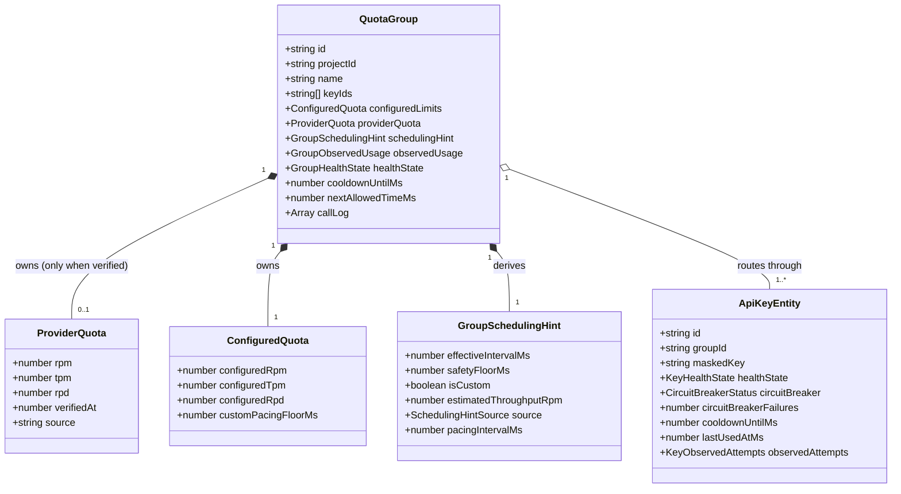

# Phase 1 Data Model: Phân Tách ProviderQuota Khỏi Fallback / Scheduling Hint

**Feature**: `039-isolate-provider-quota-fallback`  
**Date**: 2026-08-20  
**Status**: Completed

---

## 1. Sơ Đồ Thực Thể - Quan Hệ (Entity-Relationship Diagram)



---

## 2. Đặc Tả Chi Tiết Các Kiểu Dữ Liệu (TypeScript Definitions)

### 2.1 `ProviderQuota`
```typescript
/**
 * Hạn ngạch chính thức do Google Cloud / Google AI Studio cấp.
 * CHỈ TỒN TẠI KHI ĐÃ ĐƯỢC XÁC MINH (is known/verified).
 * Nếu chưa có dữ liệu, QuotaGroup.providerQuota sẽ là `undefined`.
 */
export interface ProviderQuota {
  rpm?: number;
  tpm?: number;
  rpd?: number;
  verifiedAt?: number;
  source?: 'provider';
}
```

### 2.2 `SchedulingHintSource` & `GroupSchedulingHint`
```typescript
export type SchedulingHintSource =
  | 'provider'
  | 'configured'
  | 'model-fallback'
  | 'safe-default';

export interface GroupSchedulingHint {
  effectiveIntervalMs: number;
  safetyFloorMs: number;
  isCustom: boolean;
  estimatedThroughputRpm: number;
  source: SchedulingHintSource;
  pacingIntervalMs?: number;
}
```

### 2.3 `QuotaGroup`
```typescript
export interface QuotaGroup {
  id: string;
  projectId?: string;
  name?: string;
  keyIds: string[];
  configuredLimits: ConfiguredQuota;
  providerQuota?: ProviderQuota; // undefined khi chưa có dữ liệu xác minh
  observedUsage: GroupObservedUsage;
  schedulingHint: GroupSchedulingHint;
  healthState: GroupHealthState;
  cooldownUntilMs: number;
  nextAllowedTimeMs: number;
  callLog?: Array<{ timestamp: number; tokens: number }>;
}
```

---

## 3. Quy Tắc Chuyển Đổi & Nguồn Gốc Gợi Ý Điều Phối (Derivation Logic)

Hàm tính toán `deriveSchedulingHint(configuredLimits, providerQuota, modelId, safetyFloorMs)` tuân thủ bảng quyết định sau:

| Điều Kiện | Nguồn Gốc (`source`) | Cơ Sở Tính `effectiveIntervalMs` |
|---|---|---|
| `configuredLimits.configuredRpm > 0` | `"configured"` | $\max(\text{safetyFloor}, \lceil 60000 / (\text{configuredRpm} \times 0.9) \rceil)$ |
| `providerQuota?.rpm > 0` | `"provider"` | $\max(\text{safetyFloor}, \lceil 60000 / (\text{providerQuota.rpm} \times 0.9) \rceil)$ |
| Mô hình chứa `pro` | `"model-fallback"` | $6000\,\text{ms}$ (~10 RPM) |
| Mô hình chứa `flash-lite` | `"model-fallback"` | $3500\,\text{ms}$ (~17 RPM) |
| Mô hình chứa `gemma` | `"model-fallback"` | $2000\,\text{ms}$ (~30 RPM) |
| Mô hình mặc định (Flash) | `"model-fallback"` | $4445\,\text{ms}$ (~15 RPM) |
| Không xác định được | `"safe-default"` | $\text{safetyFloorMs} \ge 400\,\text{ms}$ |
