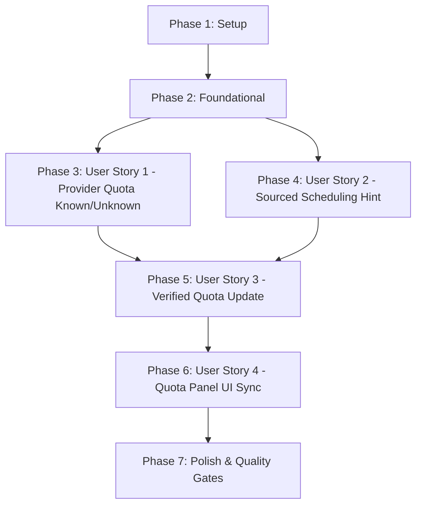

# Tasks: Tách Biệt Rõ Ràng Giữa Provider Quota Xác Minh & Gợi Ý Điều Phối (Scheduling Hint / Fallback)

**Branch**: `039-isolate-provider-quota-fallback` | **Spec**: [spec.md](file:///e:/tailieuhoctap/laptrinhnangcao/th/merged/specs/039-isolate-provider-quota-fallback/spec.md) | **Plan**: [plan.md](file:///e:/tailieuhoctap/laptrinhnangcao/th/merged/specs/039-isolate-provider-quota-fallback/plan.md)

---

## Phase 1: Setup & Data Model Alignment (Shared Infrastructure)

**Purpose**: Chuẩn hóa kiểu dữ liệu, chuyển `ProviderQuota` sang dạng tùy chọn (`optional`), chỉ tồn tại khi có `source: "provider"`, và mở rộng `SchedulingHint` với trường `source`.

- [x] T001 Cập nhật interface `ProviderQuota`, `QuotaGroup`, `GroupSchedulingHint`, `SchedulingHintSource` trong `shared/models.ts`
- [x] T002 [P] Đồng bộ hóa các kiểu DTO snapshot client-side trong `src/utils/apiClient.ts`

---

## Phase 2: Foundational Architecture & Semantic Separation

**Purpose**: Loại bỏ hoàn toàn việc gán giá trị mặc định giả định (15 RPM / 1M TPM / 1500 RPD) vào `providerQuota`, cài đặt hàm suy diễn nhịp độ điều phối `deriveSchedulingHint`.

- [x] T003 Khởi tạo `providerQuota = undefined` cho các QuotaGroup chưa xác minh và loại bỏ fake defaults trong `server/services/quotaService.ts`
- [x] T004 Cài đặt hàm suy diễn `deriveSchedulingHint(configuredLimits, providerQuota, modelId, safetyFloorMs)` với 4 nguồn gốc (`source`) trong `server/services/quotaService.ts`

**Checkpoint**: Nền tảng ngữ nghĩa dữ liệu đã sẵn sàng — các User Stories có thể bắt đầu triển khai độc lập.

---

## Phase 3: User Story 1 - Phân Biệt Tuyệt Đối Provider Quota Known vs Unknown (Priority: P1) 🎯 MVP

**Goal**: Đảm bảo QuotaGroup mới chưa xác minh luôn có `providerQuota = undefined`, chỉ có dữ liệu khi đã kiểm tra thực tế từ Google API.

**Independent Test**: Khởi tạo group mới $\to$ `group.providerQuota` là `undefined`; khi truyền `providerQuota` hợp lệ $\to$ lưu trữ đủ thông số với `source: "provider"`.

### Tests for User Story 1

- [x] T005 [P] [US1] Bổ sung các ca kiểm thử `provider quota known` và `provider quota unknown` trong `server/services/__tests__/quotaGroup.test.ts`

### Implementation for User Story 1

- [x] T006 [US1] Chuẩn hóa phương thức `getQuotaGroup` và DTO generator phản ánh đúng `providerQuota: undefined | ProviderQuota` trong `server/services/quotaService.ts`

**Checkpoint**: User Story 1 hoàn thành — Ngữ nghĩa Provider Quota được bảo toàn 100%.

---

## Phase 4: User Story 2 - Phân Tách & Nguồn Gốc Hóa Gợi Ý Điều Phối Pacing (Priority: P1) 🎯 MVP

**Goal**: Gợi ý điều phối `SchedulingHint` tính toán nhịp độ an toàn độc lập với `ProviderQuota`, mang nhãn nguồn gốc `source` rõ ràng (`configured`, `provider`, `model-fallback`, `safe-default`).

**Independent Test**: Nhóm có cấu hình RPM thủ công $\to$ `schedulingHint.source = "configured"`; nhóm chưa có cấu hình và chưa xác minh $\to$ `schedulingHint.source = "model-fallback"`.

### Tests for User Story 2

- [x] T007 [P] [US2] Bổ sung các ca kiểm thử `configured hint` và `fallback hint` trong `server/services/__tests__/quotaGroup.test.ts`

### Implementation for User Story 2

- [x] T008 [US2] Tích hợp `deriveSchedulingHint` vào quá trình điều phối gửi request và tính pacing an toàn trong `server/services/geminiService.ts`

**Checkpoint**: User Story 2 hoàn thành — Hệ thống điều phối nhịp độ an toàn và minh bạch nguồn gốc.

---

## Phase 5: User Story 3 - Cập Nhật Động Hạn Mức Xác Minh Không Ghi Đè Cấu Hình (Priority: P2)

**Goal**: Cập nhật `providerQuota` khi xác minh thành công từ Google API mà không làm mất hoặc ghi đè `configuredLimits` của người dùng.

**Independent Test**: Đặt cấu hình người dùng `configuredRpm = 10` cho group có `providerQuota = 60 RPM` $\to$ `schedulingHint` tuân theo 10 RPM (`source: "configured"`), `providerQuota` lưu 60 RPM (`source: "provider"`).

### Tests for User Story 3

- [x] T009 [P] [US3] Bổ sung ca kiểm thử `verified quota update` trong `server/services/__tests__/quotaGroup.test.ts`

### Implementation for User Story 3

- [x] T010 [US3] Cài đặt phương thức `updateProviderQuota(groupId, quota, now)` trong `server/services/quotaService.ts`

**Checkpoint**: User Story 3 hoàn thành — Cập nhật động hạn mức hoạt động chuẩn xác và bảo vệ cấu hình người dùng.

---

## Phase 6: User Story 4 - Đồng Bộ & Minh Bạch Hóa Giao Diện Quota Panel (Priority: P2)

**Goal**: Giao diện Quota Panel hiển thị rõ ràng huy hiệu và trạng thái hạn mức: "Hạn mức Google chính thức (Đã xác minh)" vs "Nhịp độ an toàn dự phòng (Chưa xác minh từ Google)".

**Independent Test**: Mở QuotaPanel với group chưa có `providerQuota` $\to$ hiển thị nhãn "Nhịp độ an toàn dự phòng"; group đã có `providerQuota` $\to$ hiển thị nhãn "Hạn mức Google chính thức".

### Tests for User Story 4

- [x] T011 [P] [US4] Cập nhật bài test UI kiểm tra hiển thị trạng thái `providerQuota` trong `src/components/__tests__/QuotaPanelMetrics.test.ts`

### Implementation for User Story 4

- [x] T012 [US4] Cập nhật QuotaGroup card trong `src/components/QuotaPanel.tsx` hiển thị badge phân biệt hạn mức xác minh và nhịp độ phỏng đoán an toàn

**Checkpoint**: User Story 4 hoàn thành — Giao diện frontend phản ánh trung thực ngữ nghĩa hạn mức.

---

## Phase 7: Polish & Cross-Cutting Concerns (Quality Gates)

**Purpose**: Cập nhật tài liệu kỹ thuật, rà soát type safety và chạy toàn diện các Quality Gates theo Hiến pháp.

- [x] T013 [P] Cập nhật tài liệu kiến trúc điều phối quota trong `docs/quota-and-scheduling.md`
- [x] T014 Kiểm tra Type Safety không có lỗi với `npm run lint` (`tsc --noEmit`)
- [x] T015 Chạy toàn bộ test suite và đảm bảo pass 100% với `npm test` (`vitest run`)
- [x] T016 Kiểm tra đóng gói build production thành công với `npm run build`
- [x] T017 Thực hiện kiểm định xác thực theo `specs/039-isolate-provider-quota-fallback/quickstart.md`

---

## Dependencies & Execution Order

### Phase Dependencies

- **Phase 1 (Setup)**: Không có phụ thuộc — có thể bắt đầu ngay lập tức.
- **Phase 2 (Foundational)**: Phụ thuộc vào Phase 1 — CHẶN toàn bộ User Stories.
- **Phase 3 (User Story 1 - P1 MVP)**: Phụ thuộc vào Phase 2 — Có thể triển khai độc lập.
- **Phase 4 (User Story 2 - P1 MVP)**: Phụ thuộc vào Phase 2 — Có thể triển khai song song hoặc nối tiếp US1.
- **Phase 5 (User Story 3 - P2)**: Phụ thuộc vào Phase 3 và Phase 4.
- **Phase 6 (User Story 4 - P2)**: Phụ thuộc vào Phase 5.
- **Phase 7 (Polish & Verification)**: Phụ thuộc vào toàn bộ các Phase trước.

---

## Parallel Execution Opportunities

- **Trong Phase 1**: `T001` (`shared/models.ts`) và `T002` (`src/utils/apiClient.ts`) có thể chạy song song.
- **Trong Phase 3**: `T005` (test file) có thể viết song song với `T006`.
- **Trong Phase 4**: `T007` (test file) có thể viết song song với `T008`.
- **Trong Phase 5**: `T009` (test file) có thể viết song song với `T010`.
- **Trong Phase 6**: `T011` (UI tests) và `T012` (`QuotaPanel.tsx`) có thể phối hợp song song.

---

## Implementation Strategy

### MVP Scope (User Story 1 & User Story 2)
1. Hoàn thành Phase 1 (Setup) và Phase 2 (Foundational).
2. Triển khai Phase 3 (US1 - Provider Quota Known/Unknown) và Phase 4 (US2 - Sourced Scheduling Hint).
3. **STOP & VALIDATE**: Chạy 4 bài test kịch bản cơ bản trong `quotaGroup.test.ts` để chứng minh MVP hoạt động chuẩn xác 100%.

### Incremental Delivery (P2 Stories)
4. Triển khai Phase 5 (US3 - Verified Quota Update không ghi đè cấu hình).
5. Triển khai Phase 6 (US4 - Đồng bộ QuotaPanel UI badge).
6. Hoàn tất Phase 7 (Quality Gates: lint, test, build).
