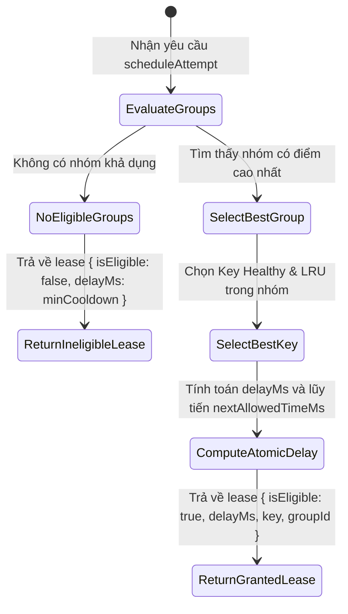

# Data Model & State Ownership: Single Scheduler Authority

**Feature**: `040-single-scheduler-authority`  
**Date**: 2026-08-20  
**Status**: Completed

---

## 1. Sơ Đồ Quyền Sở Hữu Trạng Thái (State Ownership Diagram)

```
                                 QUOTA SERVICE
                        (SINGLE SCHEDULER AUTHORITY)
                  ┌─────────────────────────────────────────┐
                  │ - groupsMap: Map<groupId, QuotaGroup>   │
                  │   └─ nextAllowedTimeMs (Atomic pacing)  │
                  │   └─ cooldownUntilMs                    │
                  │   └─ callLog                            │
                  │ - keyStatsMap: Map<keyHash, KeyStats>   │
                  │   └─ healthState, circuitBreaker        │
                  │   └─ cooldownUntil                      │
                  │ - schedulerTelemetry                    │
                  └────────────────────┬────────────────────┘
                                       │
                      1. scheduleAttempt(keys, model)
                      2. returns ScheduleLease
                                       │
                                       ▼
                              GEMINI SERVICE
                            (STATELESS EXECUTOR)
                  ┌─────────────────────────────────────────┐
                  │ 1. Prepare Request                      │
                  │ 2. Sleep(lease.delayMs) [ONCE ONLY]     │
                  │ 3. Execute HTTP Call                    │
                  │ 4. Report Result / Error to Authority   │
                  └─────────────────────────────────────────┘
```

---

## 2. Kiểu Dữ Liệu & Giao Diện TypeScript

### 2.1 Hợp Đồng Quyết Định Điều Phối (`ScheduleLease`)
```typescript
/**
 * Hợp đồng cấp quyền thực thi do Scheduler Authority ban hành
 */
export interface ScheduleLease {
  /** Mã định danh duy nhất cho phiên cấp phép */
  leaseId: string;
  /** Yêu cầu có đủ điều kiện thực thi hay không */
  isEligible: boolean;
  /** ID QuotaGroup tối ưu được chọn */
  selectedGroupId?: string;
  /** API Key tối ưu được chọn trong nhóm */
  selectedKey?: string;
  /** Khoảng thời gian hoãn bắt buộc (ms) trước khi phát HTTP request */
  delayMs: number;
  /** Khoảng cách pacing an toàn của nhóm (ms) */
  effectiveIntervalMs: number;
  /** Lý do từ chối nếu không đủ điều kiện */
  rejectReason?: string;
  /** Thời gian sớm nhất có thể thử lại nếu toàn bộ hệ thống bị nghẽn (ms) */
  earliestAvailableInMs?: number;
}
```

### 2.2 Sơ Đồ Chuyển Trạng Thái Cấp Phép Pacing

