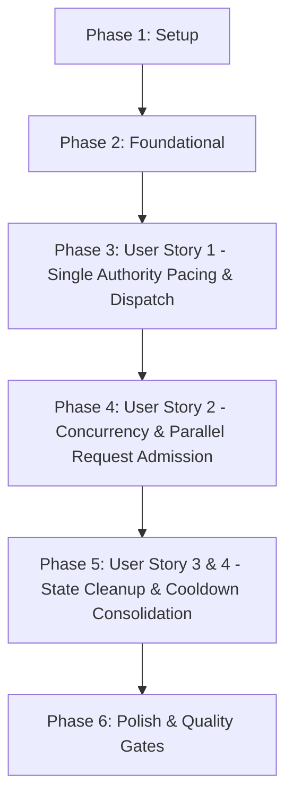

# Tasks: Single Scheduler Authority (Cơ Quan Điều Phối Hạn Ngạch Duy Nhất)

**Branch**: `040-single-scheduler-authority` | **Spec**: [spec.md](file:///e:/tailieuhoctap/laptrinhnangcao/th/merged/specs/040-single-scheduler-authority/spec.md) | **Plan**: [plan.md](file:///e:/tailieuhoctap/laptrinhnangcao/th/merged/specs/040-single-scheduler-authority/plan.md)

---

## Phase 1: Setup & Contract Definitions

**Purpose**: Định nghĩa kiểu dữ liệu hợp đồng cấp phép `ScheduleLease` trong shared models.

- [x] T001 Thêm interface `ScheduleLease` vào `shared/models.ts`

---

## Phase 2: Foundational Architecture (Central Authority Implementation)

**Purpose**: Cài đặt phương thức `scheduleAttempt` trung tâm tại `quotaService` chịu trách nhiệm toàn bộ về eligibility, pacing delay nguyên tử, và chọn key.

- [x] T002 Cài đặt phương thức `scheduleAttempt(candidateKeys, modelName, estimatedTokens, now): ScheduleLease` trong `server/services/quotaService.ts`
- [x] T003 Cập nhật bộ đếm viễn trắc chờ hàng đợi `recordQueueWait` và tính toán `earliestAvailableInMs` trong `server/services/quotaService.ts`

**Checkpoint**: Nền tảng Scheduler Authority đã sẵn sàng — các User Stories có thể bắt đầu tích hợp.

---

## Phase 3: User Story 1 - Single Authority Pacing & Dispatch (Priority: P1) 🎯 MVP

**Goal**: Đảm bảo một request chỉ có một cơ quan duy nhất quyết định thời điểm thực thi và `geminiService` chỉ sleep đúng 1 lần theo chỉ định của Scheduler.

**Independent Test**: Gửi 2 request tuần tự $\to$ Request 1 nhận `delayMs = 0`, Request 2 nhận `delayMs = 4445ms`; `geminiService` sleep đúng 1 lần duy nhất theo `lease.delayMs`.

### Tests for User Story 1

- [x] T004 [P] [US1] Tạo file test `server/services/__tests__/quotaScheduler.test.ts` và viết 2 ca kiểm thử: `group pacing` và `no double sleep`

### Implementation for User Story 1

- [x] T005 [US1] Tái cấu trúc hàm `generateWithRotation` trong `server/services/geminiService.ts` chuyển sang dùng `quotaService.scheduleAttempt` và loại bỏ logic sleep phân tán

**Checkpoint**: User Story 1 hoàn thành — Triệt tiêu hoàn toàn hiện tượng Double-Throttling.

---

## Phase 4: User Story 2 - Concurrency & Parallel Request Admission (Priority: P1) 🎯 MVP

**Goal**: Hỗ trợ nhiều request đồng thời, chia sẻ nhịp độ chung giữa các key cùng nhóm và chạy song song không độ trễ giữa các nhóm độc lập.

**Independent Test**:
- 2 key cùng nhóm $\to$ dùng chung 1 đồng hồ pacing duy nhất của nhóm.
- 2 nhóm độc lập $\to$ cấp phép thực thi song song tức thì (`delayMs = 0`).
- 5 request đồng thời vào 1 nhóm $\to$ cấp phép nguyên tử với các mốc delay tăng lũy tiến.

### Tests for User Story 2

- [x] T006 [P] [US2] Bổ sung các ca kiểm thử `multiple keys same group`, `multiple groups`, và `parallel requests` trong `server/services/__tests__/quotaScheduler.test.ts`

### Implementation for User Story 2

- [x] T007 [US2] Tối ưu hóa tính nguyên tử khi đặt chỗ pacing của nhiều request đồng thời trong `server/services/quotaService.ts`

**Checkpoint**: User Story 2 hoàn thành — Điều phối đồng thời an toàn và tối đa hóa thông lượng đa nhóm.

---

## Phase 5: User Story 3 & 4 - State Cleanup & Cooldown Consolidation (Priority: P2)

**Goal**: Xóa sạch các biến pacing phân tán (`nextAllowedTimeByKey`, `nextAllowedTimeByGroup`, `overloadCooldownUntil`) trong `geminiService.ts` và hợp nhất quản lý Cooldown tại `quotaService`.

**Independent Test**: Kiểm tra mã nguồn `geminiService.ts` không còn bất kỳ biến state pacing phân tán nào; các lỗi 429/503 kích hoạt Cooldown tự động qua `recordCategorizedError`.

- [x] T008 [US3] Xóa bỏ toàn bộ các biến map `nextAllowedTimeByKey`, `nextAllowedTimeByGroup`, `overloadCooldownUntil` trong `server/services/geminiService.ts`
- [x] T009 [US3] Hợp nhất quy trình báo cáo kết quả và kích hoạt Cooldown tự động qua `quotaService.recordCategorizedError`

**Checkpoint**: User Story 3 & 4 hoàn thành — Mã nguồn trong sáng, phân định trách nhiệm rõ ràng.

---

## Phase 6: Polish & Quality Gates (Constitution Non-Negotiable)

**Purpose**: Cập nhật tài liệu kiến trúc điều phối, rà soát type safety và chạy toàn diện các Quality Gates theo Hiến pháp.

- [x] T010 [P] Cập nhật tài liệu kiến trúc Single Scheduler Authority trong `docs/quota-and-scheduling.md`
- [x] T011 Kiểm tra Type Safety không có lỗi với `npm run lint` (`tsc --noEmit`)
- [x] T012 Chạy toàn bộ test suite và đảm bảo pass 100% với `npm test` (`vitest run`)
- [x] T013 Kiểm tra đóng gói build production thành công với `npm run build`
- [x] T014 Thực hiện kiểm định xác thực 5 ca kiểm thử theo `specs/040-single-scheduler-authority/quickstart.md`

---

## Dependencies & Execution Order

### Phase Dependencies

- **Phase 1 (Setup)**: Không có phụ thuộc — bắt đầu ngay.
- **Phase 2 (Foundational)**: Phụ thuộc vào Phase 1 — CHẶN toàn bộ User Stories.
- **Phase 3 (User Story 1 - P1 MVP)**: Phụ thuộc vào Phase 2.
- **Phase 4 (User Story 2 - P1 MVP)**: Phụ thuộc vào Phase 3.
- **Phase 5 (User Story 3 & 4 - P2)**: Phụ thuộc vào Phase 4.
- **Phase 6 (Polish & Quality Gates)**: Phụ thuộc vào toàn bộ các Phase trước.

---

## Parallel Execution Opportunities

- **Trong Phase 3 & 4**: Viết test suite `T004` và `T006` có thể chuẩn bị song song với các bước logic.
- **Trong Phase 6**: Cập nhật tài liệu `T010` có thể thực hiện song song với việc kiểm tra lints.

---

## Implementation Strategy

### MVP Scope (User Story 1 & User Story 2)
1. Hoàn thành Phase 1 (Setup) và Phase 2 (Foundational).
2. Triển khai Phase 3 (US1 - Single Authority Pacing & Dispatch) và Phase 4 (US2 - Concurrency & Parallel Request Admission).
3. **STOP & VALIDATE**: Chạy toàn bộ 5 bài test kịch bản trong `quotaScheduler.test.ts` để chứng minh MVP hoạt động chuẩn xác 100%.

### Incremental Delivery (P2 Stories)
4. Triển khai Phase 5 (US3 & US4 - Dọn dẹp sạch sẽ state phân tán).
5. Hoàn tất Phase 6 (Quality Gates: lint, test, build).
