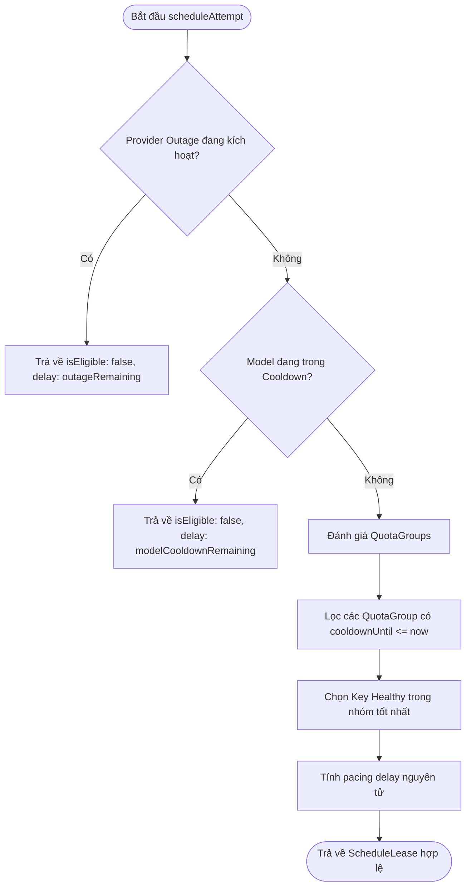

# Data Model & Cooldown State Architecture

**Feature**: `041-scoped-overload-cooldown`  
**Date**: 2026-08-20  
**Status**: Completed

---

## 1. Cấu Trúc Dữ Liệu TypeScript

### 1.1 Bản Ghi Cooldown Model (`ModelCooldownRecord`)
```typescript
export interface ModelCooldownRecord {
  modelName: string;
  cooldownUntilMs: number;
  consecutiveOverloads: number;
  lastOverloadAtMs: number;
  reason?: string;
}
```

### 1.2 Trạng Thái Sự Cố Toàn Nhà Cung Cấp (`ProviderOutageStatus`)
```typescript
export interface ProviderOutageFailureEvent {
  modelName: string;
  groupId: string;
  timestamp: number;
}

export interface ProviderOutageStatus {
  isOutage: boolean;
  outageUntilMs: number;
  remainingMs: number;
  failureEventsCount: number;
}
```

### 1.3 Mở Rộng Dữ Liệu Viễn Trắc Scheduler (`SchedulerTelemetry`)
```typescript
export interface SchedulerTelemetry {
  selectionCount: number;
  queueWaitTotalMs: number;
  queueWaitAvgMs: number;
  rejectedTotal: number;
  rejectedByReason: Record<string, number>;
  activeModelCooldowns?: Record<string, number>;
  activeGroupCooldowns?: Record<string, number>;
  isProviderOutage?: boolean;
}
```

---

## 2. Sơ Đồ Quy Trình Đánh Giá Cấp Quyền (`scheduleAttempt`)


